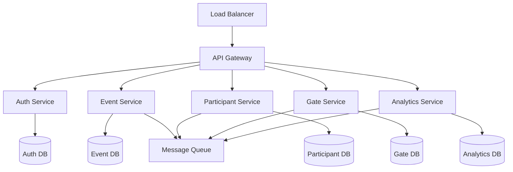

# Event Management - Scalability Architecture

## 📈 확장성 설계 및 부하 처리

대규모 이벤트를 지원하기 위한 확장 가능한 아키텍처 설계와 부하 처리 전략을 다룹니다.

### 📋 목차

1. [마이크로서비스 아키텍처](#1-마이크로서비스-아키텍처)
2. [메시지 큐를 통한 비동기 처리](#2-메시지-큐를-통한-비동기-처리)
3. [로드 밸런싱](#3-로드-밸런싱)
4. [Circuit Breaker 패턴](#4-circuit-breaker-패턴)

---

## 1. 마이크로서비스 아키텍처

### 시스템 구조



### 서비스별 구현

```typescript
// Event Service - 행사 생성/관리
class EventService {
  async createEvent(eventData: CreateEventRequest): Promise<Event> {
    // 이벤트 생성 로직
    const event = await this.repository.create(eventData);
    
    // 다른 서비스에 이벤트 알림
    await this.messageQueue.publish('event.created', {
      eventId: event.id,
      organizerId: event.organizerId
    });

    return event;
  }
}

// Participant Service - 참가자 관리
class ParticipantService {
  constructor(
    private repository: ParticipantRepository,
    private messageQueue: MessageQueue,
    private cache: CacheService
  ) {}

  async registerParticipant(
    eventId: string, 
    participantData: RegisterParticipantRequest
  ): Promise<Participant> {
    const participant = await this.repository.create({
      ...participantData,
      eventId,
      token: this.generateToken(),
      qrCode: this.generateQRCode()
    });

    // 캐시 업데이트
    await this.cache.set(`participant:${participant.id}`, participant);

    // Gate Service에 참가자 정보 동기화 알림
    await this.messageQueue.publish('participant.registered', {
      eventId,
      participantId: participant.id,
      token: participant.token
    });

    return participant;
  }
}

// Gate Service - 출입 관리
class GateService {
  async processAttendance(attendanceData: AttendanceRequest): Promise<AttendanceResult> {
    // 로컬 캐시에서 참가자 확인
    let participant = await this.cache.get(`participant:${attendanceData.token}`);
    
    if (!participant) {
      // 캐시 미스 시 Participant Service 호출
      participant = await this.participantServiceClient.getByToken(attendanceData.token);
      if (participant) {
        await this.cache.set(`participant:${participant.token}`, participant);
      }
    }

    if (!participant) {
      return { success: false, error: 'Participant not found' };
    }

    // 출석 기록 저장
    const attendance = await this.repository.createAttendance({
      participantId: participant.id,
      gateId: attendanceData.gateId,
      timestamp: new Date(),
      method: attendanceData.method
    });

    // Analytics Service에 비동기 전송
    await this.messageQueue.publish('attendance.recorded', attendance);

    return { success: true, attendance };
  }
}
```

## 2. 메시지 큐를 통한 비동기 처리

### Queue 관리 시스템

```typescript
class MessageQueueManager {
  private queue: Queue;

  constructor() {
    this.queue = new Queue('event-processing', {
      redis: {
        host: process.env.REDIS_HOST,
        port: parseInt(process.env.REDIS_PORT || '6379')
      },
      defaultJobOptions: {
        removeOnComplete: 100,  // 완료된 작업 100개만 보관
        removeOnFail: 50,       // 실패한 작업 50개만 보관
        attempts: 3,            // 최대 재시도 횟수
        backoff: 'exponential'  // 지수 백오프
      }
    });

    this.setupJobProcessors();
  }

  private setupJobProcessors(): void {
    // 출석 기록 처리
    this.queue.process('attendance.recorded', 10, async (job) => {
      const attendance = job.data;
      
      try {
        // 분석 데이터 생성
        await this.analyticsService.processAttendance(attendance);
        
        // 실시간 대시보드 업데이트
        await this.dashboardService.updateRealTimeStats(attendance);
        
        // 외부 시스템 동기화
        await this.integratedPlatformService.syncAttendance(attendance);
        
        console.log(`Processed attendance: ${attendance.id}`);
      } catch (error) {
        console.error(`Failed to process attendance: ${attendance.id}`, error);
        throw error; // 재시도를 위해 에러 재발생
      }
    });

    // 참가자 등록 후처리
    this.queue.process('participant.registered', 5, async (job) => {
      const { eventId, participantId } = job.data;
      
      // 환영 이메일 발송
      await this.emailService.sendWelcomeEmail(participantId);
      
      // 게이트 시스템에 참가자 정보 동기화
      await this.gateService.syncParticipant(participantId);
    });
  }

  async addJob(jobType: string, data: any, options?: JobOptions): Promise<void> {
    await this.queue.add(jobType, data, options);
  }
}
```

## 3. 로드 밸런싱

### 동적 로드 밸런서

```typescript
class LoadBalancer {
  private servers: ServerInstance[] = [];
  private healthChecker: HealthChecker;

  constructor() {
    this.healthChecker = new HealthChecker();
    this.initializeServers();
    this.startHealthChecking();
  }

  private initializeServers(): void {
    this.servers = [
      { id: 'api-1', url: 'http://api-1:3000', weight: 1, healthy: true, connections: 0 },
      { id: 'api-2', url: 'http://api-2:3000', weight: 1, healthy: true, connections: 0 },
      { id: 'api-3', url: 'http://api-3:3000', weight: 2, healthy: true, connections: 0 }
    ];
  }

  // 가중 라운드 로빈 + 최소 연결 수 알고리즘
  selectServer(): ServerInstance | null {
    const healthyServers = this.servers.filter(s => s.healthy);
    
    if (healthyServers.length === 0) {
      throw new Error('No healthy servers available');
    }

    // 최소 연결 수 기준으로 정렬
    const sortedByConnections = healthyServers.sort((a, b) => {
      const aScore = a.connections / a.weight;
      const bScore = b.connections / b.weight;
      return aScore - bScore;
    });

    return sortedByConnections[0];
  }

  async forwardRequest(request: Request): Promise<Response> {
    const server = this.selectServer();
    if (!server) {
      throw new Error('No available servers');
    }

    server.connections++;
    
    try {
      const response = await fetch(`${server.url}${request.url}`, {
        method: request.method,
        headers: request.headers,
        body: request.body,
        signal: AbortSignal.timeout(30000) // 30초 타임아웃
      });

      return response;
    } catch (error) {
      // 서버 오류 시 헬스 체크 강제 실행
      await this.healthChecker.checkServer(server);
      throw error;
    } finally {
      server.connections--;
    }
  }

  private async startHealthChecking(): Promise<void> {
    setInterval(async () => {
      await Promise.all(
        this.servers.map(server => this.healthChecker.checkServer(server))
      );
    }, 10000); // 10초마다 헬스 체크
  }
}
```

## 4. Circuit Breaker 패턴

### 장애 격리 시스템

```typescript
class CircuitBreaker {
  private state: 'CLOSED' | 'OPEN' | 'HALF_OPEN' = 'CLOSED';
  private failureCount: number = 0;
  private lastFailureTime: number = 0;
  private successCount: number = 0;

  constructor(
    private failureThreshold: number = 5,
    private recoveryTimeout: number = 60000, // 1분
    private halfOpenMaxCalls: number = 3
  ) {}

  async execute<T>(
    operation: () => Promise<T>,
    fallback?: () => Promise<T>
  ): Promise<T> {
    if (this.state === 'OPEN') {
      if (this.shouldAttemptReset()) {
        this.state = 'HALF_OPEN';
        this.successCount = 0;
      } else {
        return this.executeFallback(fallback);
      }
    }

    try {
      const result = await operation();
      
      if (this.state === 'HALF_OPEN') {
        this.successCount++;
        if (this.successCount >= this.halfOpenMaxCalls) {
          this.reset();
        }
      } else {
        this.reset();
      }
      
      return result;
    } catch (error) {
      this.recordFailure();
      
      if (this.state === 'HALF_OPEN') {
        this.state = 'OPEN';
        this.lastFailureTime = Date.now();
      } else if (this.failureCount >= this.failureThreshold) {
        this.state = 'OPEN';
        this.lastFailureTime = Date.now();
      }
      
      return this.executeFallback(fallback, error);
    }
  }

  private shouldAttemptReset(): boolean {
    return Date.now() - this.lastFailureTime >= this.recoveryTimeout;
  }

  private recordFailure(): void {
    this.failureCount++;
  }

  private reset(): void {
    this.state = 'CLOSED';
    this.failureCount = 0;
    this.successCount = 0;
  }

  private async executeFallback<T>(
    fallback?: () => Promise<T>,
    originalError?: any
  ): Promise<T> {
    if (fallback) {
      try {
        return await fallback();
      } catch (fallbackError) {
        throw new Error(`Circuit breaker open. Original error: ${originalError?.message}. Fallback error: ${fallbackError.message}`);
      }
    }
    
    throw new Error(`Circuit breaker open. Service unavailable. Original error: ${originalError?.message}`);
  }
}
```

## 🔗 관련 파일

### 성능 및 모니터링
- [성능 최적화](./performance-optimization.md) - 데이터베이스 최적화, 캐싱 전략, 연결 풀 관리
- [모니터링 및 스케일링](./monitoring-scaling.md) - 실시간 모니터링, 자동 스케일링

### 시스템 아키텍처
- [메인 성능 시나리오](./core-scenarios-performance-scalability.md) - 전체 성능 최적화 개요
