# Event Management - 업로드 처리 시스템

## 📁 파일 업로드 및 백그라운드 처리 시나리오

### 1. 파일 업로드 처리 시스템

```mermaid
sequenceDiagram
    participant Admin as 관리자
    participant Upload as Upload Service
    participant Queue as Job Queue
    participant Worker as Background Worker
    participant Storage as File Storage
    participant Email as Email Service
    
    Admin->>Upload: 파일 업로드
    Upload->>Upload: 파일 검증
    Upload->>Storage: 임시 저장
    Upload->>Queue: 처리 작업 등록
    Upload-->>Admin: 작업 ID 반환
    
    Queue->>Worker: 작업 할당
    Worker->>Storage: 파일 읽기
    Worker->>Worker: 데이터 처리
    Worker->>Storage: 결과 저장
    Worker->>Email: 완료 알림 발송
    Worker->>Queue: 작업 완료 보고
```



**파일 업로드 API:**
```typescript
class FileUploadService {
  private readonly MAX_FILE_SIZE = 50 * 1024 * 1024; // 50MB
  private readonly ALLOWED_TYPES = ['text/csv', 'application/vnd.ms-excel'];
  
  async uploadFile(file: Express.Multer.File, metadata: UploadMetadata): Promise<UploadResult> {
    // 1. 파일 검증
    await this.validateFile(file);
    
    // 2. 고유 파일명 생성
    const fileName = this.generateFileName(file.originalname);
    
    // 3. 임시 저장소에 저장
    const tempPath = await this.saveToTempStorage(file, fileName);
    
    // 4. 백그라운드 처리 작업 생성
    const jobId = await this.createProcessingJob({
      fileName,
      tempPath,
      originalName: file.originalname,
      fileSize: file.size,
      mimeType: file.mimetype,
      uploadedBy: metadata.uploadedBy,
      eventId: metadata.eventId,
      options: metadata.options
    });
    
    return {
      jobId,
      fileName,
      fileSize: file.size,
      status: 'uploaded',
      estimatedProcessingTime: this.estimateProcessingTime(file.size)
    };
  }
  
  private async validateFile(file: Express.Multer.File): Promise<void> {
    // 파일 크기 검증
    if (file.size > this.MAX_FILE_SIZE) {
      throw new ValidationError(`File size exceeds limit of ${this.MAX_FILE_SIZE / 1024 / 1024}MB`);
    }
    
    // MIME 타입 검증
    if (!this.ALLOWED_TYPES.includes(file.mimetype)) {
      throw new ValidationError(`Unsupported file type: ${file.mimetype}`);
    }
    
    // 파일 내용 검증 (CSV 헤더 확인)
    if (file.mimetype === 'text/csv') {
      await this.validateCSVStructure(file.buffer);
    }
  }
  
  private async validateCSVStructure(buffer: Buffer): Promise<void> {
    const content = buffer.toString('utf-8');
    const lines = content.split('\n');
    
    if (lines.length < 2) {
      throw new ValidationError('CSV file must contain at least a header and one data row');
    }
    
    const headers = lines[0].split(',').map(h => h.trim().toLowerCase());
    const requiredHeaders = ['name', 'email'];
    
    const missingHeaders = requiredHeaders.filter(h => !headers.includes(h));
    if (missingHeaders.length > 0) {
      throw new ValidationError(`Missing required columns: ${missingHeaders.join(', ')}`);
    }
  }
  
  private generateFileName(originalName: string): string {
    const timestamp = Date.now();
    const random = Math.random().toString(36).substring(2);
    const extension = path.extname(originalName);
    return `upload_${timestamp}_${random}${extension}`;
  }
  
  private async saveToTempStorage(file: Express.Multer.File, fileName: string): Promise<string> {
    const tempDir = path.join(process.env.TEMP_DIR || '/tmp', 'uploads');
    await fs.ensureDir(tempDir);
    
    const filePath = path.join(tempDir, fileName);
    await fs.writeFile(filePath, file.buffer);
    
    return filePath;
  }
  
  private estimateProcessingTime(fileSize: number): number {
    // 대략적인 처리 시간 추정 (바이트당 처리 시간)
    const BYTES_PER_SECOND = 100000; // 100KB/s
    return Math.ceil(fileSize / BYTES_PER_SECOND);
  }
}
```

### 2. 백그라운드 작업 처리 시스템

```typescript
class BackgroundJobProcessor {
  private queue: Queue;
  private workers: Worker[] = [];
  
  constructor() {
    this.queue = new Queue('file-processing', {
      redis: {
        host: process.env.REDIS_HOST,
        port: parseInt(process.env.REDIS_PORT || '6379')
      }
    });
    
    this.initializeWorkers();
  }
  
  private initializeWorkers(): void {
    const workerCount = parseInt(process.env.WORKER_COUNT || '4');
    
    for (let i = 0; i < workerCount; i++) {
      const worker = new Worker('file-processing', this.processJob.bind(this), {
        redis: this.queue.opts.redis,
        concurrency: 1
      });
      
      worker.on('completed', this.onJobCompleted.bind(this));
      worker.on('failed', this.onJobFailed.bind(this));
      
      this.workers.push(worker);
    }
  }
  
  async processJob(job: Job<FileProcessingJob>): Promise<ProcessingResult> {
    const { data } = job;
    
    try {
      // 진행률 업데이트
      await job.updateProgress(0);
      
      // 1. 파일 읽기 및 파싱
      const fileData = await this.readAndParseFile(data.tempPath, data.mimeType);
      await job.updateProgress(25);
      
      // 2. 데이터 검증 및 정리
      const validatedData = await this.validateAndCleanData(fileData);
      await job.updateProgress(50);
      
      // 3. 데이터베이스에 저장
      const saveResult = await this.saveParticipants(validatedData, data.eventId);
      await job.updateProgress(75);
      
      // 4. 토큰 및 QR 코드 생성
      const tokens = await this.generateTokensForParticipants(saveResult.participants);
      await job.updateProgress(90);
      
      // 5. 이메일 발송 (옵션)
      if (data.options.sendWelcomeEmail) {
        await this.scheduleWelcomeEmails(saveResult.participants, tokens);
      }
      
      await job.updateProgress(100);
      
      return {
        success: true,
        processedCount: saveResult.participants.length,
        errorCount: validatedData.errors.length,
        tokens: tokens.length,
        emailsSent: data.options.sendWelcomeEmail ? tokens.length : 0
      };
      
    } catch (error) {
      console.error('Job processing failed:', error);
      throw error;
    } finally {
      // 임시 파일 정리
      await this.cleanupTempFile(data.tempPath);
    }
  }
  
  private async readAndParseFile(filePath: string, mimeType: string): Promise<any[]> {
    if (mimeType === 'text/csv') {
      return this.parseCSVFile(filePath);
    } else if (mimeType === 'application/vnd.ms-excel') {
      return this.parseExcelFile(filePath);
    }
    
    throw new Error(`Unsupported file type: ${mimeType}`);
  }
  
  private async parseCSVFile(filePath: string): Promise<any[]> {
    const content = await fs.readFile(filePath, 'utf-8');
    const lines = content.split('\n').filter(line => line.trim());
    
    const headers = lines[0].split(',').map(h => h.trim());
    const data = [];
    
    for (let i = 1; i < lines.length; i++) {
      const values = lines[i].split(',').map(v => v.trim());
      const row: any = {};
      
      headers.forEach((header, index) => {
        row[header.toLowerCase()] = values[index] || '';
      });
      
      data.push(row);
    }
    
    return data;
  }
  
  private async validateAndCleanData(rawData: any[]): Promise<ValidationResult> {
    const validRows: ParticipantData[] = [];
    const errors: ValidationError[] = [];
    
    for (let i = 0; i < rawData.length; i++) {
      const row = rawData[i];
      const rowIndex = i + 2; // CSV 행 번호 (헤더 포함)
      
      try {
        const participant = this.validateParticipantRow(row, rowIndex);
        validRows.push(participant);
      } catch (error) {
        errors.push({
          row: rowIndex,
          field: error.field,
          message: error.message,
          value: error.value
        });
      }
    }
    
    return {
      validData: validRows,
      errors,
      totalRows: rawData.length,
      validRows: validRows.length,
      errorRows: errors.length
    };
  }
  
  private validateParticipantRow(row: any, rowIndex: number): ParticipantData {
    const participant: ParticipantData = {
      name: this.validateName(row.name, rowIndex),
      email: this.validateEmail(row.email, rowIndex),
      phone: this.validatePhone(row.phone, rowIndex),
      department: row.department || '',
      position: row.position || '',
      metadata: {
        importRow: rowIndex,
        importedAt: new Date().toISOString()
      }
    };
    
    return participant;
  }
  
  private validateName(name: string, rowIndex: number): string {
    if (!name || name.trim().length < 2) {
      throw new FieldValidationError('name', 'Name must be at least 2 characters', name, rowIndex);
    }
    
    if (name.length > 100) {
      throw new FieldValidationError('name', 'Name must not exceed 100 characters', name, rowIndex);
    }
    
    return name.trim();
  }
  
  private validateEmail(email: string, rowIndex: number): string {
    if (!email) {
      throw new FieldValidationError('email', 'Email is required', email, rowIndex);
    }
    
    const emailRegex = /^[^\s@]+@[^\s@]+\.[^\s@]+$/;
    if (!emailRegex.test(email)) {
      throw new FieldValidationError('email', 'Invalid email format', email, rowIndex);
    }
    
    return email.toLowerCase().trim();
  }
  
  private async saveParticipants(participants: ParticipantData[], eventId: string): Promise<SaveResult> {
    const transaction = await this.database.beginTransaction();
    const savedParticipants: Participant[] = [];
    
    try {
      for (const participantData of participants) {
        // 중복 이메일 확인
        const existing = await this.database.findParticipantByEmail(
          participantData.email, 
          eventId, 
          transaction
        );
        
        if (existing) {
          console.warn(`Duplicate email skipped: ${participantData.email}`);
          continue;
        }
        
        const participant = await this.database.createParticipant({
          ...participantData,
          eventId,
          status: 'active',
          createdAt: new Date(),
          updatedAt: new Date()
        }, transaction);
        
        savedParticipants.push(participant);
      }
      
      await transaction.commit();
      
      return {
        participants: savedParticipants,
        duplicatesSkipped: participants.length - savedParticipants.length
      };
      
    } catch (error) {
      await transaction.rollback();
      throw error;
    }
  }
  
  private async generateTokensForParticipants(participants: Participant[]): Promise<ParticipantToken[]> {
    const tokens: ParticipantToken[] = [];
    
    for (const participant of participants) {
      const token = await this.tokenGenerator.generateParticipantToken(participant);
      await this.database.saveParticipantToken(token);
      tokens.push(token);
    }
    
    return tokens;
  }
  
  private async scheduleWelcomeEmails(
    participants: Participant[], 
    tokens: ParticipantToken[]
  ): Promise<void> {
    const emailQueue = new Queue('email-sending');
    
    for (let i = 0; i < participants.length; i++) {
      const participant = participants[i];
      const token = tokens[i];
      
      await emailQueue.add('welcome-email', {
        participantId: participant.id,
        email: participant.email,
        name: participant.name,
        token: token.token,
        qrCode: token.qrCode
      }, {
        delay: i * 1000 // 1초 간격으로 발송
      });
    }
  }
  
  private async onJobCompleted(job: Job, result: ProcessingResult): Promise<void> {
    console.log(`Job ${job.id} completed:`, result);
    
    // 완료 알림 발송
    await this.notificationService.sendProcessingComplete({
      jobId: job.id,
      result,
      completedAt: new Date()
    });
  }
  
  private async onJobFailed(job: Job, error: Error): Promise<void> {
    console.error(`Job ${job.id} failed:`, error);
    
    // 실패 알림 발송
    await this.notificationService.sendProcessingFailed({
      jobId: job.id,
      error: error.message,
      failedAt: new Date()
    });
  }
  
  private async cleanupTempFile(filePath: string): Promise<void> {
    try {
      await fs.unlink(filePath);
    } catch (error) {
      console.warn(`Failed to cleanup temp file ${filePath}:`, error);
    }
  }
}
```

### 3. 작업 상태 모니터링

```typescript
class JobStatusService {
  async getJobStatus(jobId: string): Promise<JobStatusResponse> {
    const job = await this.queue.getJob(jobId);
    
    if (!job) {
      throw new NotFoundError('Job not found');
    }
    
    return {
      jobId,
      status: await job.getState(),
      progress: job.progress,
      data: job.data,
      result: job.returnvalue,
      createdAt: new Date(job.timestamp),
      processedOn: job.processedOn ? new Date(job.processedOn) : null,
      finishedOn: job.finishedOn ? new Date(job.finishedOn) : null,
      attempts: job.attemptsMade,
      error: job.failedReason
    };
  }
  
  async getActiveJobs(): Promise<JobSummary[]> {
    const [waiting, active, completed, failed] = await Promise.all([
      this.queue.getWaiting(),
      this.queue.getActive(),
      this.queue.getCompleted(0, 10),
      this.queue.getFailed(0, 10)
    ]);
    
    return {
      waiting: waiting.length,
      active: active.length,
      completed: completed.length,
      failed: failed.length,
      jobs: {
        active: active.map(this.mapJobToSummary),
        recent: [...completed, ...failed]
          .sort((a, b) => (b.finishedOn || 0) - (a.finishedOn || 0))
          .slice(0, 20)
          .map(this.mapJobToSummary)
      }
    };
  }
  
  private mapJobToSummary(job: Job): JobSummary {
    return {
      id: job.id,
      name: job.name,
      status: job.getState(),
      progress: job.progress,
      createdAt: new Date(job.timestamp),
      fileName: job.data.originalName,
      uploadedBy: job.data.uploadedBy
    };
  }
}
```

### 4. 이메일 발송 시스템

```typescript
class EmailService {
  private emailQueue: Queue;
  
  constructor() {
    this.emailQueue = new Queue('email-processing', {
      redis: { host: process.env.REDIS_HOST }
    });
    
    this.initializeEmailWorker();
  }
  
  private initializeEmailWorker(): void {
    const worker = new Worker('email-processing', this.processEmailJob.bind(this), {
      redis: this.emailQueue.opts.redis,
      concurrency: 5 // 동시 5개 이메일 발송
    });
    
    worker.on('completed', (job) => {
      console.log(`Email sent successfully: ${job.id}`);
    });
    
    worker.on('failed', (job, error) => {
      console.error(`Email failed: ${job.id}`, error);
    });
  }
  
  async processEmailJob(job: Job<EmailJob>): Promise<void> {
    const { type, data } = job.data;
    
    switch (type) {
      case 'welcome':
        await this.sendWelcomeEmail(data);
        break;
      case 'processing-complete':
        await this.sendProcessingCompleteEmail(data);
        break;
      case 'processing-failed':
        await this.sendProcessingFailedEmail(data);
        break;
      default:
        throw new Error(`Unknown email type: ${type}`);
    }
  }
  
  private async sendWelcomeEmail(data: WelcomeEmailData): Promise<void> {
    const template = await this.getEmailTemplate('welcome');
    
    const htmlContent = this.renderTemplate(template.html, {
      participantName: data.name,
      eventName: data.eventName,
      qrCodeImage: data.qrCode,
      eventDate: data.eventDate,
      eventLocation: data.eventLocation
    });
    
    await this.emailProvider.send({
      to: data.email,
      subject: template.subject,
      html: htmlContent,
      attachments: [{
        filename: 'qr-code.png',
        content: Buffer.from(data.qrCode, 'base64'),
        cid: 'qrcode'
      }]
    });
  }
  
  private async sendProcessingCompleteEmail(data: ProcessingCompleteData): Promise<void> {
    const template = await this.getEmailTemplate('processing-complete');
    
    const htmlContent = this.renderTemplate(template.html, {
      fileName: data.fileName,
      processedCount: data.processedCount,
      errorCount: data.errorCount,
      completedAt: data.completedAt
    });
    
    await this.emailProvider.send({
      to: data.adminEmail,
      subject: template.subject,
      html: htmlContent
    });
  }
  
  private renderTemplate(template: string, data: Record<string, any>): string {
    return template.replace(/\{\{(\w+)\}\}/g, (match, key) => {
      return data[key] || match;
    });
  }
}
```

## 신뢰성 지표

### 업로드 처리 성공률
- **목표**: > 99.9%
- **실패 시 자동 재시도**: 3회
- **에러 알림**: 실시간

### 이메일 발송 성공률
- **목표**: > 99.5%
- **재발송 정책**: 24시간 내 3회 시도
- **반송 처리**: 자동 상태 업데이트

---

## 🔗 관련 파일

- **[데이터 처리 시스템](./participant-management-data-processing.md)** - 참가자 데이터 관리
- **[토큰 인증 시스템](./participant-management-token-auth.md)** - 토큰 생성 및 검증
- **[참가자 관리 개요](./participant-management.md)** - 전체 시스템 개요