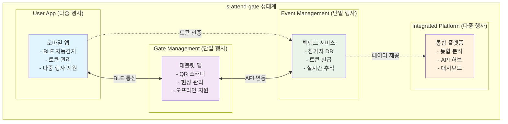
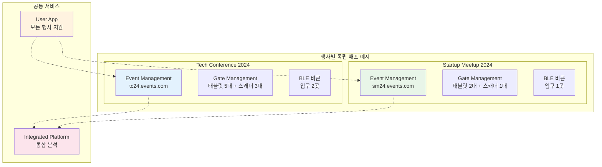
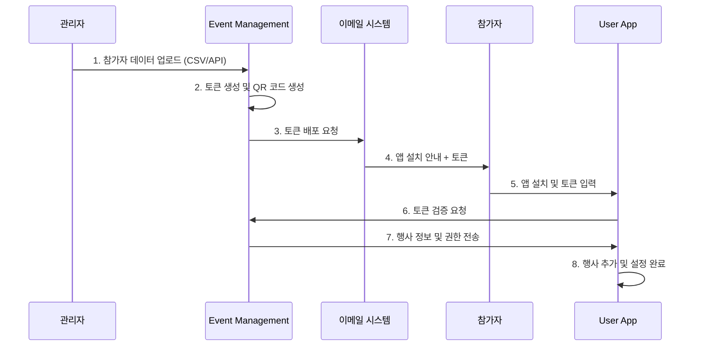
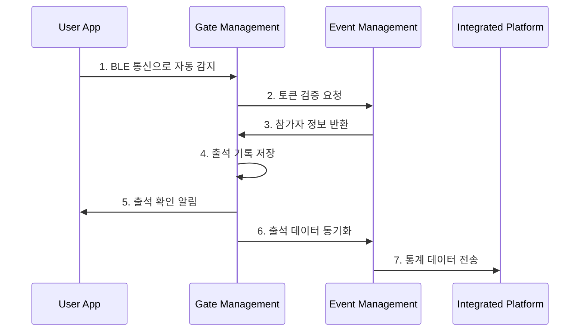
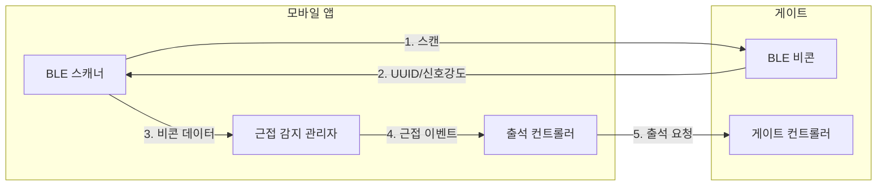
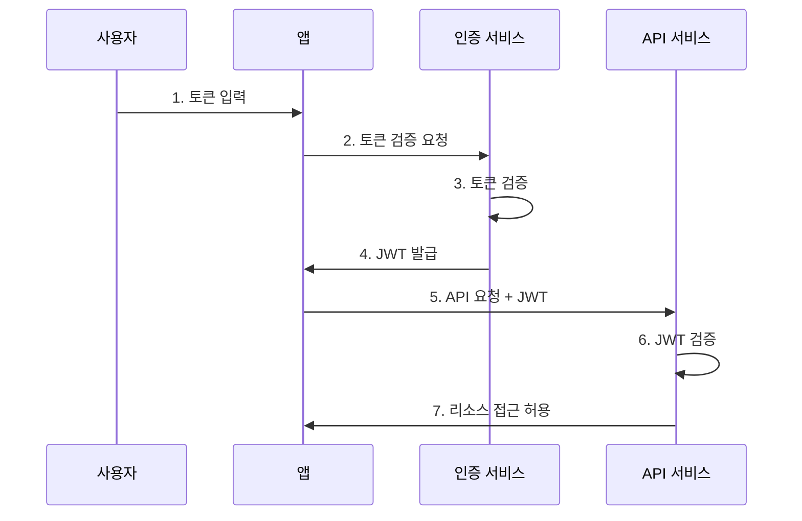
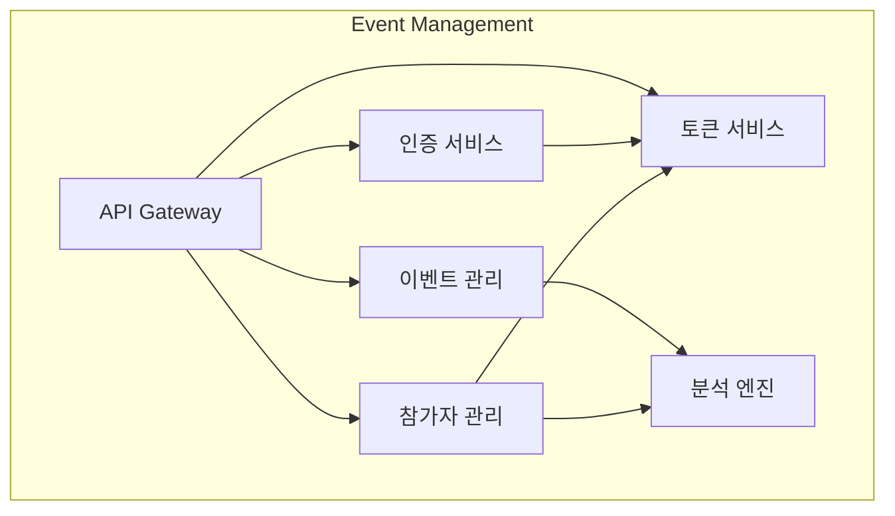
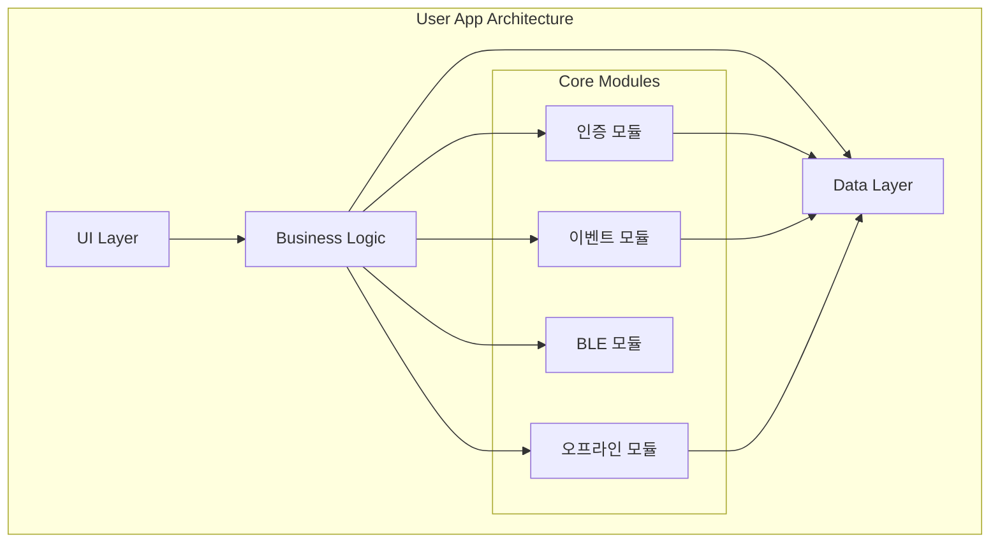
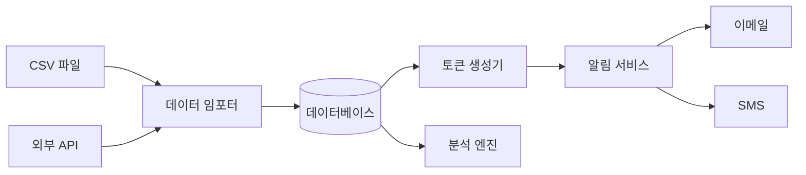
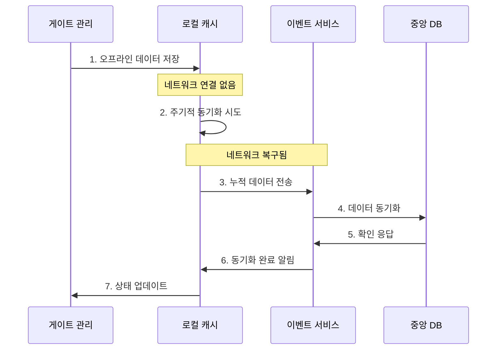

# s-attend-gate Mermaid 다이어그램 소스 모음

이 파일은 s-attend-gate 프로젝트의 모든 문서에서 사용된 mermaid 다이어그램의 소스 코드를 모아둔 참고 자료입니다.

## 📁 시스템 아키텍처 다이어그램 (system-scenarios/README.md)

### 전체 시스템 구조

### 행사별 독립 배포

### 참가자 온보딩 프로세스

### 실시간 출석 체크 프로세스

## 📊 기술 아키텍처 다이어그램

### BLE 통신 모델

### 토큰 인증 흐름

## 🧩 시스템 구성요소 다이어그램

### Event Management 구성요소

### User App 아키텍처

## 🔄 데이터 흐름 다이어그램

### 참가자 데이터 흐름

### 오프라인 동기화 흐름

