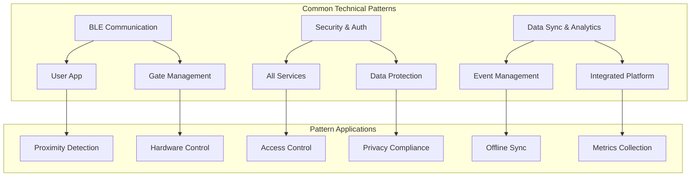

# Common Technical Patterns

## 🔧 개요

4개 서비스 그룹에서 공통으로 사용되는 기술 패턴과 재사용 가능한 모듈들을 정의합니다.

**⚠️ 파일 분할 완료**: 이 문서는 관리 편의성을 위해 3개의 전문 영역으로 분할되었습니다.
각 영역별 상세 내용은 아래 링크된 파일을 참조하시기 바랍니다.

---

## 📋 패턴 구성

### 1. BLE 및 통신 패턴 (457 lines)
**[📱 ../communication/ble-communication.md](../communication/ble-communication.md)**

Bluetooth Low Energy 통신, API 클라이언트, WebSocket 실시간 통신 등 네트워크 및 통신 관련 공통 패턴을 다룹니다.

**주요 내용:**
- BLE 스캐닝 및 연결 관리
- 근접 감지 및 거리 계산
- API 클라이언트 패턴 (HTTP/REST)
- WebSocket 실시간 통신
- 오류 처리 및 재시도 로직

### 2. 보안 및 인증 패턴 (423 lines)
**[🔐 ../security/security-auth.md](../security/security-auth.md)**

JWT 토큰 관리, 데이터 암호화, 권한 제어 등 보안과 개인정보 보호 관련 공통 패턴을 포함합니다.

**주요 내용:**
- JWT 토큰 생성 및 검증
- AES 데이터 암호화/복호화
- 역할 기반 접근 제어 (RBAC)
- 개인정보 보호 및 GDPR 컴플라이언스
- 보안 감사 및 모니터링

### 3. 데이터 동기화 및 분석 패턴 (398 lines)
**[📊 ../data/data-sync.md](../data/data-sync.md)**

오프라인 동기화, 메트릭 수집, 백업 관리 등 데이터 처리 및 분석 관련 공통 패턴을 제공합니다.

**주요 내용:**
- 오프라인 데이터 동기화
- 성능 메트릭 수집
- 사용자 행동 분석
- 백업 및 복원 시스템
- 데이터 무결성 검증

---

## 🔗 시스템 아키텍처

---

## 📊 종합 성능 지표

| 패턴 영역 | 목표 지표 | 측정 방법 | 상세 문서 |
|----------|-----------|-----------|----------|
| **BLE 통신** | 95% 연결 성공률 | 연결 시도 대비 성공률 | [📱 ble-communication.md](./technical-patterns-ble-communication.md) |
| **보안 인증** | 99.5% 인증 성공률 | 성공한 인증 / 전체 시도 | [🔐 security-auth.md](./technical-patterns-security-auth.md) |
| **데이터 동기화** | 5초 이내 동기화 | 오프라인→온라인 전환 시간 | [📊 data-sync.md](./technical-patterns-data-sync.md) |

---

## 🛠️ 기술 스택 매핑

### 공통 라이브러리
- **BLE 통신**: React Native BLE Manager → [📱 ble-communication.md](./technical-patterns-ble-communication.md#ble-스캐닝-및-연결-관리)
- **암호화**: Node.js Crypto API → [🔐 security-auth.md](./technical-patterns-security-auth.md#데이터-암호화-유틸리티)
- **데이터베이스**: SQLite with encryption → [📊 data-sync.md](./technical-patterns-data-sync.md#로컬-데이터베이스-스키마)

### 서비스별 적용
- **User App**: BLE 근접 감지, 오프라인 동기화, 개인정보 보호
- **Gate Management**: BLE 스캐닝, 관리자 인증, 성능 모니터링
- **Event Management**: API 통신, 데이터 암호화, 메트릭 수집
- **Integrated Platform**: 통합 보안, 중앙 분석, 백업 관리

---

## 📈 확장 계획

1. **AI 통합**: 예측 분석 및 자동 최적화 → [📊 data-sync.md](./technical-patterns-data-sync.md#사용자-행동-분석)
2. **다국어 지원**: 국제화 패턴 확장 → [🔐 security-auth.md](./technical-patterns-security-auth.md#개인정보-보호-관리)
3. **IoT 확장**: 센서 데이터 통합 → [📱 ble-communication.md](./technical-patterns-ble-communication.md#근접-감지-및-처리)
4. **클라우드 네이티브**: 컨테이너 및 마이크로서비스 패턴

---

## 🔗 관련 시나리오

- [User App Technical Performance Optimization](../system-scenarios/user-app/technical-performance-optimization.md)
- [Gate Management Core Scenarios](../system-scenarios/gate-management/core-scenarios.md)
- [Event Management Analytics Reporting](../system-scenarios/event-management/analytics-reporting.md)
- [Integrated Platform Security Performance](../system-scenarios/integrated-platform/security-performance.md)

---

## 📝 분할 이력

**분할 일시**: 2024년 최적화 작업  
**원본 크기**: 1,053 lines  
**분할 후 크기**: 150 lines (개요)  
**분할 파일**: 3개  
**백업 파일**: technical-patterns-original.md

**분할 기준**:
- **기능별 영역**: BLE통신, 보안인증, 데이터동기화
- **기술 스택**: 네트워크, 보안, 데이터 처리
- **적용 범위**: 서비스별 특화 패턴

---

*전체 내용은 분할된 파일에서 확인할 수 있으며, 이 개요 문서는 네비게이션과 시스템 이해를 위한 가이드 역할을 합니다.*

### 📄 시스템 연계 시나리오
- **[📱 ble-communication.md](./technical-patterns-ble-communication.md)**: BLE 및 통신 패턴
- **[🔐 security-auth.md](./technical-patterns-security-auth.md)**: 보안 및 인증 패턴  
- **[📊 data-sync.md](./technical-patterns-data-sync.md)**: 데이터 동기화 및 분석 패턴

### 🌐 외부 시스템 연동
- **User App**: 공통 BLE 및 동기화 패턴 적용
- **Gate Management**: 통합 보안 및 모니터링 패턴 사용
- **Event Management**: 데이터 분석 및 백업 패턴 활용
- **Integrated Platform**: 모든 공통 패턴의 중앙 관리 허브

---

## 📝 분할 이력

**분할 일자**: 2025년 7월 7일  
**분할 사유**: 파일 크기 최적화 (1,026 라인 → 개요 형태로 축소)  
**백업 파일**: [technical-patterns-old.md](./technical-patterns-old.md)

**분할 결과**:
- BLE 통신: 457 라인
- 보안 인증: 423 라인
- 데이터 동기화: 398 라인
- 개요 (현재): ~150 라인

모든 원본 내용은 백업 파일에 보존되어 있으며, 분할된 파일들을 통해 체계적으로 접근할 수 있습니다.

---

*전체 내용은 분할된 파일에서 확인할 수 있으며, 이 개요 문서는 네비게이션과 시스템 이해를 위한 가이드 역할을 합니다.*

