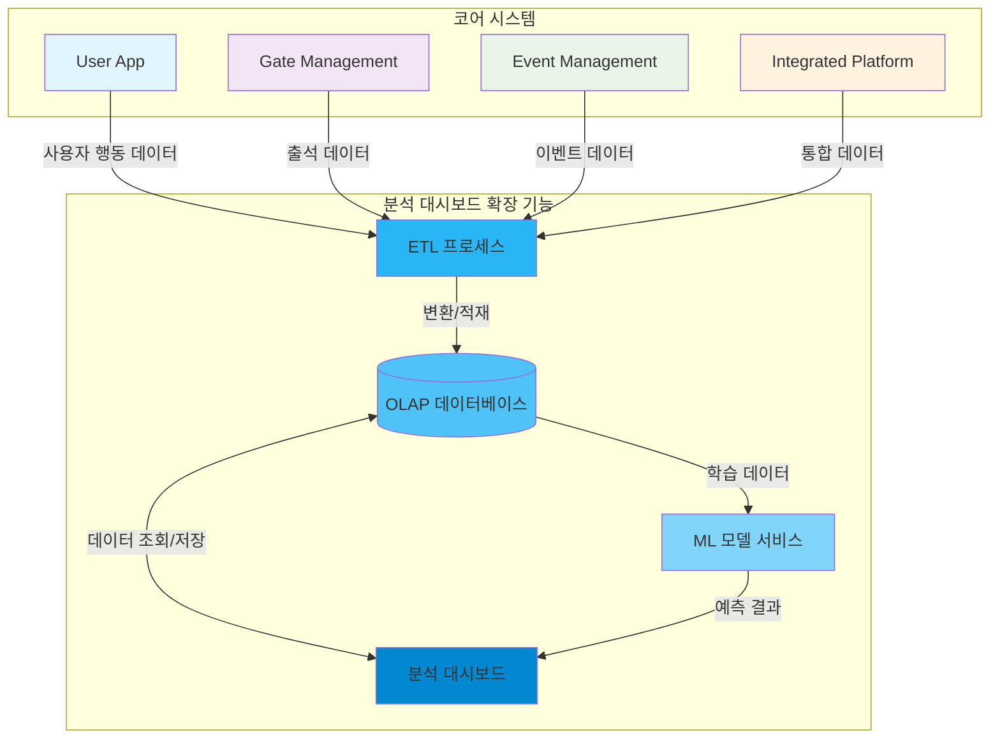
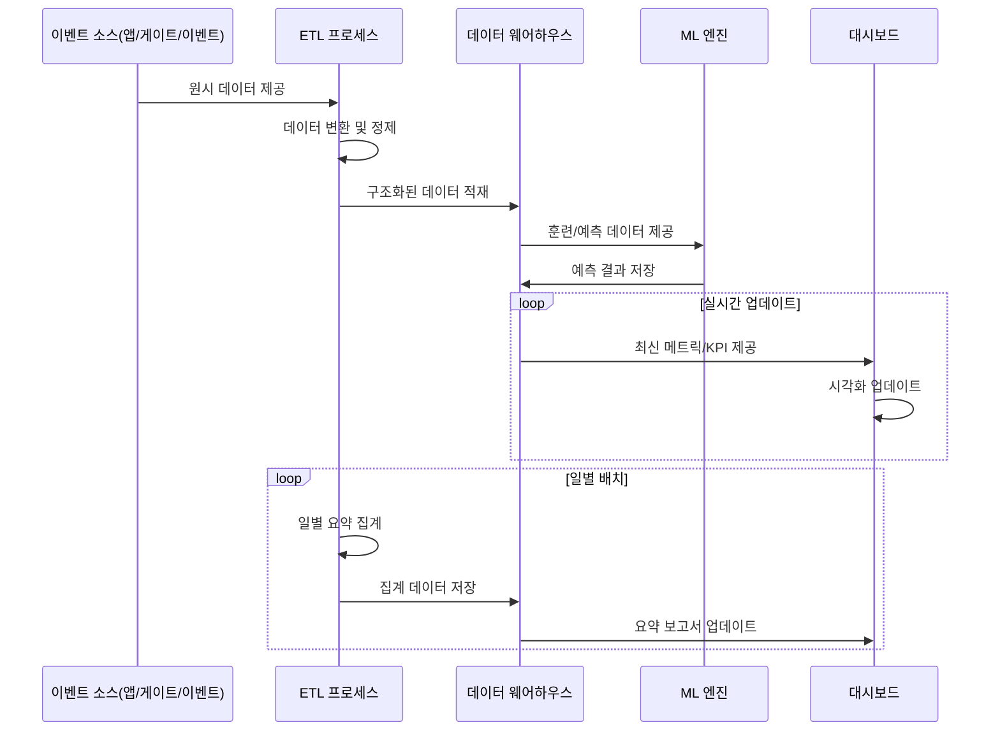
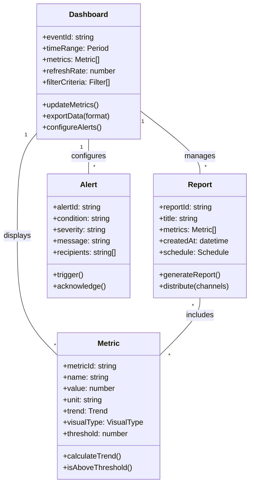
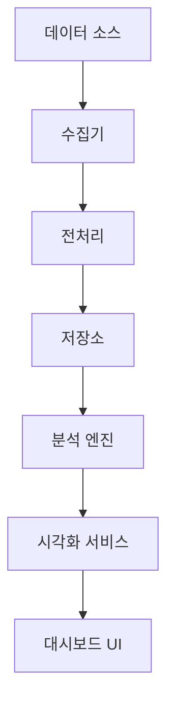
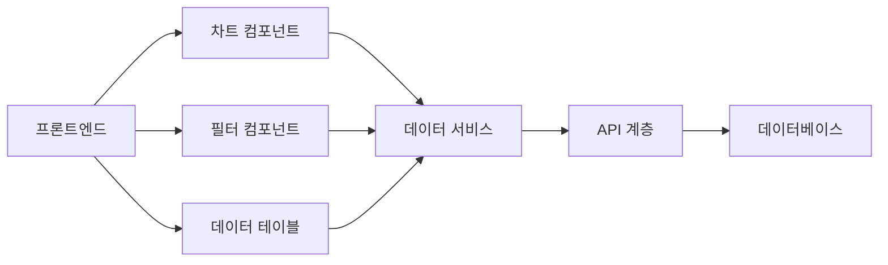
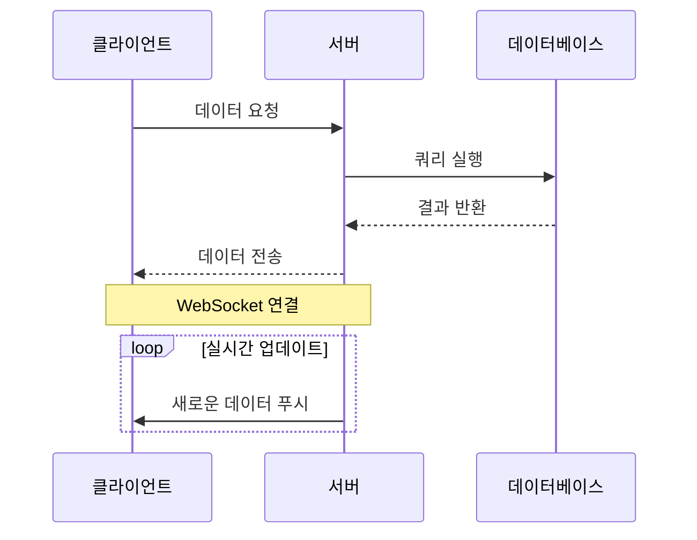
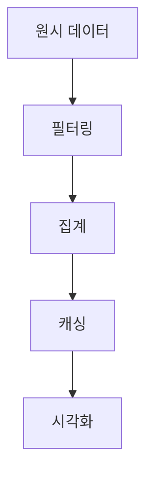
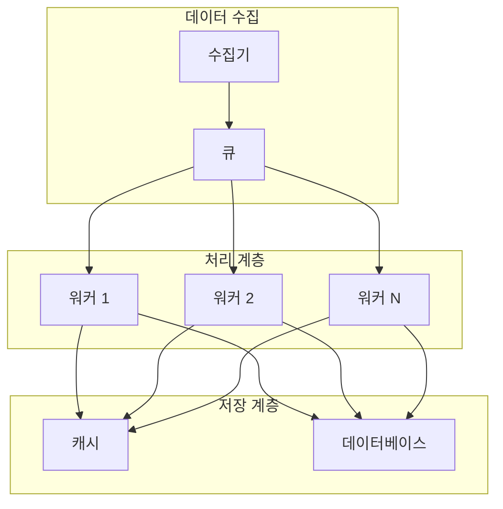

# 고급 분석 대시보드 다이어그램

## 🎯 아키텍처 구조

```mermaid
graph TB
    subgraph "분석 대시보드 확장 기능"
        AD[분석 대시보드]
        ETL[ETL 프로세스]
        OLAP[(OLAP 데이터베이스)]
        ML[ML 모델 서비스]
    end
    
    subgraph "코어 시스템"
        UA[User App]
        GM[Gate Management]
        EM[Event Management]
        IP[Integrated Platform]
    end
    
    UA -->|사용자 행동 데이터| ETL
    GM -->|출석 데이터| ETL
    EM -->|이벤트 데이터| ETL
    IP -->|통합 데이터| ETL
    
    ETL -->|변환/적재| OLAP
    OLAP <-->|데이터 조회/저장| AD
    OLAP -->|학습 데이터| ML
    ML -->|예측 결과| AD
    
    style AD fill:#0288d1
    style ETL fill:#29b6f6
    style OLAP fill:#4fc3f7
    style ML fill:#81d4fa
    style UA fill:#e1f5fe
    style GM fill:#f3e5f5
    style EM fill:#e8f5e8
    style IP fill:#fff3e0
```

## 🎯 데이터 흐름

```mermaid
sequenceDiagram
    participant 행사시스템 as 이벤트 소스(앱/게이트/이벤트)
    participant ETL as ETL 프로세스
    participant DW as 데이터 웨어하우스
    participant ML as ML 엔진
    participant 대시보드
    
    행사시스템->>ETL: 원시 데이터 제공
    ETL->>ETL: 데이터 변환 및 정제
    ETL->>DW: 구조화된 데이터 적재
    DW->>ML: 훈련/예측 데이터 제공
    ML->>DW: 예측 결과 저장
    
    loop 실시간 업데이트
        DW->>대시보드: 최신 메트릭/KPI 제공
        대시보드->>대시보드: 시각화 업데이트
    end
    
    loop 일별 배치
        ETL->>ETL: 일별 요약 집계
        ETL->>DW: 집계 데이터 저장
        DW->>대시보드: 요약 보고서 업데이트
    end
```

## 🎯 대시보드 컴포넌트

```mermaid
classDiagram
    class Dashboard {
        +eventId: string
        +timeRange: Period
        +metrics: Metric[]
        +refreshRate: number
        +filterCriteria: Filter[]
        +updateMetrics()
        +exportData(format)
        +configureAlerts()
    }
    
    class Metric {
        +metricId: string
        +name: string
        +value: number
        +unit: string
        +trend: Trend
        +visualType: VisualType
        +threshold: number
        +calculateTrend()
        +isAboveThreshold()
    }
    
    class Report {
        +reportId: string
        +title: string
        +metrics: Metric[]
        +createdAt: datetime
        +schedule: Schedule
        +generateReport()
        +distribute(channels)
    }
    
    class Alert {
        +alertId: string
        +condition: string
        +severity: string
        +message: string
        +recipients: string[]
        +trigger()
        +acknowledge()
    }
    
    Dashboard "1" -- "*" Metric: displays
    Dashboard "1" -- "*" Report: manages
    Dashboard "1" -- "*" Alert: configures
    Report "*" -- "*" Metric: includes
```

## 데이터 파이프라인 구조

```mermaid
graph TB
    A[데이터 소스] --> B[수집기]
    B --> C[전처리]
    C --> D[저장소]
    D --> E[분석 엔진]
    E --> F[시각화 서비스]
    F --> G[대시보드 UI]
```

## 컴포넌트 구조

```mermaid
graph LR
    A[프론트엔드] --> B[차트 컴포넌트]
    A --> C[필터 컴포넌트]
    A --> D[데이터 테이블]
    B & C & D --> E[데이터 서비스]
    E --> F[API 계층]
    F --> G[데이터베이스]
```

## 실시간 처리 흐름

```mermaid
sequenceDiagram
    participant C as 클라이언트
    participant S as 서버
    participant DB as 데이터베이스
    
    C->>S: 데이터 요청
    S->>DB: 쿼리 실행
    DB-->>S: 결과 반환
    S-->>C: 데이터 전송
    Note over C,S: WebSocket 연결
    loop 실시간 업데이트
        S->>C: 새로운 데이터 푸시
    end
```

## 데이터 집계 프로세스

```mermaid
graph TD
    A[원시 데이터] --> B[필터링]
    B --> C[집계]
    C --> D[캐싱]
    D --> E[시각화]
```

## 시스템 확장성

```mermaid
graph TB
    subgraph 데이터 수집
        A[수집기] --> B[큐]
    end
    subgraph 처리 계층
        B --> C[워커 1]
        B --> D[워커 2]
        B --> E[워커 N]
    end
    subgraph 저장 계층
        C & D & E --> F[캐시]
        C & D & E --> G[데이터베이스]
    end
```
