# 외부 시스템 연동 다이어그램

## 🎯 통합 아키텍처

```mermaid
graph TB
    subgraph "통합 확장 기능"
        IG[통합 게이트웨이]
        AD[어댑터 모듈]
        TF[변환 엔진]
        SC[스케줄러]
    end
    
    subgraph "코어 시스템"
        EM[Event Management]
        IP[Integrated Platform]
    end
    
    subgraph "외부 시스템"
        CRM[CRM 시스템]
        MKT[마케팅 도구]
        ERP[ERP 시스템]
        LMS[LMS 시스템]
    end
    
    EM <--> IG
    IP <--> IG
    
    IG <--> AD
    AD <--> TF
    TF <--> SC
    
    AD <--> CRM
    AD <--> MKT
    AD <--> ERP
    AD <--> LMS
    
    style IG fill:#7b1fa2
    style AD fill:#9c27b0
    style TF fill:#ba68c8
    style SC fill:#ce93d8
    style EM fill:#e8f5e8
    style IP fill:#fff3e0
    style CRM fill:#eeeeee
    style MKT fill:#e0e0e0
    style ERP fill:#bdbdbd
    style LMS fill:#9e9e9e
```



## 🎯 데이터 동기화 흐름

```mermaid
sequenceDiagram
    participant 이벤트시스템 as Event Management
    participant 통합게이트웨이 as Integration Gateway
    participant 어댑터 as System Adapter
    participant 외부시스템 as External System
    
    alt 푸시 동기화 (이벤트 기반)
        이벤트시스템->>통합게이트웨이: 이벤트 발생 알림
        통합게이트웨이->>어댑터: 데이터 변환 요청
        어댑터->>어댑터: 형식 변환 및 매핑
        어댑터->>외부시스템: 외부 시스템 API 호출
        외부시스템-->>어댑터: 응답 반환
        어댑터-->>통합게이트웨이: 결과 반환
        통합게이트웨이-->>이벤트시스템: 동기화 결과 알림
    else 풀 동기화 (스케줄 기반)
        통합게이트웨이->>통합게이트웨이: 스케줄 트리거
        통합게이트웨이->>외부시스템: 데이터 요청
        외부시스템-->>통합게이트웨이: 데이터 반환
        통합게이트웨이->>어댑터: 데이터 변환 요청
        어댑터->>어댑터: 형식 변환 및 매핑
        어댑터->>이벤트시스템: 변환된 데이터 갱신
    end
```



## 🎯 주요 연동 시스템 구조


# Integrations 시스템 다이어그램

## 통합 아키텍처

```mermaid
graph TB
    A[외부 시스템] --> B[커넥터]
    B --> C[변환 계층]
    C --> D[통합 API]
    D --> E[내부 시스템]
```


## 데이터 흐름

```mermaid
graph LR
    A[데이터 소스] --> B[수집기]
    B --> C[검증]
    C --> D[변환]
    D --> E[동기화]
    E --> F[대상 시스템]
```


## 동기화 프로세스

```mermaid
sequenceDiagram
    participant S1 as 소스 시스템
    participant C as 커넥터
    participant S2 as 대상 시스템
    
    S1->>C: 데이터 변경
    C->>C: 변환/검증
    C->>S2: 동기화
    S2-->>C: 결과
    C-->>S1: 상태 업데이트
```


## 커넥터 아키텍처

```mermaid
graph TD
    A[API 인터페이스] --> B[인증]
    B --> C[데이터 변환]
    C --> D[오류 처리]
    D --> E[재시도 로직]
```


## 시스템 구성
```mermaid
graph TB
    subgraph 외부 시스템
        A[CRM] & B[ERP] & C[기타]
    end
    subgraph 통합 계층
        D[커넥터 관리]
        E[데이터 변환]
        F[동기화 엔진]
    end
    subgraph 내부 시스템
        G[코어 API]
        H[데이터베이스]
    end
    A & B & C --> D
    D --> E
    E --> F
    F --> G
    G --> H
```
