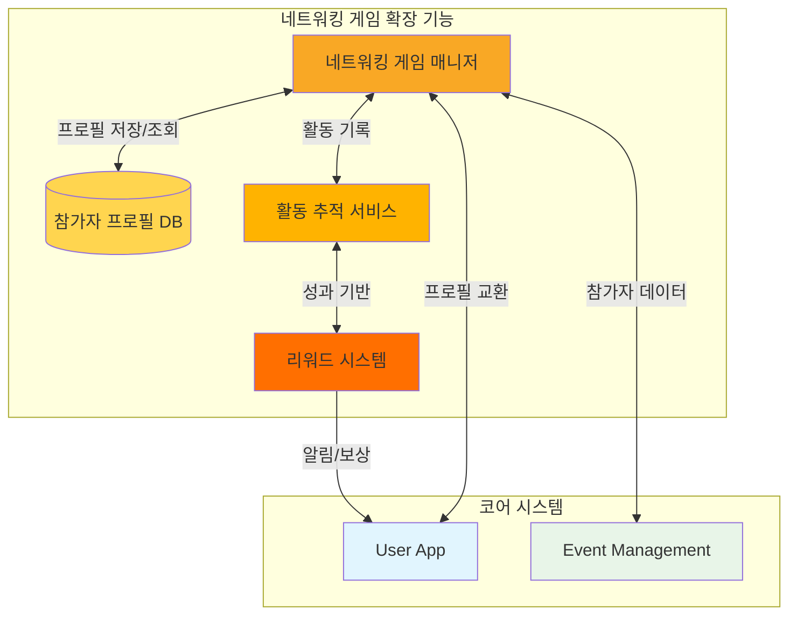
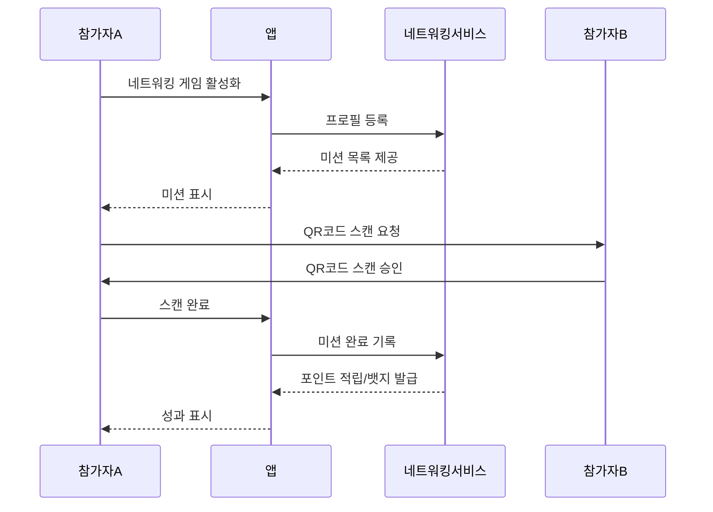
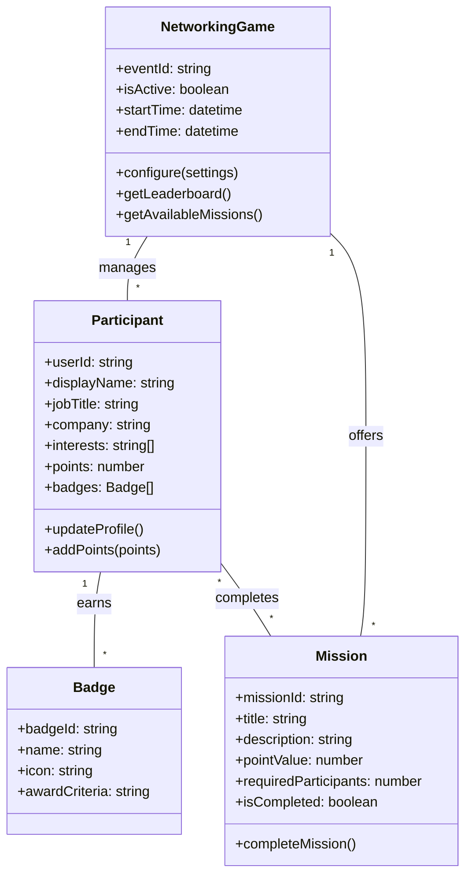
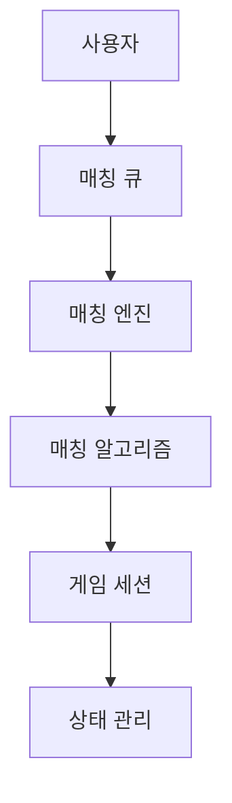
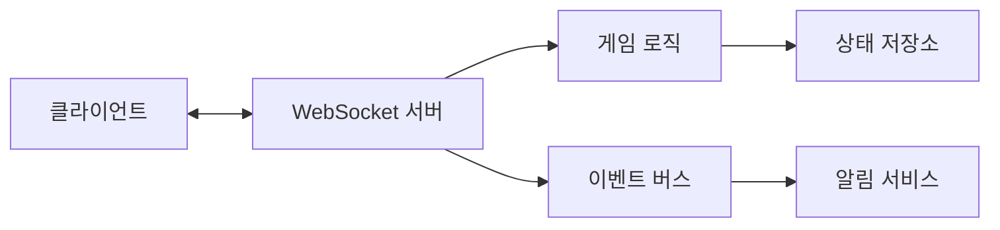
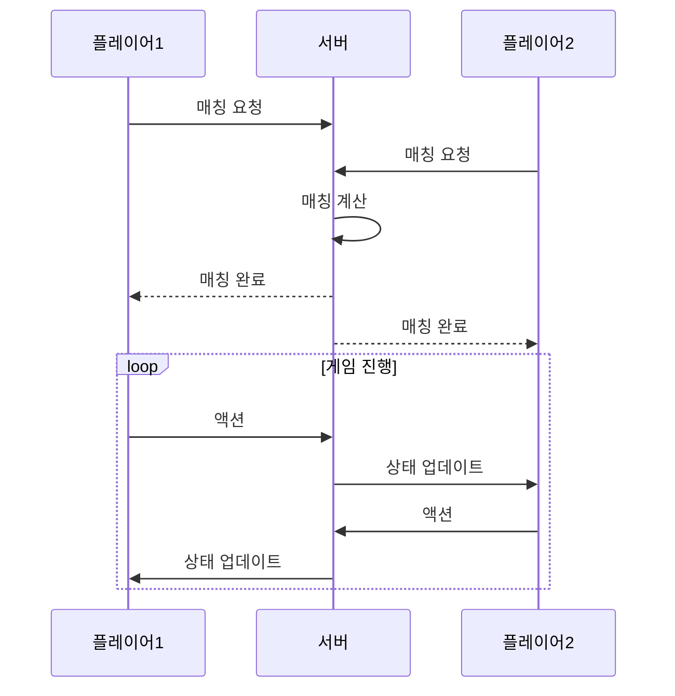
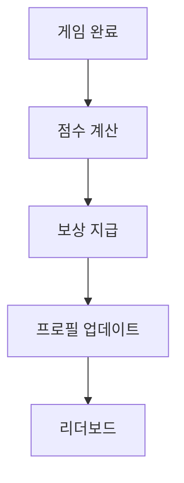
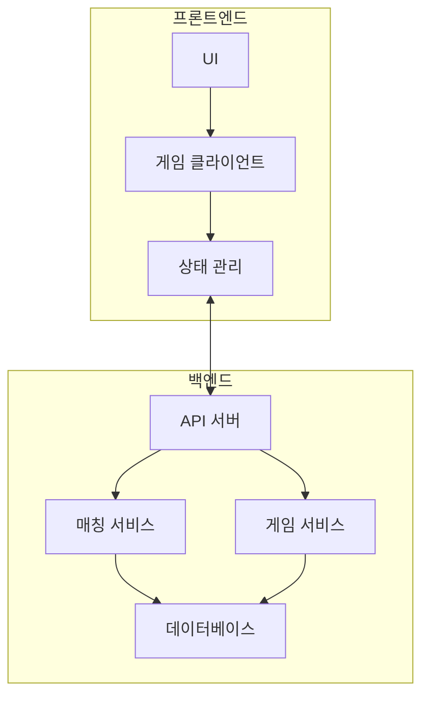

# 네트워킹 게임 다이어그램

## 🎯 시스템 구조

```mermaid
graph TB
    subgraph "네트워킹 게임 확장 기능"
        NGM[네트워킹 게임 매니저]
        PDB[(참가자 프로필 DB)]
        ACT[활동 추적 서비스]
        RWD[리워드 시스템]
    end
    
    subgraph "코어 시스템"
        UA[User App]
        EM[Event Management]
    end
    
    UA <-->|프로필 교환| NGM
    NGM <-->|참가자 데이터| EM
    NGM <-->|프로필 저장/조회| PDB
    NGM <-->|활동 기록| ACT
    ACT <-->|성과 기반| RWD
    RWD -->|알림/보상| UA
    
    style NGM fill:#f9a825
    style PDB fill:#ffd54f
    style ACT fill:#ffb300
    style RWD fill:#ff6f00
    style UA fill:#e1f5fe
    style EM fill:#e8f5e8
```

## 🎯 사용자 경험 흐름

```mermaid
sequenceDiagram
    participant 참가자A
    participant 앱
    participant 네트워킹서비스
    participant 참가자B
    
    참가자A->>앱: 네트워킹 게임 활성화
    앱->>네트워킹서비스: 프로필 등록
    네트워킹서비스-->>앱: 미션 목록 제공
    앱-->>참가자A: 미션 표시
    
    참가자A->>참가자B: QR코드 스캔 요청
    참가자B->>참가자A: QR코드 스캔 승인
    
    참가자A->>앱: 스캔 완료
    앱->>네트워킹서비스: 미션 완료 기록
    네트워킹서비스-->>앱: 포인트 적립/뱃지 발급
    앱-->>참가자A: 성과 표시
```

## 🎯 데이터 구조

```mermaid
classDiagram
    class NetworkingGame {
        +eventId: string
        +isActive: boolean
        +startTime: datetime
        +endTime: datetime
        +configure(settings)
        +getLeaderboard()
        +getAvailableMissions()
    }
    
    class Participant {
        +userId: string
        +displayName: string
        +jobTitle: string
        +company: string
        +interests: string[]
        +points: number
        +badges: Badge[]
        +updateProfile()
        +addPoints(points)
    }
    
    class Mission {
        +missionId: string
        +title: string
        +description: string
        +pointValue: number
        +requiredParticipants: number
        +isCompleted: boolean
        +completeMission()
    }
    
    class Badge {
        +badgeId: string
        +name: string
        +icon: string
        +awardCriteria: string
    }
    
    NetworkingGame "1" -- "*" Participant: manages
    NetworkingGame "1" -- "*" Mission: offers
    Participant "1" -- "*" Badge: earns
    Participant "*" -- "*" Mission: completes
```

# Networking Game 시스템 다이어그램

## 매칭 시스템 구조

```mermaid
graph TB
    A[사용자] --> B[매칭 큐]
    B --> C[매칭 엔진]
    C --> D[매칭 알고리즘]
    D --> E[게임 세션]
    E --> F[상태 관리]
```

## 실시간 통신 구조

```mermaid
graph LR
    A[클라이언트] <--> B[WebSocket 서버]
    B --> C[게임 로직]
    C --> D[상태 저장소]
    B --> E[이벤트 버스]
    E --> F[알림 서비스]
```

## 게임 세션 흐름

```mermaid
sequenceDiagram
    participant P1 as 플레이어1
    participant S as 서버
    participant P2 as 플레이어2
    
    P1->>S: 매칭 요청
    P2->>S: 매칭 요청
    S->>S: 매칭 계산
    S-->>P1: 매칭 완료
    S-->>P2: 매칭 완료
    loop 게임 진행
        P1->>S: 액션
        S->>P2: 상태 업데이트
        P2->>S: 액션
        S->>P1: 상태 업데이트
    end
```

## 점수/보상 시스템

```mermaid
graph TD
    A[게임 완료] --> B[점수 계산]
    B --> C[보상 지급]
    C --> D[프로필 업데이트]
    D --> E[리더보드]
```

## 시스템 아키텍처

```mermaid
graph TB
    subgraph 프론트엔드
        A[UI] --> B[게임 클라이언트]
        B --> C[상태 관리]
    end
    subgraph 백엔드
        D[API 서버] --> E[매칭 서비스]
        D --> F[게임 서비스]
        E & F --> G[데이터베이스]
    end
    C <--> D
```
