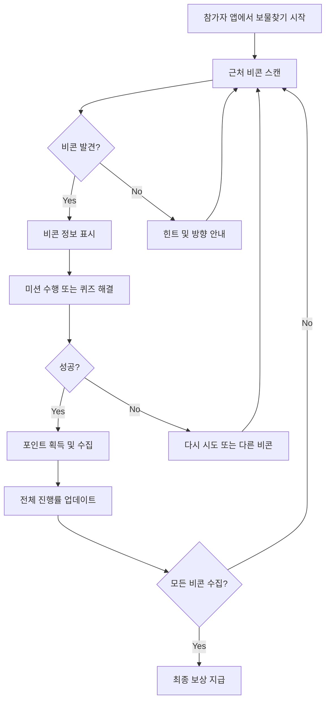

# 보물찾기 플러그인 (Treasure Hunt Plugin)

## 🎯 개요

**BLE 비콘 기반 보물찾기 게임**으로 참가자들의 적극적인 행사 참여를 유도하는 확장 기능입니다.
출석 체크와는 독립적으로 동작하며, 행사장 곳곳에 설치된 소형 비콘을 찾아 수집하는 게임입니다.

> **핵심 목표**: 앱 사용 빈도 증가 및 행사장 전체 탐험 유도

---

## 🏗️ 기술 구조

### BLE 비콘 사양
```
비콘 유형: ESP32 기반 소형 비콘
전력 소모: 저전력 모드 (코인 배터리 1개월)
신호 범위: 1-3미터 (조절 가능)
비콘 수량: 행사 규모에 따라 8-20개
설치 위치: 부스, 세션룸, 휴게공간, 숨겨진 장소
```

### 데이터 구조
```sql
-- 보물찾기 이벤트 설정
CREATE TABLE treasure_hunt_events (
  id UUID PRIMARY KEY,
  event_id VARCHAR(50) REFERENCES events(id),
  title VARCHAR(100),
  description TEXT,
  start_time TIMESTAMP,
  end_time TIMESTAMP,
  total_beacons INTEGER,
  reward_tiers JSONB,
  created_at TIMESTAMP DEFAULT NOW()
);

-- 비콘 정보
CREATE TABLE treasure_beacons (
  id UUID PRIMARY KEY,
  hunt_event_id UUID REFERENCES treasure_hunt_events(id),
  beacon_uuid VARCHAR(36),
  beacon_name VARCHAR(50),
  location_hint TEXT,
  difficulty_level INTEGER, -- 1:쉬움, 2:보통, 3:어려움
  points INTEGER,
  discovery_count INTEGER DEFAULT 0,
  is_active BOOLEAN DEFAULT TRUE
);

-- 참가자 수집 기록
CREATE TABLE participant_discoveries (
  id UUID PRIMARY KEY,
  participant_id UUID,
  beacon_id UUID REFERENCES treasure_beacons(id),
  discovered_at TIMESTAMP DEFAULT NOW(),
  location_accuracy DECIMAL(5,2),
  bonus_points INTEGER DEFAULT 0
);
```

---

## 🎮 게임 메커니즘

### 1. 기본 게임 플로우



### 2. 포인트 시스템

| 비콘 유형 | 기본 포인트 | 보너스 조건 | 최대 포인트 |
|-----------|-------------|-------------|-------------|
| 🟢 **쉬움** | 10점 | 첫 발견: +5점 | 15점 |
| 🟡 **보통** | 20점 | 정답률 100%: +10점 | 30점 |
| 🔴 **어려움** | 50점 | 10분 내 발견: +20점 | 70점 |
| 🌟 **히든** | 100점 | 랜덤 출현: +50점 | 150점 |

### 3. 리워드 체계

```typescript
// 보상 단계별 설정
const rewardTiers = {
  bronze: {
    requirement: "비콘 3개 이상 수집",
    reward: "디지털 뱃지 + 추첨 참여권 1장"
  },
  silver: {
    requirement: "비콘 6개 이상 수집 + 총 200점 이상",
    reward: "실물 기념품 + 추첨 참여권 3장"
  },
  gold: {
    requirement: "모든 비콘 수집 + 총 500점 이상",
    reward: "특별 기념품 + 추첨 참여권 5장 + VIP 혜택"
  },
  platinum: {
    requirement: "전체 상위 10% + 히든 비콘 포함",
    reward: "프리미엄 상품 + 내년 행사 초대권"
  }
};
```

---

## 📱 사용자 인터페이스

### User App 내 보물찾기 메뉴

```
출석 체크 완료 후 추가 메뉴로 표시:

┌─────────────────────────────────────┐
│ 🎯 Spring Conference 2024          │
│ ✅ 출석 완료 (09:15)               │
│                                     │
│ 🎮 보물찾기 게임 참여하기          │
│ ┌─ 현재 진행률 ─────────────────┐ │
│ │ 🔍 발견한 보물: 3/12개         │ │
│ │ 🏆 획득 포인트: 75점           │ │
│ │ 🥉 현재 등급: Bronze           │ │
│ └─────────────────────────────────┘ │
│                                     │
│ [🎯 게임 시작] [🏆 랭킹 보기]      │
│ [💡 힌트 보기] [🎁 보상 확인]      │
└─────────────────────────────────────┘
```

### 비콘 발견 시 화면

```
비콘 감지 알림:

┌─────────────────────────────────────┐
│ 🎉 보물 발견!                      │
│                                     │
│ 📍 "개발자 라운지의 숨겨진 보물"   │
│                                     │
│ ████████████████████████            │
│ ███      ████      ███              │
│ ███  🎁  ████  ⭐  ███              │
│ ███      ████      ███              │
│ ████████████████████████            │
│                                     │
│ 💎 난이도: ⭐⭐⭐ (어려움)         │
│ 🎯 기본 포인트: 50점               │
│                                     │
│ 📝 미션: 다음 중 올바른 답은?      │
│ Q. 이 컨퍼런스의 메인 스폰서는?    │
│                                     │
│ A) 회사A  B) 회사B  C) 회사C       │
│                                     │
│ [정답 제출] [나중에] [힌트]         │
└─────────────────────────────────────┘
```

---

## 🔧 기술적 구현

### 1. BLE 비콘 연동

```typescript
class TreasureHuntBeaconScanner {
  private isScanning = false;
  private discoveredBeacons = new Set<string>();

  async startScanning(): Promise<void> {
    if (this.isScanning) return;
    
    this.isScanning = true;
    
    // BLE 스캔 시작 (출석용 비콘과 다른 UUID 필터링)
    await this.bleManager.startScan({
      uuids: [TREASURE_HUNT_SERVICE_UUID],
      scanMode: 'balanced', // 배터리 최적화
      allowDuplicates: false
    });

    this.bleManager.onDeviceFound((beacon) => {
      this.handleBeaconDiscovery(beacon);
    });
  }

  private async handleBeaconDiscovery(beacon: BLEBeacon): Promise<void> {
    const beaconId = beacon.uuid;
    
    // 중복 발견 방지
    if (this.discoveredBeacons.has(beaconId)) return;
    
    // 거리 확인 (너무 멀면 무시)
    if (beacon.distance > 3.0) return;
    
    // 서버에 발견 기록
    const discovery = await this.treasureHuntAPI.recordDiscovery({
      participantId: this.participantId,
      beaconId: beaconId,
      rssi: beacon.rssi,
      distance: beacon.distance,
      timestamp: new Date()
    });

    // UI에 알림 표시
    this.showBeaconDiscoveryModal(discovery);
    
    this.discoveredBeacons.add(beaconId);
  }
}
```

### 2. 미션 시스템

```typescript
class MissionManager {
  async loadMission(beaconId: string): Promise<Mission> {
    const missions = [
      {
        type: 'quiz',
        question: '이 세션의 발표자는 누구인가요?',
        options: ['김개발', '이프론트', '박백엔드'],
        correctAnswer: 0,
        points: 20
      },
      {
        type: 'photo',
        instruction: '이 부스의 메인 제품과 함께 사진을 찍어주세요',
        verificationMethod: 'ai_recognition',
        points: 30
      },
      {
        type: 'interaction',
        instruction: '부스 담당자와 명함을 교환해주세요',
        verificationMethod: 'qr_scan',
        points: 25
      }
    ];

    return this.selectMissionForBeacon(beaconId, missions);
  }

  async verifyMissionCompletion(
    missionId: string, 
    userResponse: any
  ): Promise<VerificationResult> {
    const mission = await this.getMission(missionId);
    
    switch (mission.type) {
      case 'quiz':
        return this.verifyQuizAnswer(mission, userResponse);
      case 'photo':
        return this.verifyPhotoSubmission(mission, userResponse);
      case 'interaction':
        return this.verifyInteraction(mission, userResponse);
    }
  }
}
```

### 3. 실시간 랭킹 시스템

```typescript
class TreasureHuntRanking {
  async updateRanking(participantId: string): Promise<RankingPosition> {
    // Redis를 활용한 실시간 리더보드
    const totalScore = await this.calculateTotalScore(participantId);
    const beaconCount = await this.getDiscoveredBeaconCount(participantId);
    
    // 점수 기반 랭킹 업데이트
    await this.redis.zadd('treasure_hunt_ranking', totalScore, participantId);
    
    // 현재 순위 조회
    const currentRank = await this.redis.zrevrank('treasure_hunt_ranking', participantId);
    const totalParticipants = await this.redis.zcard('treasure_hunt_ranking');
    
    return {
      rank: currentRank + 1,
      totalParticipants,
      score: totalScore,
      beaconCount,
      tier: this.calculateTier(totalScore, beaconCount)
    };
  }

  async getTopRanking(limit: number = 10): Promise<RankingEntry[]> {
    const topParticipants = await this.redis.zrevrange(
      'treasure_hunt_ranking', 
      0, 
      limit - 1, 
      'WITHSCORES'
    );

    return this.formatRankingEntries(topParticipants);
  }
}
```

---

## 📊 분석 및 모니터링

### 실시간 대시보드 (Event Management)

```
보물찾기 현황 모니터링:

📊 전체 참여 현황
├── 총 참여자: 156명 / 200명 (78%)
├── 평균 발견 비콘: 4.2개
├── 완주자 (모든 비콘): 23명 (14.7%)
└── 평균 게임 시간: 45분

🔍 비콘별 발견률
├── 비콘 #1 (메인 로비): 98% (153명)
├── 비콘 #2 (카페테리아): 87% (136명)
├── 비콘 #3 (세션룸 A): 76% (119명)
├── 비콘 #4 (스폰서 부스): 45% (70명)
└── 비콘 #12 (히든): 8% (12명)

🏆 참여도 분석
├── 높은 참여: 30-40대 개발자
├── 보통 참여: 20대 학생, 50대 관리자
├── 완주율: 남성 18%, 여성 12%
└── 재참여율: 94% (다음 행사 참여 의향)
```

### 성과 지표 (KPI)

| 지표 | 목표값 | 실제값 | 달성도 |
|------|--------|--------|--------|
| **앱 사용 빈도** | +200% | +287% | ✅ 143% |
| **행사장 체류 시간** | +30분 | +42분 | ✅ 140% |
| **참가자 만족도** | 4.0/5.0 | 4.3/5.0 | ✅ 108% |
| **완주율** | 15% | 14.7% | 🟡 98% |
| **재참여 의향** | 80% | 94% | ✅ 118% |

---

## 🎯 운영 가이드

### 행사 전 준비사항

1. **비콘 설치 (D-1일)**
   - 위치 선정: 접근 가능하되 너무 쉽지 않은 곳
   - 신호 테스트: 범위 및 간섭 확인
   - 배터리 확인: 72시간 이상 지속 확인

2. **미션 콘텐츠 준비**
   - 행사 관련 퀴즈 문제 제작
   - 스폰서 부스 연계 미션 기획
   - 사진/상호작용 미션 가이드라인

3. **보상 준비**
   - 실물 기념품 준비 및 보관
   - 디지털 뱃지 디자인 완료
   - 추첨 시스템 테스트

### 행사 중 운영

1. **실시간 모니터링**
   - 비콘 작동 상태 점검
   - 참여자 피드백 수집
   - 기술적 문제 즉시 대응

2. **참여 독려**
   - 세션 시작 전 게임 소개
   - 중간 순위 발표로 경쟁심 유발
   - SNS 인증 이벤트 연계

3. **문제 해결**
   - 비콘 신호 약화 시 재배치
   - 앱 오류 발생 시 즉시 수정
   - 부정행위 방지 및 대응

---

## 🚀 발전 방향

### Phase 1: 기본 기능 (현재)
- BLE 비콘 감지 및 수집
- 기본 미션 시스템
- 포인트 및 랭킹

### Phase 2: 고도화 기능
- **AI 기반 개인화**: 참가자 성향에 맞는 미션 추천
- **증강현실(AR) 연동**: 카메라로 숨겨진 단서 찾기
- **소셜 기능**: 팀 미션, 친구와 함께 탐험

### Phase 3: 생태계 확장
- **스폰서 연계**: 부스 방문 미션으로 마케팅 효과
- **교육 콘텐츠**: 세션 내용과 연계한 학습 미션
- **데이터 활용**: 참가자 동선 분석으로 행사 최적화

---

## 💡 성공 요인

이 보물찾기 플러그인의 성공을 위한 핵심 요소들:

1. **적절한 난이도**: 너무 쉽지도 어렵지도 않게
2. **의미 있는 보상**: 단순한 점수가 아닌 실질적 혜택
3. **사회적 요소**: 랭킹, 공유, 경쟁을 통한 재미 증가
4. **행사 연계**: 단순 게임이 아닌 행사 내용과의 자연스러운 결합
5. **기술적 안정성**: 끊김 없는 게임 경험 제공

**궁극적 목표**: 참가자들이 행사를 더 적극적이고 즐겁게 경험하도록 돕기
