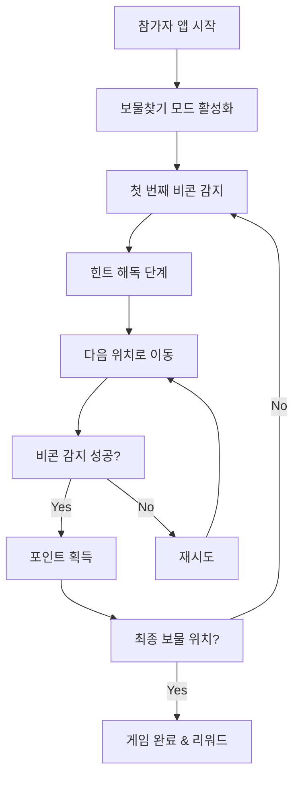
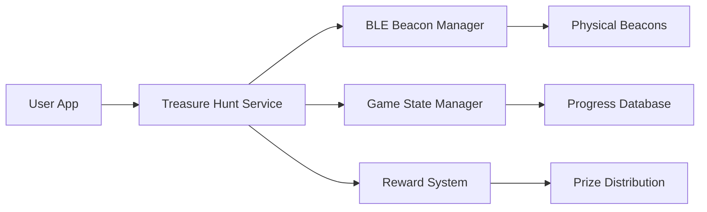
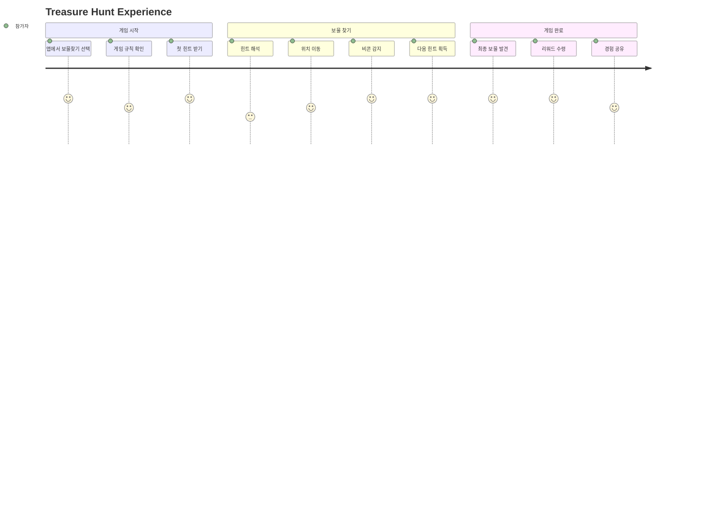
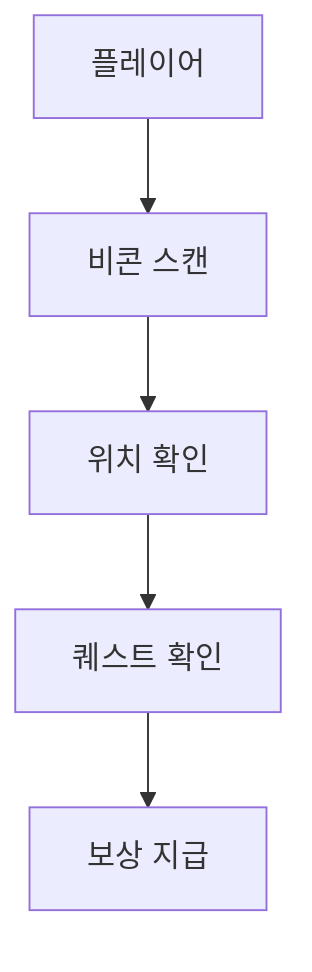
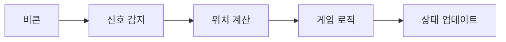
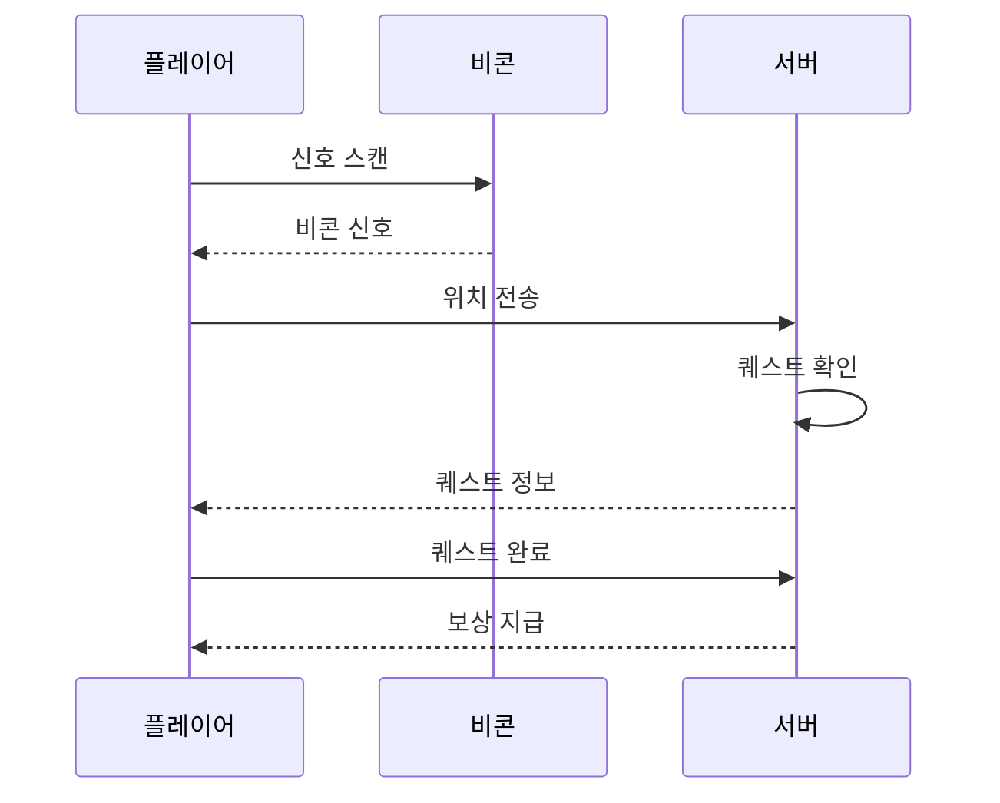
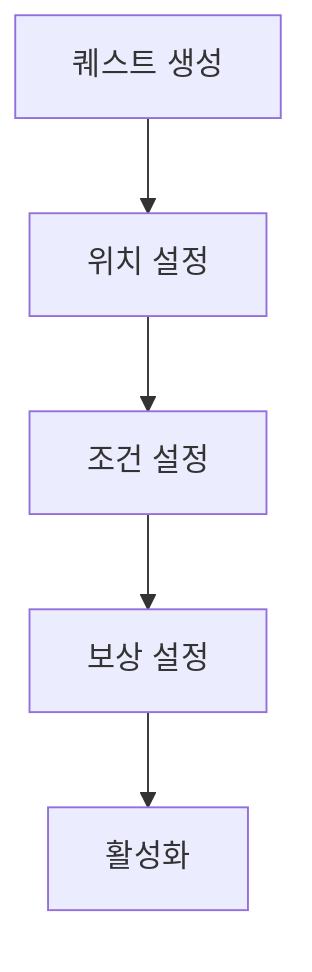
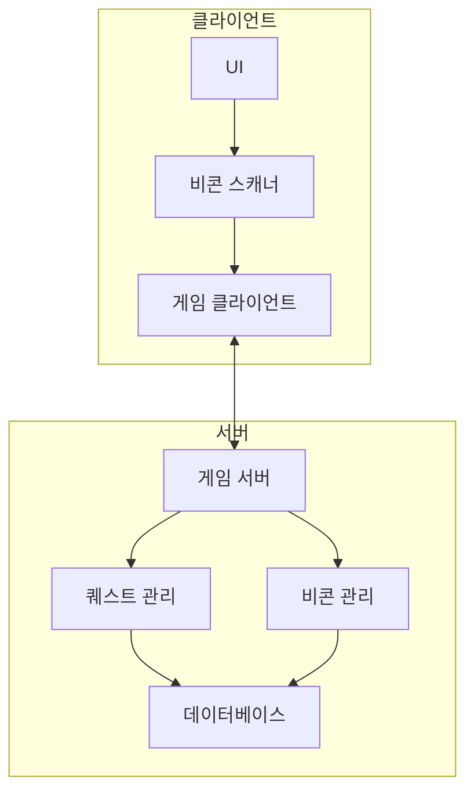

# Treasure Hunt - Visual Diagrams

## Game Flow Diagram

```mermaid
graph TD
    A[참가자 앱 시작] --> B[보물찾기 모드 활성화]
    B --> C[첫 번째 비콘 감지]
    C --> D[힌트 해독 단계]
    D --> E[다음 위치로 이동]
    E --> F[비콘 감지 성공?]
    F -->|Yes| G[포인트 획득]
    F -->|No| H[재시도]
    H --> E
    G --> I[최종 보물 위치?]
    I -->|No| C
    I -->|Yes| J[게임 완료 & 리워드]
```

## System Architecture

```mermaid
graph LR
    A[User App] --> B[Treasure Hunt Service]
    B --> C[BLE Beacon Manager]
    B --> D[Game State Manager]
    B --> E[Reward System]
    C --> F[Physical Beacons]
    D --> G[Progress Database]
    E --> H[Prize Distribution]
```

## User Journey

```mermaid
journey
    title Treasure Hunt Experience
    section 게임 시작
      앱에서 보물찾기 선택: 5: 참가자
      게임 규칙 확인: 4: 참가자
      첫 힌트 받기: 5: 참가자
    section 보물 찾기
      힌트 해석: 3: 참가자
      위치 이동: 4: 참가자
      비콘 감지: 5: 참가자
      다음 힌트 획득: 5: 참가자
    section 게임 완료
      최종 보물 발견: 5: 참가자
      리워드 수령: 5: 참가자
      경험 공유: 4: 참가자
```

# Treasure Hunt 시스템 다이어그램

## 게임 구조

```mermaid
graph TB
    A[플레이어] --> B[비콘 스캔]
    B --> C[위치 확인]
    C --> D[퀘스트 확인]
    D --> E[보상 지급]
```

## 비콘 시스템

```mermaid
graph LR
    A[비콘] --> B[신호 감지]
    B --> C[위치 계산]
    C --> D[게임 로직]
    D --> E[상태 업데이트]
```

## 게임 플로우

```mermaid
sequenceDiagram
    participant P as 플레이어
    participant B as 비콘
    participant S as 서버
    
    P->>B: 신호 스캔
    B-->>P: 비콘 신호
    P->>S: 위치 전송
    S->>S: 퀘스트 확인
    S-->>P: 퀘스트 정보
    P->>S: 퀘스트 완료
    S-->>P: 보상 지급
```

## 퀘스트 시스템

```mermaid
graph TD
    A[퀘스트 생성] --> B[위치 설정]
    B --> C[조건 설정]
    C --> D[보상 설정]
    D --> E[활성화]
```

## 시스템 아키텍처

```mermaid
graph TB
    subgraph 클라이언트
        A[UI] --> B[비콘 스캐너]
        B --> C[게임 클라이언트]
    end
    subgraph 서버
        D[게임 서버] --> E[퀘스트 관리]
        D --> F[비콘 관리]
        E & F --> G[데이터베이스]
    end
    C <--> D
```
