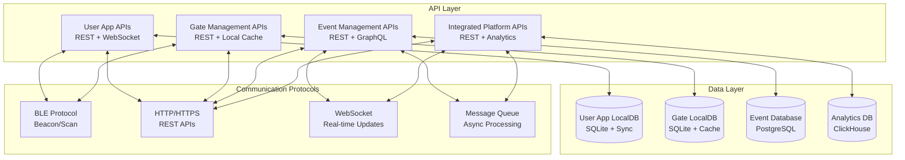
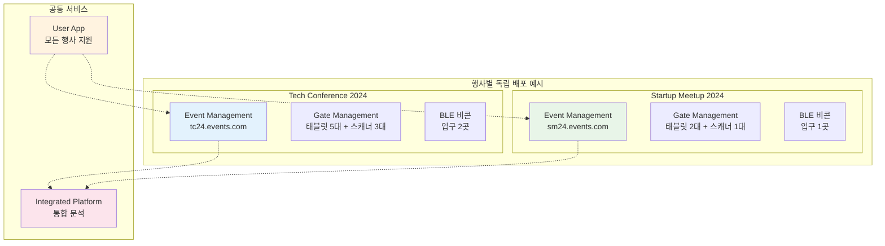
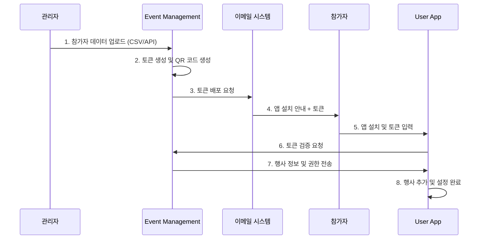
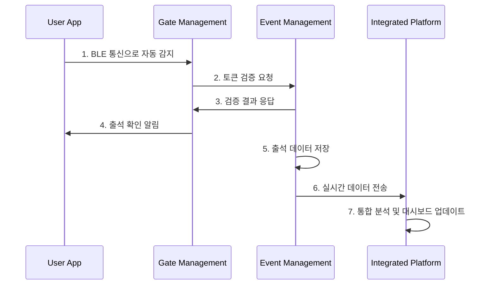
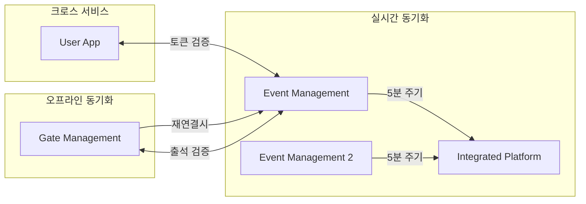
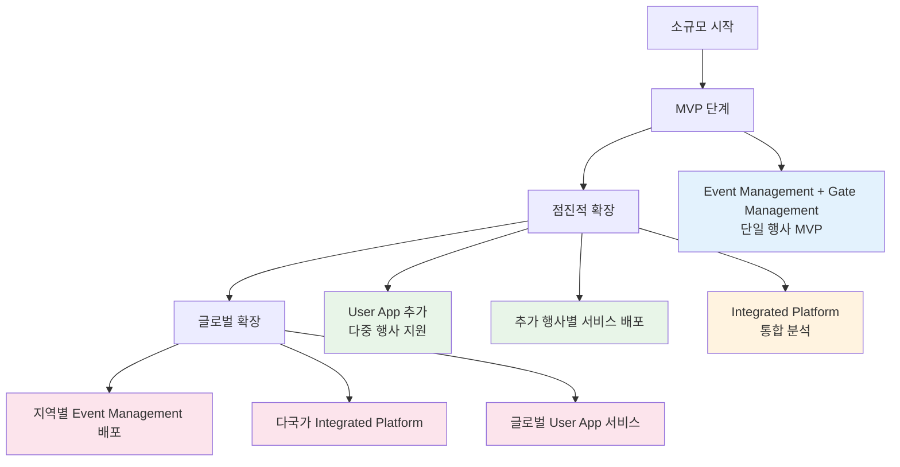
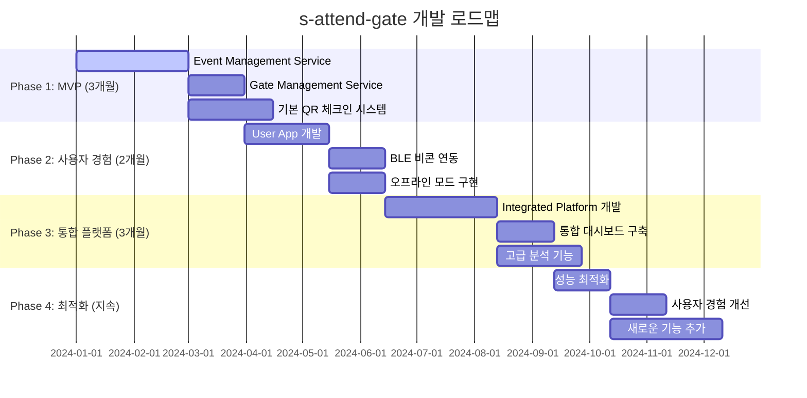

# 시스템 시나리오 (Technical API/ABI Focus)

## 🎯 개요

s-attend-gate 시스템의 **기술적 구현과 API/ABI 인터페이스**에 집중한 시나리오 모음입니다.
사용자 경험은 [user-scenarios](../user-scenarios/)에서 다루며, 여기서는 순수한 기술적 구현과 서비스 간 통신에 초점을 맞춥니다.

## 🏗️ 시스템 아키텍처 (Technical Focus)

4개 독립 서비스의 기술적 구조와 API 인터페이스:



---

## 📋 시나리오 카테고리

### 🔧 [Core APIs & Services](./core-apis/)
- Event Management Service API 명세
- Gate Management Service API 명세  
- User App Client API 명세
- Integrated Platform API 명세

### 🔗 [Inter-Service Communication](./communication/)
- API Gateway 패턴
- Message Queue 구조
- Real-time Sync Protocols
- Error Handling & Retry Logic

### 💾 [Data Architecture](./data-architecture/)
- Database Schema Design
- Data Synchronization Patterns
- Cache Strategies
- Backup & Recovery

### 🔒 [Security & Authentication](./security/)
- JWT Token Management
- API Rate Limiting
- Data Encryption
- Security Audit Logs

### 📊 [Performance & Monitoring](./performance/)
- System Metrics Collection
- Load Testing Scenarios
- Performance Optimization
- Alert & Monitoring

### 🚀 [Deployment & DevOps](./deployment/)
- CI/CD Pipeline Design
- Container Orchestration
- Environment Management
- Rolling Update Strategies

### 데이터 구조
```json
{
  "user": { "userId": "...", "profile": {...} },
  "events": [
    {
      "eventId": "tech-conference-2024",
      "token": "TCF24-ABCD-1234",
      "serverEndpoint": "https://tc24.events.com/api",
      "attendance": { "checkedIn": true, "time": "..." }
    }
  ]
}
```

## 🚪 Gate Management (단일 행사 특화)

### 핵심 특징
- **특정 행사만을 위한 전용 시스템**
- **현장 최적화된 태블릿 UI**
- **실시간 출석 처리 및 검증**
- **오프라인 모드 필수 지원**

### 주요 구성 요소
```
현장 도구:
├── Gate Admin Tablet App
│   ├── 터치 최적화 UI
│   ├── 참가자 지원
│   └── 실시간 모니터링
├── QR Scanner Device
│   ├── 고성능 스캔
│   ├── 자동 처리
│   └── 대량 처리 지원
└── BLE Beacon System
    ├── User App 연동
    ├── 자동 감지
    └── 근접 기반 체크인
```

### 배포 특징



## 📊 Event Management (단일 행사 백엔드)

### 핵심 특징
- **행사별 독립 서버 배포**
- **참가자 데이터 중앙 관리**
- **토큰 생성 및 검증 시스템**
- **실시간 출석 데이터 수집**

### 주요 기능
```
데이터 관리:
├── CSV/API 참가자 업로드
├── 외부 시스템 동기화
├── 참가자 정보 관리
└── 데이터 검증 및 정제

토큰 시스템:
├── 참가자별 고유 토큰 생성
├── QR 코드 자동 생성
├── 실시간 토큰 검증
└── 권한 관리

실시간 추적:
├── Gate Management 연동
├── 출석 데이터 수집
├── 중복 방지 및 검증
└── 실시간 통계 업데이트
```

### API 엔드포인트 예시
```
POST /api/participants/bulk-upload    # 참가자 대량 등록
POST /api/tokens/verify              # 토큰 검증
POST /api/attendance/checkin         # 출석 체크
GET  /api/analytics/realtime         # 실시간 현황
```

## 🌐 Integrated Platform (다중 행사 통합)

### 핵심 특징
- **여러 Event Management Service 통합**
- **크로스 이벤트 분석 및 인사이트**
- **외부 시스템 통합 API 허브**
- **경영진용 통합 대시보드**

### 주요 기능
```
통합 관리:
├── 다중 행사 실시간 모니터링
├── 통합 대시보드 (웹/모바일)
├── 행사별 성과 비교
└── 전체 현황 한눈에 보기

고급 분석:
├── 크로스 이벤트 패턴 분석
├── 참가자 행동 분석 (익명화)
├── 예측 모델링
└── ROI 분석 및 최적화

API 허브:
├── 외부 시스템 통합 API
├── 써드파티 연동 (Zapier 등)
├── 웹훅 기반 실시간 이벤트
└── 개발자 API 플랫폼
```

### 플랫폼 구조
```
외부 연동:
├── CRM 시스템 ◄────┐
├── 마케팅 도구 ◄───┤
├── 회계 시스템 ◄───┼── API Gateway
├── BI 도구 ◄───────┤
└── 자동화 도구 ◄───┘

데이터 분석:
├── 실시간 스트리밍 처리
├── 배치 분석 (야간)
├── 머신러닝 모델
└── 예측 분석 엔진
```

## 🔄 서비스 간 연동 흐름

### 참가자 온보딩 프로세스



### 실시간 출석 체크 프로세스



### 데이터 동기화 흐름



## 🎯 독립성과 연동의 균형

### 완전한 독립성
- **Event Management**: 행사별 완전 분리
- **Gate Management**: 행사별 독립 배포
- **장애 격리**: 한 행사 문제가 다른 행사에 영향 없음

### 유연한 연동
- **User App**: 다중 행사 통합 경험
- **Integrated Platform**: 전사적 인사이트
- **API 기반**: 느슨한 결합으로 유연성 확보

### 확장 전략



## 🚀 구현 우선순위



### Phase 1: MVP (3개월)
- Event Management Service 개발
- Gate Management Service (태블릿 앱)
- 기본 QR 체크인 시스템

### Phase 2: 사용자 경험 (2개월)
- User App 개발 (다중 행사 지원)
- BLE 비콘 연동
- 오프라인 모드 구현

### Phase 3: 통합 플랫폼 (3개월)
- Integrated Platform 개발
- 통합 대시보드 구축
- 고급 분석 기능

### Phase 4: 최적화 (지속)
- 성능 최적화
- 사용자 경험 개선
- 새로운 기능 추가

이 아키텍처는 각 서비스의 독립성을 보장하면서도 전체 시스템으로서의 시너지를 만들어내는 균형잡힌 설계입니다.
