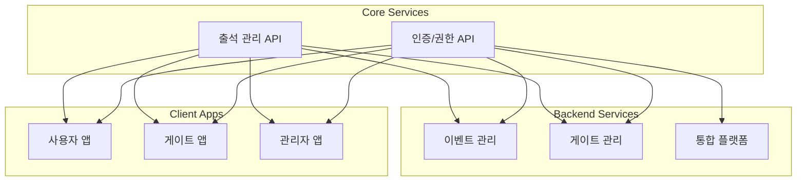

# Core APIs & Services

## 📌 개요

s-attend-gate 시스템의 핵심 API들과 서비스 간 인터페이스를 정의합니다.
각 서비스는 RESTful API와 특화된 프로토콜을 통해 통신하며, 명확한 계약을 통해 독립적으로 개발됩니다.

## 📑 서비스 구성

### [🔐 인증 및 권한 관리](./auth/)
- 사용자 인증 및 세션 관리
- 역할 기반 접근 제어(RBAC)
- 다중 인증(MFA)
- 권한 위임

### [📝 출석 관리](./attendance/)
- BLE 자동 출석
- QR 코드 출석
- 수동 출석 처리
- 실시간 추적

## 🔄 시스템 통합도

