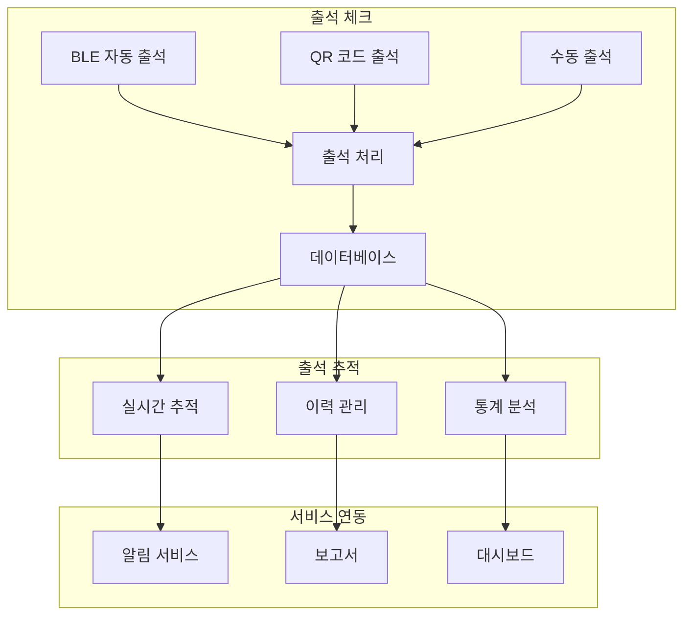

# 출석 관리 API

## 📌 개요

s-attend-gate 시스템의 출석 체크 및 추적을 위한 API 집합입니다.
BLE 비콘, QR 코드, 수동 출석 등 다양한 출석 방식을 지원하며, 실시간 추적과 통계 분석 기능을 제공합니다.

## 📑 API 목록

### [출석 체크 API](./attendance-check-api.md)
- BLE 자동 출석 처리
- QR 코드 출석 처리
- 수동 출석 등록
- 오프라인 동기화

### [출석 추적 API](./attendance-tracking-api.md)
- 실시간 현황 조회
- 출석 이력 관리
- 통계 분석
- 데이터 집계

## 🔗 시스템 구성도

## 📊 성능 지표

| API 영역 | 응답 시간 | 처리량 | 정확도 |
|---------|-----------|--------|---------|
| 출석 체크 | < 300ms | 100/s | 99.9% |
| 현황 조회 | < 200ms | 500/s | 100% |
| 통계 분석 | < 2s | 10/s | 99.99% |

## ⚡ 주요 기능

- 다중 출석 방식 지원
- 실시간 데이터 동기화
- 오프라인 작동 보장
- 상세 통계 및 분석

## 📚 관련 문서
- [출석 처리 아키텍처](../../architecture/attendance-architecture.md)
- [데이터 모델](../../data/attendance-data-model.md)
- [동기화 전략](../../sync/attendance-sync-strategy.md)
