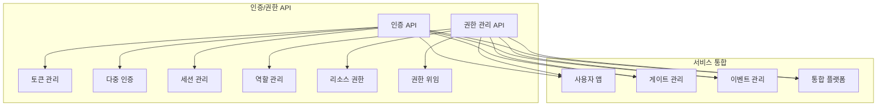

# 인증 및 권한 관리 API

## 📌 개요

s-attend-gate 시스템의 사용자 인증, 권한 부여, 토큰 관리를 위한 API 집합입니다.
모든 서비스에서 공통으로 사용되는 인증 및 권한 부여 기능을 제공합니다.

## 📑 API 목록

### [인증 API](./authentication-api.md)
- 사용자 로그인/로그아웃
- 토큰 발급 및 갱신
- 세션 관리
- Multi-Factor 인증 

### [권한 관리 API](./authorization-api.md)
- 역할 기반 접근 제어(RBAC)
- 리소스 권한 관리
- 권한 위임 및 공유
- 접근 토큰 검증

## 🔗 통합 지점

## 📊 성능 지표

| API 영역 | 응답 시간 | 처리량 | 가용성 |
|---------|-----------|--------|---------|
| 인증 API | < 200ms | 500 req/s | 99.99% |
| 권한 관리 API | < 100ms | 1000 req/s | 99.99% |

## 🔐 보안 요구사항

- TLS 1.3 필수
- OAuth 2.0 + OIDC 구현
- JWT 기반 토큰 관리
- Rate Limiting 적용

## 📚 관련 문서
- [시스템 보안 정책](../../security/security-policies.md)
- [API 보안 가이드라인](../../security/api-security-guidelines.md)
- [통합 인증 아키텍처](../../architecture/auth-architecture.md)
