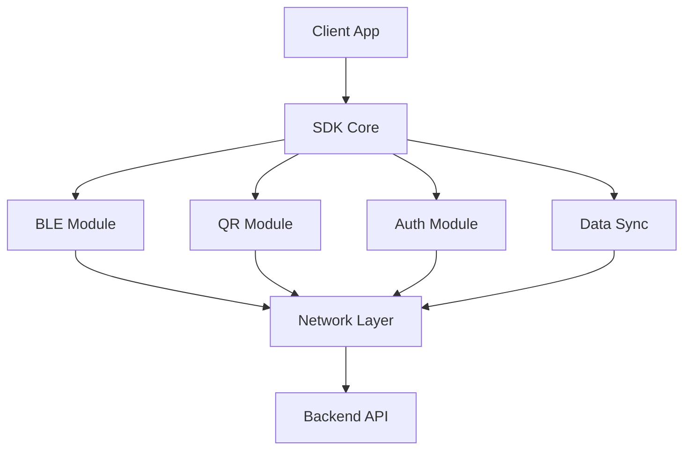

# Event Management - Client SDK

## 클라이언트 SDK 사양

클라이언트 앱에서 사용할 수 있는 SDK의 기술 사양과 구현 세부사항을 정의합니다.

### 목차
- [출석 체크 구현 사양](./attendance/implementation.md)
- [API 사양](./attendance/api.md)
- [권한 및 보안](./auth/authentication.md)

## SDK 아키텍처

## 주요 모듈

### Core Module
- API 클라이언트
- 설정 관리
- 에러 처리
- 로깅

### BLE Module
- BLE 스캔
- 신호 강도 분석
- 입/출장 판별

### QR Module
- QR 코드 생성
- QR 코드 스캔
- 데이터 검증

### Auth Module
- 토큰 관리
- 인증 상태 관리
- 보안 정책 적용

### Data Sync
- 오프라인 데이터 관리
- 동기화 정책
- 충돌 해결

## 📌 참고
- [출석 체크 구현](./attendance/implementation.md)
- [인증 API](./auth/authentication.md)
- [데이터 동기화](../data/sync.md)
