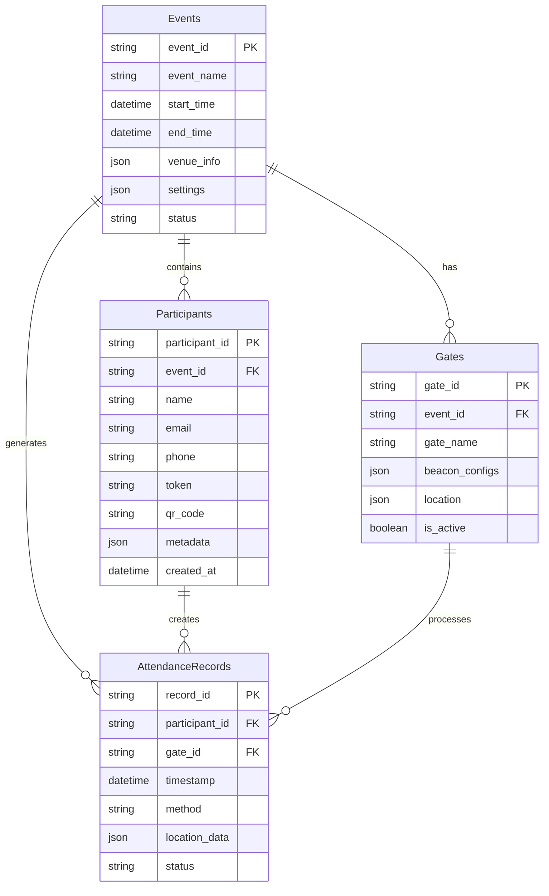
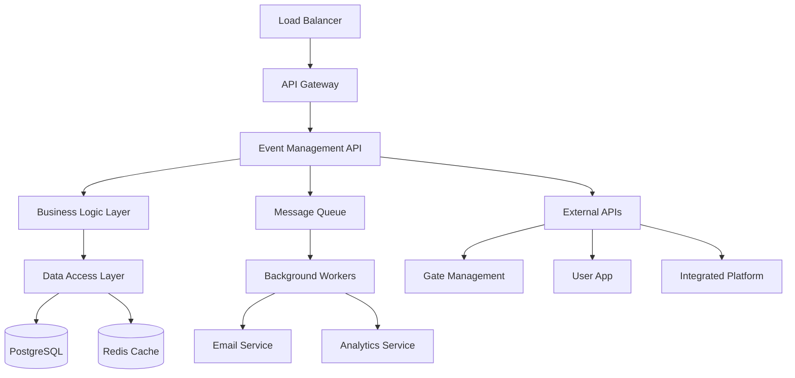

# Event Management Service

이벤트 관리 시스템의 기술적 시나리오와 구현 사양을 포함하는 디렉토리입니다.

## 🎯 서비스 정의

**Event Management Service**는 단일 행사의 데이터 관리와 운영을 담당하는 백엔드 서비스입니다.
**행사별 독립 배포**를 통해 각 행사만의 전용 시스템으로 운영되며, 고가용성과 확장성을 제공합니다.

## 📁 디렉토리 구조

### 핵심 컴포넌트 (core/)
- **data/** - 데이터 관리 시나리오
  - 참가자 데이터 관리
  - 이벤트 데이터 통합
  - 데이터 백업 및 복구
- **lifecycle/** - 이벤트 라이프사이클 관리
  - 이벤트 생성 및 설정
  - 진행 단계 관리
  - 종료 및 아카이브
- **performance/** - 성능 및 확장성 관리
  - 시스템 성능 모니터링
  - 부하 분산 전략
  - 확장성 계획

### 추적 시스템 (tracking/)
- **attendance/** - 출석 추적 시스템
  - API 사양
  - 실시간 처리
  - 시스템 통합
- **monitoring/** - 실시간 모니터링
  - 모니터링 구현
  - 성능 측정
  - 알림 시스템

### 분석 (analytics/)
- 이벤트 데이터 분석
- 성과 지표 및 보고서
- 실시간 통계

### 참가자 관리 (participants/)
- 참가자 데이터 관리
- 출석 상태 추적
- 참가자 그룹화

## 🔗 관련 문서
- [시스템 시나리오 개요](../../README.md)
- [사용자 시나리오](../../../user-scenarios/event-management/README.md)
- [통합 플랫폼](../../integrated-platform/README.md)

## 🏗️ 기술 아키텍처

### 백엔드 기술 스택
```
API Framework: Node.js (Express/Fastify) | Python (FastAPI) | Go (Gin)
데이터베이스: PostgreSQL (주) + Redis (캐시)
메시징: Redis Pub/Sub | Apache Kafka
인증: JWT + OAuth 2.0
모니터링: Prometheus + Grafana
```

### 데이터베이스 설계


### 시스템 구성


## 📋 주요 기능

### 참가자 데이터 관리
- CSV/API를 통한 대량 참가자 등록
- 참가자 정보 수정 및 관리
- 외부 시스템과의 실시간 동기화

### 토큰 및 인증 시스템
- 참가자별 고유 토큰 생성
- QR 코드 자동 생성
- 토큰 검증 및 권한 관리

### 실시간 출석 추적
- Gate Management로부터 출석 데이터 수신
- 실시간 출석 현황 통계
- 중복 출석 방지 및 검증

### 분석 및 리포팅
- 출석 패턴 분석
- 실시간 대시보드 데이터 제공
- 행사 종료 후 최종 보고서 생성

## 🔗 연동 서비스

### User App
- 참가자 토큰 검증
- 행사 정보 제공
- 출석 기록 동기화

### Gate Management  
- 실시간 토큰 검증
- 출석 데이터 수신
- 오프라인 데이터 동기화

### Integrated Platform
- 통합 분석을 위한 데이터 제공
- 크로스 이벤트 인사이트 공유

### 외부 시스템
- 등록 시스템 (Eventbrite, 자체 시스템)
- CRM 시스템
- 이메일 발송 서비스

## 📊 데이터 구조

### 참가자 정보
```json
{
  "participant": {
    "id": "P001",
    "email": "john@example.com",
    "name": "John Doe",
    "organization": "Tech Corp",
    "registrationDate": "2024-01-15T10:00:00Z",
    "token": "TCF24-ABCD-1234-EFGH",
    "permissions": ["attendance", "session-access"],
    "status": "registered"
  }
}
```

### 출석 기록
```json
{
  "attendanceRecord": {
    "id": "ATT001",
    "participantId": "P001", 
    "gateId": "main-entrance",
    "checkinTime": "2024-01-20T09:30:00Z",
    "method": "qr_scan",
    "deviceId": "tablet-001",
    "verified": true
  }
}
```

### 행사 설정
```json
{
  "eventConfig": {
    "eventId": "tech-conference-2024",
    "eventName": "Tech Conference 2024",
    "startDate": "2024-01-20T09:00:00Z",
    "endDate": "2024-01-20T18:00:00Z",
    "venue": "Seoul Convention Center",
    "gates": ["main-entrance", "side-entrance"],
    "settings": {
      "allowMultipleCheckins": false,
      "offlineMode": true
    }
  }
}
```

## 🎯 핵심 시나리오

1. **[참가자 데이터 업로드 시나리오](./event-management-scenarios.md#데이터-관리-시나리오)**
   - CSV 파일 대량 업로드
   - API를 통한 실시간 등록

2. **[토큰 생성 및 배포 시나리오](./event-management-scenarios.md#토큰-및-인증-시나리오)**
   - 참가자별 고유 토큰 발급
   - QR 코드 생성 및 이메일 발송

3. **[실시간 출석 추적 시나리오](./event-management-scenarios.md#실시간-모니터링-시나리오)**
   - Gate Management로부터 데이터 수신
   - 실시간 통계 업데이트

4. **[외부 시스템 연동 시나리오](./event-management-scenarios.md#외부-서비스-연동-시나리오)**
   - User App 다중 행사 지원
   - Integrated Platform 데이터 제공

## 🔧 기술 스택 권장사항

### 백엔드 프레임워크
- **Node.js** + Express/Fastify
- **Python** + FastAPI/Django  
- **Go** + Gin/Echo
- **Java** + Spring Boot

### 데이터베이스
- **PostgreSQL**: 주 데이터베이스
- **Redis**: 캐시 및 세션 관리
- **MongoDB**: 문서 기반 데이터 (선택사항)

### API 및 통신
- **REST API**: 표준 HTTP API
- **WebSocket**: 실시간 통신
- **GraphQL**: 복잡한 쿼리 지원 (선택사항)

### 클라우드 서비스
- **AWS/Azure/GCP**: 서버 인프라
- **Docker**: 컨테이너화
- **Kubernetes**: 오케스트레이션

## 📈 성능 요구사항

### 처리량
- 동시 사용자: 1,000명
- API 응답시간: 200ms 이하
- 출석 처리: 100건/분

### 가용성
- 시스템 가동률: 99.9%
- 데이터 백업: 실시간
- 장애 복구: 5분 이내

### 확장성
- 수평적 확장 지원
- 로드 밸런싱
- 자동 스케일링

## 🏢 배포 아키텍처

### 행사별 독립 배포
```
Production 환경:
├── tech-conference-2024.events.com
│   ├── Event Management Service
│   ├── PostgreSQL Database
│   └── Redis Cache
├── startup-meetup-2024.events.com  
│   ├── Event Management Service
│   ├── PostgreSQL Database
│   └── Redis Cache
└── design-workshop-2024.events.com
    ├── Event Management Service
    ├── PostgreSQL Database
    └── Redis Cache
```

### 공통 인프라
- **DNS 관리**: 행사별 서브도메인
- **SSL 인증서**: 자동 갱신
- **모니터링**: 통합 로그 및 메트릭
- **백업**: 중앙집중식 백업 시스템

## 📊 모니터링 및 분석

### 핵심 지표
- **출석률**: 실시간 및 누적
- **API 성능**: 응답시간, 에러율
- **시스템 리소스**: CPU, 메모리, 디스크
- **비즈니스 메트릭**: 참가자 만족도, 운영 효율성

### 알림 시스템
- **임계치 기반 알림**: 성능 저하 시
- **비즈니스 알림**: 출석률 목표 달성
- **장애 알림**: 시스템 오류 발생

## 🚀 개발 로드맵

### Phase 1: 핵심 기능
- 참가자 데이터 관리
- 토큰 생성 및 검증
- 기본 API 구현

### Phase 2: 연동 기능
- Gate Management 연동
- User App 연동
- 실시간 출석 처리

### Phase 3: 고급 기능
- 외부 시스템 연동
- 오프라인 모드 지원
- 고급 분석 기능

### Phase 4: 최적화
- 성능 최적화
- 보안 강화
- 운영 자동화

## 🔒 보안 고려사항

### 데이터 보호
- **개인정보 암호화**: AES-256
- **통신 암호화**: TLS 1.3
- **데이터베이스 암호화**: 저장 시 암호화

### 접근 제어
- **API 키 관리**: 서비스별 인증
- **역할 기반 권한**: 관리자 레벨별 접근
- **토큰 관리**: JWT 기반 인증

### 규정 준수
- **GDPR**: EU 개인정보보호 규정
- **개인정보보호법**: 국내 법규 준수
- **보안 감사**: 정기적인 보안 점검

이 Event Management Service는 단일 행사에 특화되어 최적의 성능과 안정성을 제공하면서도, 다른 서비스들과의 유연한 연동을 통해 전체 시스템의 핵심 역할을 담당합니다.
