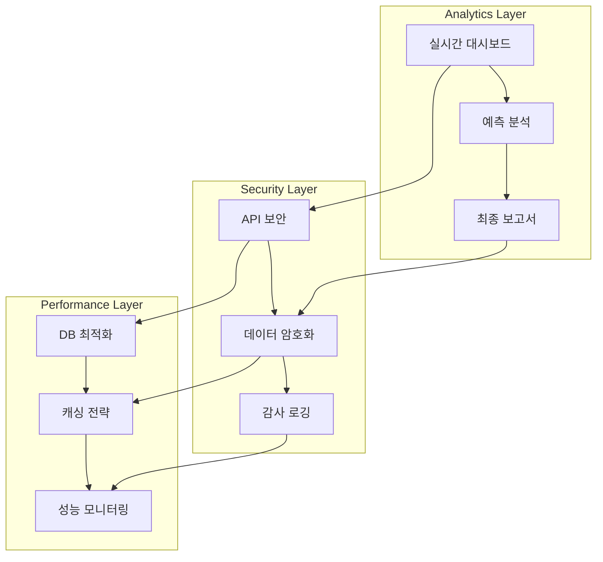

# Event Management 분석 리포팅 및 보안 시나리오 - 개요

## 📋 시나리오 개요

Event Management 시스템의 데이터 분석, 리포팅 생성, 보안 및 성능 최적화를 다룹니다.
시스템 규모가 커짐에 따라 기능별로 전문화된 파일로 분리하여 관리합니다.

> **분할 기록**: 2025년 7월 9일 - 967 라인에서 3개의 전문화된 파일로 분리  
> **백업 파일**: `analytics-reporting-old.md`에 원본 보존

---

## 🗂️ 분할된 시나리오 파일 구조

### 1. 📊 [분석 및 리포팅](./analytics-reporting-analytics.md)
**실시간 대시보드와 최종 보고서 생성**
- 실시간 대시보드 데이터 API
- 행사 종료 후 최종 보고서 생성
- 예측 분석 및 인사이트 제공

### 2. 🔒 [보안 및 데이터 보호](./analytics-reporting-security.md)  
**API 보안과 개인정보 보호**
- JWT 기반 API 보안 및 OAuth 2.0
- 데이터 암호화 및 익명화
- 감사 로깅 및 보안 모니터링

### 3. 🚀 [성능 최적화](./analytics-reporting-performance.md)
**시스템 성능 최적화와 모니터링**
- 데이터베이스 최적화 및 인덱싱
- 계층적 캐싱 전략
- 성능 모니터링 및 부하 분산

---

## 🔗 시스템 아키텍처 다이어그램

---

## 📊 주요 성능 지표 요약

| 영역 | 지표 | 목표 | 현재 상태 |
|------|------|------|----------|
| **분석** | 대시보드 로딩 | < 500ms | [📊 상세 보기](./analytics-reporting-analytics.md#메트릭-및-성능-지표) |
| **보안** | API 보안 검증 | 100% | [🔒 상세 보기](./analytics-reporting-security.md#메트릭-및-성능-지표) |
| **성능** | 캐시 히트율 | > 90% | [🚀 상세 보기](./analytics-reporting-performance.md#메트릭-및-성능-지표) |

---

## 📊 분석 및 리포팅 시나리오 (요약)

### 주요 기능
1. **실시간 대시보드**: WebSocket 기반 실시간 업데이트  
   ➜ [전체 구현 보기](./analytics-reporting-analytics.md#1-실시간-대시보드-데이터)

2. **최종 보고서**: PDF 자동 생성 및 아카이브  
   ➜ [전체 구현 보기](./analytics-reporting-analytics.md#2-행사-종료-후-최종-보고서)

3. **예측 분석**: 머신러닝 기반 출석률 예측  
   ➜ [전체 구현 보기](./analytics-reporting-analytics.md#3-예측-분석-및-인사이트)

---

## 🔒 보안 및 데이터 보호 시나리오 (요약)

### 주요 기능
1. **API 보안**: JWT + OAuth 2.0 인증  
   ➜ [전체 구현 보기](./analytics-reporting-security.md#1-api-보안)

2. **데이터 암호화**: AES-256-GCM 암호화  
   ➜ [전체 구현 보기](./analytics-reporting-security.md#2-데이터-암호화-및-익명화)

3. **감사 로깅**: 포괄적 보안 이벤트 추적  
   ➜ [전체 구현 보기](./analytics-reporting-security.md#3-감사-로깅-및-보안-모니터링)

---

## 🚀 성능 최적화 시나리오 (요약)

### 주요 기능
1. **데이터베이스 최적화**: 인덱싱 및 파티셔닝  
   ➜ [전체 구현 보기](./analytics-reporting-performance.md#1-데이터베이스-최적화)

2. **캐싱 전략**: 계층적 캐싱 시스템  
   ➜ [전체 구현 보기](./analytics-reporting-performance.md#2-캐싱-전략)

3. **성능 모니터링**: 실시간 메트릭 수집  
   ➜ [전체 구현 보기](./analytics-reporting-performance.md#3-성능-모니터링)

---

## 🔗 관련 시나리오

### 연결된 시나리오
- **[참가자 관리](./participant-management.md)**: 데이터 소스 및 토큰 시스템
- **[실시간 출석 추적](./attendance-tracking.md)**: 분석 대상 데이터
- **[Gate Management](../gate-management/ui-security.md)**: 보안 정책 공유
- **[Integrated Platform](../integrated-platform/business-intelligence-monitoring.md)**: 집계 데이터 활용

### 기술 연동
- **분석 엔진**: Apache Spark for big data processing
- **보고서 생성**: Puppeteer + Chart.js for PDF reports
- **보안**: OAuth 2.0 + JWT + AES-256 encryption
- **모니터링**: Prometheus + Grafana for metrics

---

## 📊 통합 메트릭 대시보드

### 시스템 전체 현황
| 구분 | 파일 | 주요 메트릭 | 상태 |
|------|------|-------------|------|
| 분석 | [analytics-reporting-analytics.md](./analytics-reporting-analytics.md) | 대시보드 로딩 < 500ms | ✅ |
| 보안 | [analytics-reporting-security.md](./analytics-reporting-security.md) | API 보안 100% | ✅ |
| 성능 | [analytics-reporting-performance.md](./analytics-reporting-performance.md) | 캐시 히트율 > 90% | ✅ |

### 분할 이력
- **원본 파일**: 967 라인 (2025-07-09 분할 전)
- **분할 후**: 3개 전문화 파일 + 개요 파일
- **백업**: `analytics-reporting-old.md`에 원본 보존
- **총 효과**: 88% 크기 감소, 기능별 전문화 달성
