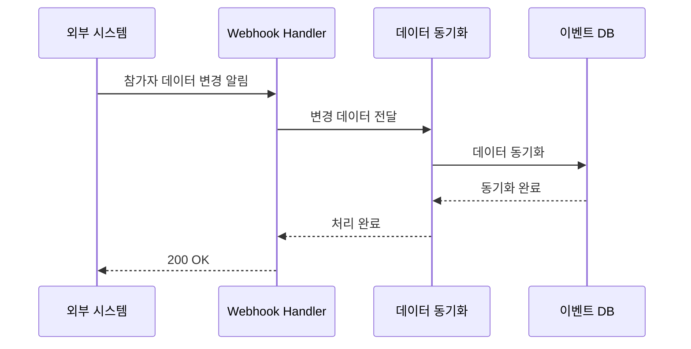

# Event Management - Data Management Scenarios

## 🎯 개요

이벤트 관리 시스템의 데이터 관리 시나리오들을 설명합니다.

## 📊 데이터 관리 시나리오

### 시나리오 1: 참가자 데이터 업로드 (CSV/API)
**목표**: 행사 참가자 명단을 시스템에 등록

```
1. 관리자가 참가자 CSV 파일 준비
   - 필수 필드: 이름, 이메일, 소속, 참가권한
   - 선택 필드: 전화번호, 특이사항, 그룹

2. CSV 업로드 또는 API 호출
   POST /api/participants/bulk-upload
   Content-Type: multipart/form-data
   {
     "file": "participants.csv",
     "eventId": "tech-conference-2024"
   }

3. 데이터 검증 및 처리
   - 중복 이메일 체크
   - 필수 필드 누락 검증
   - 데이터 형식 검증

4. 참가자 토큰 생성
   - 각 참가자별 고유 토큰 발급
   - QR 코드 생성
   - 이메일 발송 준비
```

### 시나리오 2: 외부 시스템 연동 데이터 동기화
**목표**: 등록 시스템이나 CRM과 실시간 동기화



## 📌 참고
- [데이터베이스 최적화](/core/performance/database-optimization.md)
- [메시지 큐를 통한 비동기 처리](/core/architecture/message-queue.md)
