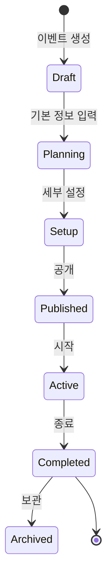

# 이벤트 관리 핵심 API

## 📌 개요

이벤트의 생성, 수정, 삭제 및 생명주기 관리를 위한 핵심 API들을 정의합니다.
이벤트의 기본 속성과 구성을 관리하는 기능을 제공합니다.

## 📑 API 구성

### [이벤트 생성 API](./event-creation-api.md)
- 이벤트 기본 정보 설정
- 참가자 제한 설정
- 위치 및 시간 설정
- 출석 정책 구성

### [이벤트 생명주기 구현](./event-lifecycle-implementation.md)
- 상태 전이 관리
- 이벤트 단계별 처리
- 자동화된 작업 관리
- 알림 및 피드백

## 🔗 기술 구성도

## ⚡ 주요 기능

1. 이벤트 생성 및 구성
   - 기본 정보 관리
   - 출석 정책 설정
   - 알림 설정
   - 권한 설정

2. 생명주기 관리
   - 상태 전이
   - 자동화 규칙
   - 이벤트 종료 처리
   - 데이터 보관

## 📊 성능 지표

| 작업 | 목표 응답시간 | 동시처리량 |
|-----|-------------|-----------|
| 이벤트 생성 | < 2초 | 10/초 |
| 상태 변경 | < 1초 | 50/초 |
| 구성 변경 | < 1초 | 30/초 |

## 📚 관련 문서
- [출석 추적](../tracking/README.md)
- [참가자 관리](../participants/README.md)
- [분석 도구](../analytics/README.md)
