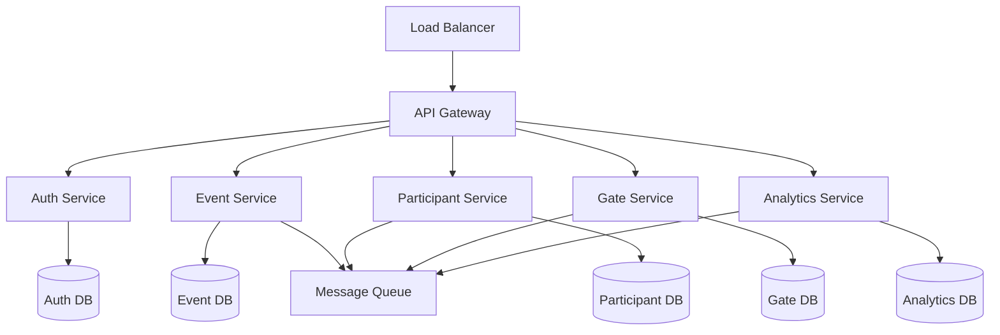

# Event Management - Microservices Architecture

## 📈 마이크로서비스 아키텍처

이벤트 관리 시스템의 마이크로서비스 기반 아키텍처 설계를 설명합니다.

### 시스템 구조



### 서비스별 구현

```typescript
// Event Service - 행사 생성/관리
class EventService {
  async createEvent(eventData: CreateEventRequest): Promise<Event> {
    // 이벤트 생성 로직
    const event = await this.repository.create(eventData);
    
    // 다른 서비스에 이벤트 알림
    await this.messageQueue.publish('event.created', event);
    
    return event;
  }
}

// Participant Service - 참가자 관리
class ParticipantService {
  async registerParticipant(data: RegisterParticipantRequest): Promise<Participant> {
    const participant = await this.repository.create(data);
    
    // 게이트 서비스에 알림
    await this.messageQueue.publish('participant.registered', participant);
    
    return participant;
  }
}
```

### 구현 고려사항

1. 서비스 분리
   - 명확한 책임과 경계
   - 독립적인 배포
   - 기술 스택 자유도

2. 통신
   - 동기 (REST/gRPC)
   - 비동기 (메시지 큐)
   - 이벤트 기반

3. 데이터 일관성
   - SAGA 패턴
   - 이벤트 소싱
   - 보상 트랜잭션

4. 모니터링
   - 분산 추적
   - 로그 집계
   - 메트릭 수집

## 📌 참고
- [메시지 큐](/core/architecture/message-queue.md)
- [로드 밸런싱](/core/architecture/load-balancing.md)
- [모니터링](/tracking/monitoring/metrics-collection.md)
