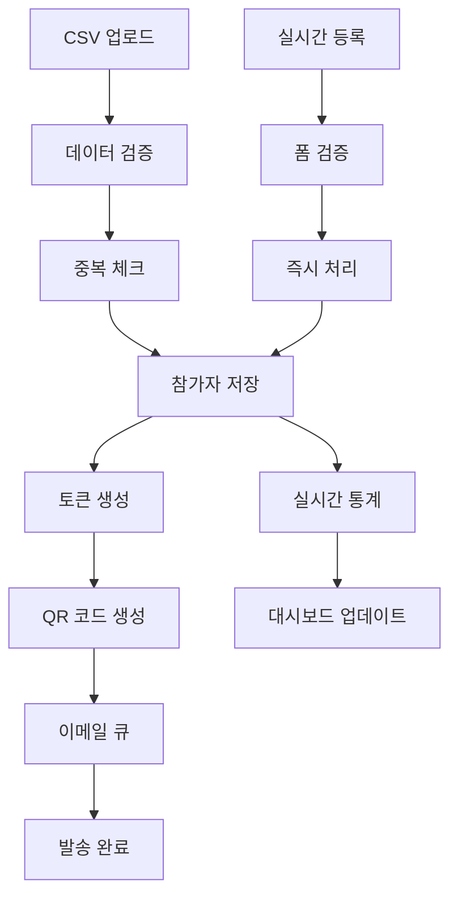

# Event Management - 데이터 처리 및 통합

## 🔄 데이터 플로우 및 통합 시나리오

### 1. 참가자 데이터 처리 흐름



### 2. 실시간 출석 데이터 통합

```typescript
class AttendanceDataIntegrator {
  private messageQueue: MessageQueue;
  private realTimeProcessor: RealTimeProcessor;

  async processAttendanceEvent(attendanceData: AttendanceEvent): Promise<void> {
    // 1. 데이터 검증 및 정규화
    const normalizedData = await this.normalizeAttendanceData(attendanceData);
    
    // 2. 실시간 처리
    await this.realTimeProcessor.process(normalizedData);
    
    // 3. 비동기 처리 큐에 추가
    await this.messageQueue.publish('attendance.processed', normalizedData);
    
    // 4. 외부 시스템 알림
    await this.notifyExternalSystems(normalizedData);
  }

  private async normalizeAttendanceData(data: AttendanceEvent): Promise<NormalizedAttendance> {
    return {
      participantId: data.participantId,
      eventId: data.eventId,
      gateId: data.gateId,
      timestamp: new Date(data.timestamp),
      method: data.method, // 'qr', 'ble', 'manual'
      location: {
        lat: data.location?.lat,
        lng: data.location?.lng,
        accuracy: data.location?.accuracy
      },
      deviceInfo: {
        deviceId: data.deviceId,
        platform: data.platform,
        version: data.version
      },
      metadata: data.metadata || {}
    };
  }

  async handleBulkAttendanceUpdate(
    eventId: string, 
    attendanceRecords: AttendanceRecord[]
  ): Promise<BulkUpdateResult> {
    const batchSize = 100;
    const batches = this.createBatches(attendanceRecords, batchSize);
    const results: BatchResult[] = [];

    for (const batch of batches) {
      const batchResult = await this.processBatch(batch);
      results.push(batchResult);
      
      // 실시간 통계 업데이트
      await this.updateEventStatistics(eventId, batch);
    }

    return {
      totalProcessed: attendanceRecords.length,
      successful: results.reduce((sum, r) => sum + r.successful, 0),
      failed: results.reduce((sum, r) => sum + r.failed, 0),
      errors: results.flatMap(r => r.errors)
    };
  }
}
```

### 3. 외부 시스템 연동

```typescript
class ExternalSystemIntegrator {
  private gateManagementClient: GateManagementClient;
  private integratedPlatformClient: IntegratedPlatformClient;
  private userAppClient: UserAppClient;

  async syncWithGateManagement(eventId: string): Promise<void> {
    const event = await this.eventRepository.findById(eventId);
    const participants = await this.participantRepository.findActiveByEventId(eventId);

    // 게이트 관리 시스템에 참가자 목록 전송
    await this.gateManagementClient.updateParticipantList(eventId, {
      participants: participants.map(p => ({
        id: p.id,
        token: p.token,
        name: p.name,
        status: p.status
      })),
      event: {
        id: event.id,
        name: event.name,
        startTime: event.startDate,
        endTime: event.endDate
      }
    });

    // 게이트 설정 동기화
    const gates = await this.gateRepository.findByEventId(eventId);
    await this.gateManagementClient.updateGateConfiguration(eventId, gates);
  }

  async syncWithIntegratedPlatform(eventId: string): Promise<void> {
    // 익명화된 분석 데이터 생성
    const analyticsData = await this.generateAnalyticsData(eventId);
    
    // 통합 플랫폼으로 데이터 전송
    await this.integratedPlatformClient.sendAnalyticsData({
      eventId,
      timestamp: new Date().toISOString(),
      data: analyticsData
    });
  }

  async syncWithUserApp(participantId: string): Promise<void> {
    const participant = await this.participantRepository.findById(participantId);
    const event = await this.eventRepository.findById(participant.eventId);

    // 사용자 앱에 참가자 정보 동기화
    await this.userAppClient.updateParticipantInfo({
      participantId: participant.id,
      token: participant.token,
      event: {
        id: event.id,
        name: event.name,
        startTime: event.startDate,
        location: event.location
      },
      checkInStatus: participant.checkInStatus
    });
  }

  private async generateAnalyticsData(eventId: string): Promise<AnalyticsData> {
    const participants = await this.participantRepository.findByEventId(eventId);
    const attendanceRecords = await this.attendanceRepository.findByEventId(eventId);

    return {
      totalParticipants: participants.length,
      attendanceRate: attendanceRecords.length / participants.length,
      demographicInsights: {
        ageGroups: this.groupByAge(participants),
        regions: this.groupByRegion(participants)
      },
      behaviorInsights: {
        checkInTimes: this.analyzeCheckInTimes(attendanceRecords),
        stayDuration: this.calculateStayDuration(attendanceRecords)
      },
      // 개인 식별 정보는 제외
      anonymizedMetrics: {
        popularCheckInMethods: this.analyzeCheckInMethods(attendanceRecords),
        peakHours: this.identifyPeakHours(attendanceRecords)
      }
    };
  }
}
```

### 4. 메시지 큐 기반 이벤트 스트리밍

```typescript
class EventStreamProcessor {
  private kafkaProducer: KafkaProducer;
  private eventHandlers: Map<string, EventHandler[]>;

  constructor() {
    this.eventHandlers = new Map();
    this.setupEventHandlers();
  }

  private setupEventHandlers(): void {
    // 참가자 등록 이벤트
    this.registerHandler('participant.registered', [
      new TokenGenerationHandler(),
      new WelcomeEmailHandler(),
      new StatisticsUpdateHandler()
    ]);

    // 출석 이벤트
    this.registerHandler('attendance.recorded', [
      new RealTimeStatsHandler(),
      new NotificationHandler(),
      new AnalyticsHandler()
    ]);

    // 이벤트 상태 변경
    this.registerHandler('event.status.changed', [
      new ExternalSystemNotificationHandler(),
      new CacheInvalidationHandler(),
      new AuditLogHandler()
    ]);
  }

  async publishEvent(eventType: string, eventData: any): Promise<void> {
    const event = {
      id: generateUUID(),
      type: eventType,
      timestamp: new Date().toISOString(),
      data: eventData,
      source: 'event-management-service',
      version: '1.0'
    };

    // Kafka로 이벤트 발행
    await this.kafkaProducer.send({
      topic: this.getTopicForEvent(eventType),
      messages: [{
        key: event.id,
        value: JSON.stringify(event),
        timestamp: event.timestamp
      }]
    });

    // 로컬 핸들러 실행
    await this.executeLocalHandlers(eventType, event);
  }

  private async executeLocalHandlers(eventType: string, event: EventMessage): Promise<void> {
    const handlers = this.eventHandlers.get(eventType) || [];
    
    for (const handler of handlers) {
      try {
        await handler.handle(event);
      } catch (error) {
        console.error(`Handler ${handler.constructor.name} failed:`, error);
        // 핸들러 실패는 다른 핸들러에 영향을 주지 않음
      }
    }
  }

  async subscribeToEvents(eventTypes: string[], handler: EventHandler): Promise<void> {
    for (const eventType of eventTypes) {
      if (!this.eventHandlers.has(eventType)) {
        this.eventHandlers.set(eventType, []);
      }
      this.eventHandlers.get(eventType)!.push(handler);
    }
  }
}
```

### 5. 데이터 일관성 관리

```typescript
class DataConsistencyManager {
  private distributedLock: DistributedLock;
  private compensationHandlers: Map<string, CompensationHandler>;

  async executeDistributedTransaction(
    operations: DistributedOperation[]
  ): Promise<TransactionResult> {
    const transactionId = generateUUID();
    const executedOperations: ExecutedOperation[] = [];

    try {
      // 분산 락 획득
      const locks = await this.acquireDistributedLocks(operations);

      // 각 서비스에서 작업 실행
      for (const operation of operations) {
        const result = await this.executeOperation(operation);
        executedOperations.push({
          operation,
          result,
          timestamp: new Date()
        });
      }

      // 모든 작업이 성공하면 커밋
      await this.commitAllOperations(executedOperations);

      return { success: true, transactionId, operations: executedOperations };

    } catch (error) {
      // 실패 시 보상 트랜잭션 실행
      await this.executeCompensation(executedOperations);
      
      return { 
        success: false, 
        transactionId, 
        error: error.message,
        compensated: true 
      };
    } finally {
      // 분산 락 해제
      await this.releaseDistributedLocks(operations);
    }
  }

  private async executeCompensation(
    executedOperations: ExecutedOperation[]
  ): Promise<void> {
    // 역순으로 보상 작업 실행
    for (const executedOp of executedOperations.reverse()) {
      const handler = this.compensationHandlers.get(executedOp.operation.type);
      if (handler) {
        try {
          await handler.compensate(executedOp);
        } catch (compensationError) {
          console.error('Compensation failed:', compensationError);
          // 보상 실패는 알림을 통해 수동 개입 요청
          await this.alertOperationsTeam(executedOp, compensationError);
        }
      }
    }
  }
}
```

## 데이터 품질 관리

### 데이터 검증 및 정제

```typescript
class DataQualityManager {
  async validateParticipantData(data: ParticipantData): Promise<ValidationResult> {
    const errors: ValidationError[] = [];

    // 필수 필드 검증
    if (!data.name || data.name.trim().length < 2) {
      errors.push({ field: 'name', message: 'Name must be at least 2 characters' });
    }

    if (!data.email || !this.isValidEmail(data.email)) {
      errors.push({ field: 'email', message: 'Valid email address required' });
    }

    // 데이터 형식 검증
    if (data.phone && !this.isValidPhoneNumber(data.phone)) {
      errors.push({ field: 'phone', message: 'Invalid phone number format' });
    }

    // 비즈니스 규칙 검증
    if (data.birthDate && this.calculateAge(data.birthDate) < 13) {
      errors.push({ field: 'birthDate', message: 'Minimum age requirement not met' });
    }

    return {
      isValid: errors.length === 0,
      errors,
      cleanedData: this.cleanData(data)
    };
  }

  private cleanData(data: ParticipantData): ParticipantData {
    return {
      ...data,
      name: data.name?.trim(),
      email: data.email?.toLowerCase().trim(),
      phone: this.normalizePhoneNumber(data.phone)
    };
  }
}
```

---

## 🔗 관련 파일

- **[이벤트 생명주기](./core-scenarios-lifecycle.md)** - 이벤트 생성부터 종료까지의 전체 흐름
- **[성능 및 확장성](./core-scenarios-performance-scalability.md)** - 시스템 최적화 및 확장 전략  
- **[Event Management 개요](./core-scenarios.md)** - 전체 시스템 개요
