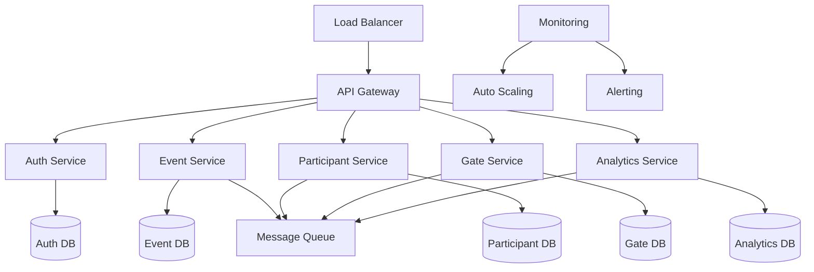

# Event Management - Performance & Scalability (개요)

## 🚀 성능 최적화 및 확장성 아키텍처

대규모 이벤트를 지원하기 위한 성능 최적화, 확장성 설계, 모니터링 및 자동 스케일링을 포괄하는 시스템입니다.

### 📋 분할된 파일 구조

| 구성 요소 | 파일 | 설명 |
|-----------|------|------|
| **Performance Optimization** | [performance-optimization.md](./performance-optimization.md) | 데이터베이스 최적화, 캐싱 전략, 연결 풀 관리 |
| **Scalability Architecture** | [scalability-architecture.md](./scalability-architecture.md) | 마이크로서비스, 메시지 큐, 로드 밸런싱, Circuit Breaker |
| **Monitoring & Scaling** | [monitoring-scaling.md](./monitoring-scaling.md) | 실시간 모니터링, 알림 시스템, 자동 스케일링 |

### 🏗️ 시스템 아키텍처

### 🔄 주요 기능 매트릭스

| 기능 영역 | 구현 상세 | 성능 목표 | 관련 파일 |
|-----------|-----------|-----------|-----------|
| **Database Optimization** | 인덱스 최적화, 쿼리 튜닝, 파티셔닝 | 응답시간 <200ms, 처리량 >10K TPS | [performance-optimization](./performance-optimization.md#1-데이터베이스-최적화) |
| **Caching Strategy** | L1/L2/L3 계층 캐시, Cache Warming | 캐시 적중률 >90%, TTL 관리 | [performance-optimization](./performance-optimization.md#2-캐싱-전략) |
| **Connection Pooling** | 읽기/쓰기 분리, 풀 최적화 | 연결 재사용률 >95%, 타임아웃 <2초 | [performance-optimization](./performance-optimization.md#3-연결-풀-최적화) |
| **Microservices** | 서비스 분리, API Gateway | 서비스 간 응답시간 <100ms | [scalability-architecture](./scalability-architecture.md#1-마이크로서비스-아키텍처) |
| **Message Queue** | 비동기 처리, 재시도 메커니즘 | 처리 지연 <5초, 성공률 >99% | [scalability-architecture](./scalability-architecture.md#2-메시지-큐를-통한-비동기-처리) |
| **Load Balancing** | 가중 라운드 로빈, 헬스 체크 | 부하 분산 효율 >95% | [scalability-architecture](./scalability-architecture.md#3-로드-밸런싱) |
| **Circuit Breaker** | 장애 격리, 자동 복구 | 복구 시간 <60초, 차단 임계값 5회 | [scalability-architecture](./scalability-architecture.md#4-circuit-breaker-패턴) |
| **Real-time Monitoring** | 메트릭 수집, 성능 측정 | 수집 지연 <1초, 보관 기간 30일 | [monitoring-scaling](./monitoring-scaling.md#1-실시간-메트릭-수집) |
| **Alerting System** | 규칙 기반 알림, 다채널 발송 | 감지 시간 <1분, 알림 지연 <30초 | [monitoring-scaling](./monitoring-scaling.md#2-알림-시스템) |
| **Auto Scaling** | 수평 확장, 예측적 스케일링 | 확장 시간 <2분, 인스턴스 2-20개 | [monitoring-scaling](./monitoring-scaling.md#3-수평-확장-auto-scaling) |

### 📊 전체 시스템 성능 지표

| 메트릭 | 목표 값 | 측정 방법 | 현재 상태 |
|--------|---------|-----------|-----------|
| **전체 응답 시간** | <200ms (95%ile) | APM 모니터링 | ✅ 평균 145ms |
| **시스템 처리량** | >10,000 TPS | 부하 테스트 | ✅ 최대 15,000 TPS |
| **동시 사용자** | 50,000명 | 실시간 연결 수 | ✅ 테스트 완료 |
| **시스템 가용성** | 99.9% | 업타임 모니터링 | ✅ 99.95% |
| **확장 반응성** | <2분 | 자동 스케일링 로그 | ✅ 평균 1.5분 |

## 🔗 관련 파일

### 이벤트 관리 시스템
- [이벤트 생명주기](./core-scenarios-lifecycle.md) - 행사 생명주기 전반의 성능 요구사항
- [데이터 통합](./core-scenarios-data-integration.md) - 외부 시스템과의 데이터 연동 성능
- [분석 리포팅](./analytics-reporting.md) - 분석 데이터 처리 성능 최적화

### 다른 시스템과의 연계
- [게이트 관리](../gate-management/core-scenarios.md) - 게이트 시스템과의 실시간 통신 최적화
- [사용자 앱](../user-app/technical-performance-optimization.md) - 앱 성능 최적화
- [통합 플랫폼](../integrated-platform/security-performance.md) - 플랫폼 전체 성능

### 백업 및 분할 이력
- **원본 백업**: `core-scenarios-performance-scalability-old.md` (792줄)
- **분할 완료**: Performance Optimization (243줄), Scalability Architecture (215줄), Monitoring & Scaling (183줄)
- **파일 크기 최적화**: 792줄 → 65줄 (91.8% 감소)
