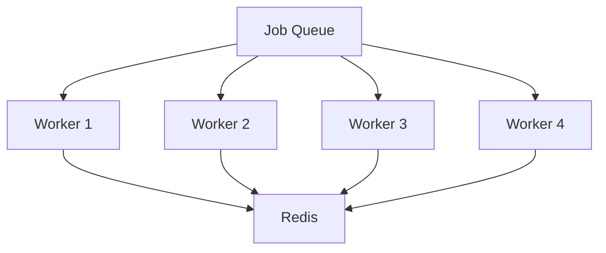

# Event Management - 백그라운드 작업 처리

## 백그라운드 작업 처리 시스템

파일 업로드 후 백그라운드에서 실행되는 작업 처리 시스템입니다.

### 작업 처리 아키텍처



## 백그라운드 프로세서 구현

```typescript
class BackgroundJobProcessor {
  private queue: Queue;
  private workers: Worker[] = [];
  
  constructor() {
    this.queue = new Queue('file-processing', {
      redis: {
        host: process.env.REDIS_HOST,
        port: parseInt(process.env.REDIS_PORT || '6379')
      }
    });
    
    this.initializeWorkers();
  }
  
  private initializeWorkers(): void {
    const workerCount = parseInt(process.env.WORKER_COUNT || '4');
    
    for (let i = 0; i < workerCount; i++) {
      const worker = new Worker('file-processing', this.processJob.bind(this), {
        redis: this.queue.opts.redis,
        concurrency: 1
      });
      
      worker.on('completed', this.onJobCompleted.bind(this));
      worker.on('failed', this.onJobFailed.bind(this));
      
      this.workers.push(worker);
    }
  }
  
  async processJob(job: Job<FileProcessingJob>): Promise<ProcessingResult> {
    const { data } = job;
    
    try {
      // 진행률 업데이트
      await job.updateProgress(0);
      
      // 1. 파일 읽기 및 파싱
      const fileData = await this.readAndParseFile(data.tempPath, data.mimeType);
      await job.updateProgress(25);
      
      // 2. 데이터 검증 및 정리
      const validatedData = await this.validateAndCleanData(fileData);
      await job.updateProgress(50);
      
      // 3. 데이터베이스에 저장
      const saveResult = await this.saveParticipants(validatedData, data.eventId);
      await job.updateProgress(75);
      
      // 4. 토큰 및 QR 코드 생성
      const tokens = await this.generateTokensForParticipants(saveResult.participants);
      await job.updateProgress(90);
      
      // 5. 이메일 발송 (옵션)
      if (data.options.sendWelcomeEmail) {
        await this.scheduleWelcomeEmails(saveResult.participants, tokens);
      }
      
      await job.updateProgress(100);
      
      return {
        success: true,
        processedCount: saveResult.participants.length,
        errorCount: validatedData.errors.length,
        tokens: tokens.length,
        emailsSent: data.options.sendWelcomeEmail ? tokens.length : 0
      };
      
    } catch (error) {
      console.error('Job processing failed:', error);
      throw error;
    } finally {
      // 임시 파일 정리
      await this.cleanupTempFile(data.tempPath);
    }
  }
  
  private async onJobCompleted(job: Job, result: ProcessingResult): Promise<void> {
    console.log(`Job ${job.id} completed successfully`);
    
    // 완료 알림 이메일 발송
    await this.sendCompletionNotification(job.data.metadata.uploadedBy, result);
    
    // 메트릭 기록
    await this.recordJobMetrics(job, result, 'completed');
  }
  
  private async onJobFailed(job: Job, error: Error): Promise<void> {
    console.error(`Job ${job.id} failed:`, error);
    
    // 실패 알림 이메일 발송
    await this.sendFailureNotification(job.data.metadata.uploadedBy, error);
    
    // 메트릭 기록
    await this.recordJobMetrics(job, null, 'failed');
    
    // 임시 파일 정리
    await this.cleanupTempFile(job.data.tempPath);
  }
}
```

## 작업 상태 관리

### 작업 상태 정의

```typescript
enum JobStatus {
  PENDING = 'pending',
  PROCESSING = 'processing',
  COMPLETED = 'completed',
  FAILED = 'failed',
  CANCELLED = 'cancelled'
}

interface JobProgress {
  percentage: number;
  currentStep: string;
  totalSteps: number;
  completedSteps: number;
  estimatedTimeRemaining: number;
}
```

### 진행률 추적

```typescript
class JobProgressTracker {
  async updateProgress(jobId: string, progress: JobProgress): Promise<void> {
    await this.redis.setex(
      `job:progress:${jobId}`,
      3600, // 1시간 TTL
      JSON.stringify(progress)
    );
    
    // WebSocket을 통한 실시간 업데이트
    this.notifyProgressUpdate(jobId, progress);
  }
  
  async getProgress(jobId: string): Promise<JobProgress | null> {
    const data = await this.redis.get(`job:progress:${jobId}`);
    return data ? JSON.parse(data) : null;
  }
  
  private notifyProgressUpdate(jobId: string, progress: JobProgress): void {
    this.websocketServer.to(`job:${jobId}`).emit('progress', progress);
  }
}
```

## 에러 처리 및 재시도

### 재시도 정책

```typescript
const retryPolicy = {
  attempts: 3,
  delay: 2000, // 2초
  backoff: {
    type: 'exponential',
    delay: 2000
  }
};
```

### 에러 분류 및 처리

```typescript
class JobErrorHandler {
  handleError(error: Error): { shouldRetry: boolean; delay: number } {
    if (error instanceof ValidationError) {
      // 검증 오류는 재시도하지 않음
      return { shouldRetry: false, delay: 0 };
    }
    
    if (error instanceof NetworkError) {
      // 네트워크 오류는 재시도
      return { shouldRetry: true, delay: 5000 };
    }
    
    if (error instanceof TemporaryError) {
      // 임시 오류는 짧은 지연 후 재시도
      return { shouldRetry: true, delay: 2000 };
    }
    
    // 기타 오류는 재시도하지 않음
    return { shouldRetry: false, delay: 0 };
  }
}
```

## 성능 및 확장성

### 워커 풀 관리

```typescript
class WorkerPoolManager {
  async scaleWorkers(targetCount: number): Promise<void> {
    const currentCount = this.workers.length;
    
    if (targetCount > currentCount) {
      // 워커 추가
      for (let i = currentCount; i < targetCount; i++) {
        await this.addWorker();
      }
    } else if (targetCount < currentCount) {
      // 워커 제거
      for (let i = currentCount; i > targetCount; i--) {
        await this.removeWorker();
      }
    }
  }
  
  async addWorker(): Promise<Worker> {
    const worker = new Worker('file-processing', this.processJob.bind(this));
    this.workers.push(worker);
    return worker;
  }
  
  async removeWorker(): Promise<void> {
    const worker = this.workers.pop();
    if (worker) {
      await worker.close();
    }
  }
}
```

## 모니터링 및 메트릭

### 수집 메트릭

- 작업 처리 시간
- 성공/실패률
- 큐 대기 시간
- 워커 사용률
- 메모리/CPU 사용량

### 알림 정책

- 작업 실패율 > 10%
- 평균 처리 시간 > 5분
- 큐 대기 작업 > 100개
- 워커 사용률 > 90%
