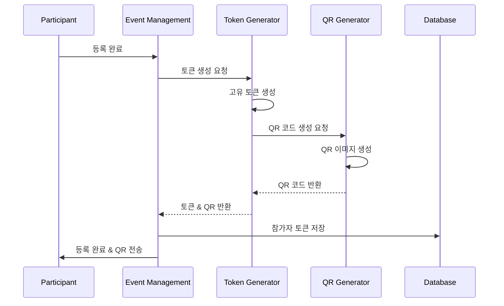

# Event Management - 토큰 인증 시스템

## 🔐 토큰 인증 및 검증 시나리오

### 1. 토큰 생성 및 QR 코드 생성



**토큰 생성 로직:**
```typescript
class TokenGenerator {
  private readonly TOKEN_LENGTH = 32;
  private readonly TOKEN_EXPIRY_DAYS = 30;
  
  generateToken(): string {
    // 암호학적으로 안전한 랜덤 토큰 생성
    const bytes = crypto.randomBytes(this.TOKEN_LENGTH);
    return bytes.toString('base64url');
  }
  
  async generateParticipantToken(participant: Participant): Promise<ParticipantToken> {
    const token = this.generateToken();
    const expiresAt = new Date();
    expiresAt.setDate(expiresAt.getDate() + this.TOKEN_EXPIRY_DAYS);
    
    // 토큰 메타데이터 생성
    const tokenData: ParticipantToken = {
      id: uuidv4(),
      participantId: participant.id,
      token,
      type: 'attendance',
      status: 'active',
      createdAt: new Date(),
      expiresAt,
      metadata: {
        eventId: participant.eventId,
        participantName: participant.name,
        generatedBy: 'system'
      }
    };
    
    // QR 코드 생성
    const qrCodeData = {
      token,
      participantId: participant.id,
      eventId: participant.eventId,
      version: '1.0'
    };
    
    const qrCodeImage = await this.generateQRCode(qrCodeData);
    tokenData.qrCode = qrCodeImage;
    
    return tokenData;
  }
  
  private async generateQRCode(data: QRCodeData): Promise<string> {
    const qrDataString = JSON.stringify(data);
    
    // QR 코드 옵션
    const options = {
      type: 'image/png' as const,
      quality: 0.92,
      margin: 1,
      color: {
        dark: '#000000',
        light: '#FFFFFF'
      },
      width: 256
    };
    
    const qrCodeBuffer = await QRCode.toBuffer(qrDataString, options);
    return qrCodeBuffer.toString('base64');
  }
  
  // 토큰 검증용 체크섬 생성
  generateChecksum(token: string, participantId: string): string {
    const data = `${token}:${participantId}:${process.env.TOKEN_SECRET}`;
    return crypto.createHash('sha256').update(data).digest('hex').substring(0, 8);
  }
}
```

### 2. 토큰 검증 시스템

```typescript
class TokenValidationService {
  private cache = new Map<string, CachedToken>();
  private readonly CACHE_TTL = 300000; // 5분
  
  async validateToken(token: string): Promise<TokenValidationResult> {
    // 1. 캐시에서 먼저 확인
    const cached = this.cache.get(token);
    if (cached && Date.now() - cached.timestamp < this.CACHE_TTL) {
      return this.buildValidationResult(cached.tokenData, true);
    }
    
    // 2. 데이터베이스에서 토큰 조회
    const tokenData = await this.database.findToken(token);
    if (!tokenData) {
      return this.buildValidationResult(null, false, 'TOKEN_NOT_FOUND');
    }
    
    // 3. 토큰 상태 검증
    const validationChecks = await this.performValidationChecks(tokenData);
    
    // 4. 캐시에 저장 (유효한 토큰만)
    if (validationChecks.valid) {
      this.cache.set(token, {
        tokenData,
        timestamp: Date.now()
      });
    }
    
    return this.buildValidationResult(tokenData, validationChecks.valid, validationChecks.reason);
  }
  
  private async performValidationChecks(tokenData: ParticipantToken): Promise<ValidationChecks> {
    const checks: ValidationChecks = { valid: true, reason: null };
    
    // 만료 확인
    if (tokenData.expiresAt && new Date() > tokenData.expiresAt) {
      checks.valid = false;
      checks.reason = 'TOKEN_EXPIRED';
      return checks;
    }
    
    // 상태 확인
    if (tokenData.status !== 'active') {
      checks.valid = false;
      checks.reason = `TOKEN_${tokenData.status.toUpperCase()}`;
      return checks;
    }
    
    // 참가자 상태 확인
    const participant = await this.database.findParticipant(tokenData.participantId);
    if (!participant || participant.status !== 'active') {
      checks.valid = false;
      checks.reason = 'PARTICIPANT_INACTIVE';
      return checks;
    }
    
    // 이벤트 상태 확인
    const event = await this.database.findEvent(tokenData.metadata.eventId);
    if (!event || event.status !== 'active') {
      checks.valid = false;
      checks.reason = 'EVENT_INACTIVE';
      return checks;
    }
    
    return checks;
  }
  
  private buildValidationResult(
    tokenData: ParticipantToken | null,
    valid: boolean,
    reason?: string
  ): TokenValidationResult {
    return {
      valid,
      token: tokenData,
      participant: tokenData ? {
        id: tokenData.participantId,
        name: tokenData.metadata.participantName,
        eventId: tokenData.metadata.eventId
      } : null,
      reason: reason || (valid ? 'VALID' : 'INVALID'),
      timestamp: new Date().toISOString()
    };
  }
  
  // 토큰 무효화
  async invalidateToken(token: string, reason: string): Promise<void> {
    await this.database.updateToken(token, {
      status: 'revoked',
      revokedAt: new Date(),
      revokeReason: reason
    });
    
    // 캐시에서 제거
    this.cache.delete(token);
  }
  
  // 배치 토큰 검증 (Gate Management에서 사용)
  async validateTokensBatch(tokens: string[]): Promise<BatchValidationResult> {
    const results = await Promise.all(
      tokens.map(async (token) => {
        try {
          const result = await this.validateToken(token);
          return { token, ...result };
        } catch (error) {
          return {
            token,
            valid: false,
            reason: 'VALIDATION_ERROR',
            error: error.message
          };
        }
      })
    );
    
    return {
      total: tokens.length,
      valid: results.filter(r => r.valid).length,
      invalid: results.filter(r => !r.valid).length,
      results
    };
  }
}
```

### 3. 토큰 생명주기 관리

```typescript
class TokenLifecycleManager {
  // 토큰 갱신
  async refreshToken(oldToken: string): Promise<RefreshTokenResult> {
    const validation = await this.tokenValidator.validateToken(oldToken);
    
    if (!validation.valid) {
      throw new InvalidTokenError('Cannot refresh invalid token');
    }
    
    // 새 토큰 생성
    const newToken = await this.tokenGenerator.generateParticipantToken(
      validation.participant
    );
    
    // 기존 토큰 무효화
    await this.tokenValidator.invalidateToken(oldToken, 'REFRESHED');
    
    // 새 토큰 저장
    await this.database.saveToken(newToken);
    
    return {
      oldToken,
      newToken: newToken.token,
      participant: validation.participant,
      expiresAt: newToken.expiresAt
    };
  }
  
  // 만료된 토큰 정리
  async cleanupExpiredTokens(): Promise<CleanupResult> {
    const expiredTokens = await this.database.findExpiredTokens();
    
    let cleanedCount = 0;
    for (const token of expiredTokens) {
      try {
        await this.database.deleteToken(token.id);
        this.cache.delete(token.token);
        cleanedCount++;
      } catch (error) {
        console.error(`Failed to cleanup token ${token.id}:`, error);
      }
    }
    
    return {
      total: expiredTokens.length,
      cleaned: cleanedCount,
      failed: expiredTokens.length - cleanedCount
    };
  }
  
  // 토큰 통계
  async getTokenStatistics(): Promise<TokenStatistics> {
    const stats = await this.database.getTokenStatistics();
    
    return {
      total: stats.total,
      active: stats.active,
      expired: stats.expired,
      revoked: stats.revoked,
      byEvent: stats.byEvent,
      recentActivity: stats.recentActivity
    };
  }
}
```

### 4. 보안 강화 기능

```typescript
class TokenSecurityService {
  private suspiciousActivityDetector = new SuspiciousActivityDetector();
  
  // 토큰 사용 로깅
  async logTokenUsage(token: string, context: UsageContext): Promise<void> {
    const logEntry = {
      token,
      timestamp: new Date(),
      ipAddress: context.ipAddress,
      userAgent: context.userAgent,
      gateId: context.gateId,
      action: context.action,
      success: context.success
    };
    
    await this.database.saveTokenUsageLog(logEntry);
    
    // 의심스러운 활동 감지
    await this.suspiciousActivityDetector.analyze(logEntry);
  }
  
  // 토큰 남용 감지
  async detectTokenAbuse(token: string): Promise<AbuseDetectionResult> {
    const recentUsage = await this.database.getRecentTokenUsage(token, '1 hour');
    
    const analysis = {
      usageCount: recentUsage.length,
      uniqueIPs: new Set(recentUsage.map(u => u.ipAddress)).size,
      uniqueGates: new Set(recentUsage.map(u => u.gateId)).size,
      timeSpread: this.calculateTimeSpread(recentUsage)
    };
    
    // 남용 패턴 확인
    const suspicious = 
      analysis.usageCount > 10 || // 1시간에 10회 초과
      analysis.uniqueIPs > 3 ||   // 3개 이상의 IP
      analysis.uniqueGates > 5;   // 5개 이상의 게이트
    
    if (suspicious) {
      await this.handleSuspiciousToken(token, analysis);
    }
    
    return {
      suspicious,
      analysis,
      action: suspicious ? 'token_flagged' : 'none'
    };
  }
  
  private async handleSuspiciousToken(
    token: string, 
    analysis: UsageAnalysis
  ): Promise<void> {
    // 토큰 일시 정지
    await this.tokenValidator.invalidateToken(token, 'SUSPICIOUS_ACTIVITY');
    
    // 보안팀 알림
    await this.notificationService.sendSecurityAlert({
      type: 'suspicious_token_usage',
      token,
      analysis,
      timestamp: new Date().toISOString()
    });
    
    // 참가자에게 알림
    const tokenData = await this.database.findToken(token);
    if (tokenData) {
      await this.notificationService.notifyParticipant(
        tokenData.participantId,
        'security_alert',
        'Your attendance token has been temporarily suspended due to suspicious activity.'
      );
    }
  }
  
  // 토큰 암호화 (전송용)
  encryptTokenForTransmission(token: string): string {
    const cipher = crypto.createCipher('aes-256-gcm', process.env.TOKEN_ENCRYPTION_KEY);
    let encrypted = cipher.update(token, 'utf8', 'hex');
    encrypted += cipher.final('hex');
    return encrypted;
  }
  
  // 토큰 복호화
  decryptTokenFromTransmission(encryptedToken: string): string {
    const decipher = crypto.createDecipher('aes-256-gcm', process.env.TOKEN_ENCRYPTION_KEY);
    let decrypted = decipher.update(encryptedToken, 'hex', 'utf8');
    decrypted += decipher.final('utf8');
    return decrypted;
  }
}
```

### 5. 토큰 API 엔드포인트

```typescript
// Express 라우터 설정
class TokenController {
  // 토큰 검증
  async validateToken(req: Request, res: Response): Promise<void> {
    try {
      const { token } = req.body;
      
      if (!token) {
        return res.status(400).json({ error: 'Token is required' });
      }
      
      const result = await this.tokenValidationService.validateToken(token);
      
      // 사용 로그 기록
      await this.tokenSecurityService.logTokenUsage(token, {
        ipAddress: req.ip,
        userAgent: req.get('User-Agent'),
        gateId: req.headers['x-gate-id'] as string,
        action: 'validate',
        success: result.valid
      });
      
      res.json(result);
    } catch (error) {
      res.status(500).json({ error: 'Token validation failed' });
    }
  }
  
  // 토큰 갱신
  async refreshToken(req: Request, res: Response): Promise<void> {
    try {
      const { token } = req.body;
      const result = await this.tokenLifecycleManager.refreshToken(token);
      res.json(result);
    } catch (error) {
      res.status(400).json({ error: error.message });
    }
  }
  
  // 토큰 무효화
  async revokeToken(req: Request, res: Response): Promise<void> {
    try {
      const { token, reason } = req.body;
      await this.tokenValidationService.invalidateToken(token, reason);
      res.json({ success: true, message: 'Token revoked successfully' });
    } catch (error) {
      res.status(500).json({ error: 'Token revocation failed' });
    }
  }
  
  // 참가자 토큰 조회
  async getParticipantTokens(req: Request, res: Response): Promise<void> {
    try {
      const { participantId } = req.params;
      const tokens = await this.database.findTokensByParticipant(participantId);
      res.json(tokens);
    } catch (error) {
      res.status(500).json({ error: 'Failed to retrieve tokens' });
    }
  }
}

// 라우터 설정
const tokenRouter = express.Router();
tokenRouter.post('/validate', tokenController.validateToken.bind(tokenController));
tokenRouter.post('/refresh', tokenController.refreshToken.bind(tokenController));
tokenRouter.post('/revoke', tokenController.revokeToken.bind(tokenController));
tokenRouter.get('/participant/:participantId', tokenController.getParticipantTokens.bind(tokenController));
```

## 성능 지표

### 토큰 검증 성능
- **목표 응답시간**: < 100ms
- **캐시 히트율**: > 80%
- **동시 처리**: 1,000 req/sec

### 보안 지표
- **토큰 남용 감지율**: > 95%
- **잘못된 토큰 차단**: 100%
- **보안 인시던트 대응**: < 5분

---

## 🔗 관련 파일

- **[데이터 처리](./data-processing.md)** - 참가자 데이터 관리
- **[업로드 처리](./upload-processing.md)** - 파일 업로드 및 백그라운드 처리
- **[데이터 유효성 검사](./data-validation.md)** - 참가자 데이터 검증