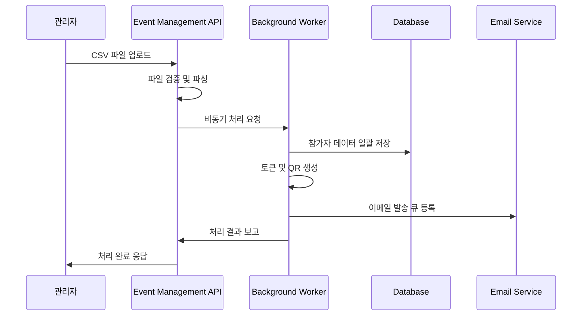

# Event Management - 참가자 데이터 처리

## 📊 참가자 데이터 관리 시나리오

### 1. 대량 참가자 등록 (CSV 업로드)



**API 엔드포인트 구현:**
```typescript
// CSV 업로드 API
POST /api/v1/participants/bulk-upload

interface BulkUploadRequest {
  file: File; // CSV 파일
  options: {
    skipDuplicates: boolean;
    sendWelcomeEmail: boolean;
    generateTokens: boolean;
  };
}

interface BulkUploadResponse {
  jobId: string;
  totalRows: number;
  estimatedProcessingTime: number;
}

// 처리 상태 확인 API
GET /api/v1/jobs/{jobId}/status

interface JobStatus {
  jobId: string;
  status: 'pending' | 'processing' | 'completed' | 'failed';
  processed: number;
  total: number;
  errors: ValidationError[];
  startedAt: string;
  completedAt?: string;
}
```

**CSV 처리 로직:**
```typescript
class ParticipantCSVProcessor {
  async processCSVFile(file: File, options: ProcessingOptions): Promise<string> {
    const jobId = generateUUID();
    
    // 즉시 응답을 위한 비동기 처리
    this.processInBackground(jobId, file, options);
    
    return jobId;
  }

  private async processInBackground(
    jobId: string, 
    file: File, 
    options: ProcessingOptions
  ): Promise<void> {
    try {
      // 1. CSV 파싱 및 검증
      const participants = await this.parseAndValidateCSV(file);
      
      // 2. 배치 처리 (1000개씩)
      const batches = this.createBatches(participants, 1000);
      
      for (const batch of batches) {
        await this.processBatch(batch, options);
        await this.updateJobProgress(jobId, batch.length);
      }
      
      // 3. 후처리 (이메일 발송 등)
      if (options.sendWelcomeEmail) {
        await this.scheduleWelcomeEmails(participants);
      }
      
      await this.markJobCompleted(jobId);
      
    } catch (error) {
      await this.markJobFailed(jobId, error);
    }
  }

  private async parseAndValidateCSV(file: File): Promise<ParticipantData[]> {
    const csvText = await file.text();
    const rows = csvText.split('\n');
    const headers = rows[0].split(',').map(h => h.trim());
    
    // 필수 컬럼 검증
    const requiredColumns = ['name', 'email', 'phone'];
    const missingColumns = requiredColumns.filter(col => !headers.includes(col));
    
    if (missingColumns.length > 0) {
      throw new ValidationError(`Missing required columns: ${missingColumns.join(', ')}`);
    }
    
    const participants: ParticipantData[] = [];
    
    for (let i = 1; i < rows.length; i++) {
      const row = rows[i];
      if (!row.trim()) continue;
      
      const values = row.split(',').map(v => v.trim());
      const participant = this.createParticipantFromRow(headers, values, i + 1);
      
      // 개별 참가자 데이터 검증
      const validationResult = this.validateParticipant(participant);
      if (validationResult.isValid) {
        participants.push(participant);
      } else {
        console.warn(`Row ${i + 1} validation failed:`, validationResult.errors);
      }
    }
    
    return participants;
  }

  private validateParticipant(participant: ParticipantData): ValidationResult {
    const errors: string[] = [];
    
    // 이메일 형식 검증
    if (!this.isValidEmail(participant.email)) {
      errors.push('Invalid email format');
    }
    
    // 전화번호 형식 검증
    if (!this.isValidPhone(participant.phone)) {
      errors.push('Invalid phone number format');
    }
    
    // 이름 길이 검증
    if (participant.name.length < 2 || participant.name.length > 100) {
      errors.push('Name must be between 2 and 100 characters');
    }
    
    return {
      isValid: errors.length === 0,
      errors
    };
  }

  private async processBatch(
    batch: ParticipantData[], 
    options: ProcessingOptions
  ): Promise<void> {
    const transaction = await this.database.beginTransaction();
    
    try {
      for (const participant of batch) {
        // 중복 체크
        if (options.skipDuplicates) {
          const existing = await this.findExistingParticipant(participant.email);
          if (existing) {
            continue;
          }
        }
        
        // 참가자 저장
        const savedParticipant = await this.saveParticipant(participant, transaction);
        
        // 토큰 생성
        if (options.generateTokens) {
          await this.generateParticipantToken(savedParticipant.id, transaction);
        }
      }
      
      await transaction.commit();
    } catch (error) {
      await transaction.rollback();
      throw error;
    }
  }
}
```

### 2. 참가자 검색 및 필터링

```typescript
class ParticipantSearchService {
  async searchParticipants(criteria: SearchCriteria): Promise<SearchResult> {
    const query = this.buildSearchQuery(criteria);
    
    // 페이징 처리
    const offset = (criteria.page - 1) * criteria.pageSize;
    const results = await this.database.query(query, {
      limit: criteria.pageSize,
      offset: offset
    });
    
    const totalCount = await this.getSearchResultCount(criteria);
    
    return {
      participants: results.map(this.transformParticipant),
      pagination: {
        page: criteria.page,
        pageSize: criteria.pageSize,
        total: totalCount,
        pages: Math.ceil(totalCount / criteria.pageSize)
      },
      filters: this.getAppliedFilters(criteria)
    };
  }

  private buildSearchQuery(criteria: SearchCriteria): string {
    let query = `
      SELECT p.*, COUNT(a.id) as attendance_count
      FROM participants p
      LEFT JOIN attendance_records a ON p.id = a.participant_id
      WHERE 1=1
    `;
    
    // 텍스트 검색
    if (criteria.searchText) {
      query += ` AND (
        p.name ILIKE '%${criteria.searchText}%' OR 
        p.email ILIKE '%${criteria.searchText}%' OR
        p.phone ILIKE '%${criteria.searchText}%'
      )`;
    }
    
    // 등록 날짜 필터
    if (criteria.registeredAfter) {
      query += ` AND p.created_at >= '${criteria.registeredAfter}'`;
    }
    
    if (criteria.registeredBefore) {
      query += ` AND p.created_at <= '${criteria.registeredBefore}'`;
    }
    
    // 출석 상태 필터
    if (criteria.attendanceStatus) {
      switch (criteria.attendanceStatus) {
        case 'attended':
          query += ` AND EXISTS (SELECT 1 FROM attendance_records WHERE participant_id = p.id)`;
          break;
        case 'not_attended':
          query += ` AND NOT EXISTS (SELECT 1 FROM attendance_records WHERE participant_id = p.id)`;
          break;
      }
    }
    
    // 그룹화 및 정렬
    query += ` GROUP BY p.id`;
    query += ` ORDER BY ${this.getOrderClause(criteria.sortBy, criteria.sortOrder)}`;
    
    return query;
  }

  private getOrderClause(sortBy: string, sortOrder: 'asc' | 'desc'): string {
    const validSortFields = {
      'name': 'p.name',
      'email': 'p.email',
      'created_at': 'p.created_at',
      'attendance_count': 'attendance_count'
    };
    
    const field = validSortFields[sortBy] || 'p.created_at';
    return `${field} ${sortOrder.toUpperCase()}`;
  }
}
```

### 3. 참가자 데이터 수정 및 관리

```typescript
class ParticipantManagementService {
  async updateParticipant(
    participantId: string, 
    updateData: ParticipantUpdateData
  ): Promise<Participant> {
    // 권한 검증
    await this.verifyUpdatePermission(participantId);
    
    // 데이터 검증
    const validationResult = this.validateUpdateData(updateData);
    if (!validationResult.isValid) {
      throw new ValidationError(validationResult.errors);
    }
    
    const transaction = await this.database.beginTransaction();
    
    try {
      // 참가자 정보 업데이트
      const updatedParticipant = await this.database.update('participants', participantId, {
        ...updateData,
        updated_at: new Date()
      }, transaction);
      
      // 이메일 변경 시 토큰 재생성
      if (updateData.email) {
        await this.regenerateParticipantToken(participantId, transaction);
      }
      
      // 변경 이력 저장
      await this.logParticipantChange(participantId, updateData, transaction);
      
      await transaction.commit();
      
      return updatedParticipant;
    } catch (error) {
      await transaction.rollback();
      throw error;
    }
  }

  async deleteParticipant(participantId: string): Promise<void> {
    // 권한 검증
    await this.verifyDeletePermission(participantId);
    
    // 관련 데이터 확인
    const hasAttendanceRecords = await this.checkAttendanceRecords(participantId);
    
    if (hasAttendanceRecords) {
      // 출석 기록이 있는 경우 소프트 삭제
      await this.softDeleteParticipant(participantId);
    } else {
      // 완전 삭제
      await this.hardDeleteParticipant(participantId);
    }
  }

  private async softDeleteParticipant(participantId: string): Promise<void> {
    await this.database.update('participants', participantId, {
      deleted_at: new Date(),
      email: `deleted_${participantId}@deleted.com`,
      phone: null,
      personal_data_removed: true
    });
  }

  private async hardDeleteParticipant(participantId: string): Promise<void> {
    const transaction = await this.database.beginTransaction();
    
    try {
      // 토큰 삭제
      await this.database.delete('participant_tokens', { participant_id: participantId }, transaction);
      
      // 참가자 삭제
      await this.database.delete('participants', participantId, transaction);
      
      await transaction.commit();
    } catch (error) {
      await transaction.rollback();
      throw error;
    }
  }
}
```

### 4. 데이터 내보내기

```typescript
class ParticipantExportService {
  async exportParticipants(
    criteria: ExportCriteria,
    format: 'csv' | 'xlsx' | 'json'
  ): Promise<ExportResult> {
    const jobId = generateUUID();
    
    // 비동기 처리
    this.processExportInBackground(jobId, criteria, format);
    
    return {
      jobId,
      estimatedCompletionTime: this.estimateExportTime(criteria)
    };
  }

  private async processExportInBackground(
    jobId: string,
    criteria: ExportCriteria,
    format: string
  ): Promise<void> {
    try {
      // 1. 데이터 조회
      const participants = await this.getParticipantsForExport(criteria);
      
      // 2. 개인정보 마스킹 (필요시)
      const processedData = criteria.maskPersonalInfo 
        ? this.maskPersonalInformation(participants)
        : participants;
      
      // 3. 형식에 따른 변환
      const fileContent = await this.convertToFormat(processedData, format);
      
      // 4. 파일 저장
      const fileName = `participants_export_${Date.now()}.${format}`;
      const filePath = await this.saveExportFile(fileName, fileContent);
      
      // 5. 다운로드 링크 생성
      const downloadUrl = await this.generateDownloadUrl(filePath);
      
      // 6. 완료 알림
      await this.notifyExportCompletion(jobId, downloadUrl);
      
    } catch (error) {
      await this.notifyExportFailure(jobId, error);
    }
  }

  private maskPersonalInformation(participants: Participant[]): Participant[] {
    return participants.map(participant => ({
      ...participant,
      email: this.maskEmail(participant.email),
      phone: this.maskPhone(participant.phone),
      name: this.maskName(participant.name)
    }));
  }

  private maskEmail(email: string): string {
    const [localPart, domain] = email.split('@');
    const maskedLocal = localPart.length > 2 
      ? localPart.substring(0, 2) + '*'.repeat(localPart.length - 2)
      : localPart;
    return `${maskedLocal}@${domain}`;
  }
}
```

## 성능 최적화

### 데이터베이스 인덱스 최적화

```sql
-- 검색 성능 향상을 위한 인덱스
CREATE INDEX idx_participants_search 
ON participants(name, email, phone);

CREATE INDEX idx_participants_created_at 
ON participants(created_at);

CREATE INDEX idx_participants_status 
ON participants(status, deleted_at);

-- 복합 인덱스 (자주 사용되는 조합)
CREATE INDEX idx_participants_status_created 
ON participants(status, created_at, deleted_at);
```

### 캐싱 전략

```typescript
class ParticipantCacheService {
  private cache = new Map<string, CachedData>();
  private readonly CACHE_TTL = 300000; // 5분
  
  async getParticipant(participantId: string): Promise<Participant> {
    const cacheKey = `participant:${participantId}`;
    const cached = this.cache.get(cacheKey);
    
    if (cached && Date.now() - cached.timestamp < this.CACHE_TTL) {
      return cached.data;
    }
    
    const participant = await this.database.findById('participants', participantId);
    
    this.cache.set(cacheKey, {
      data: participant,
      timestamp: Date.now()
    });
    
    return participant;
  }
  
  invalidateParticipantCache(participantId: string): void {
    this.cache.delete(`participant:${participantId}`);
  }
}
```

---

## 🔗 관련 파일

- **[토큰 인증 시스템](./participant-management-token-auth.md)** - 참가자 토큰 생성 및 검증
- **[업로드 처리 시스템](./participant-management-upload-processing.md)** - 파일 업로드 및 백그라운드 처리
- **[참가자 관리 개요](./participant-management.md)** - 전체 시스템 개요