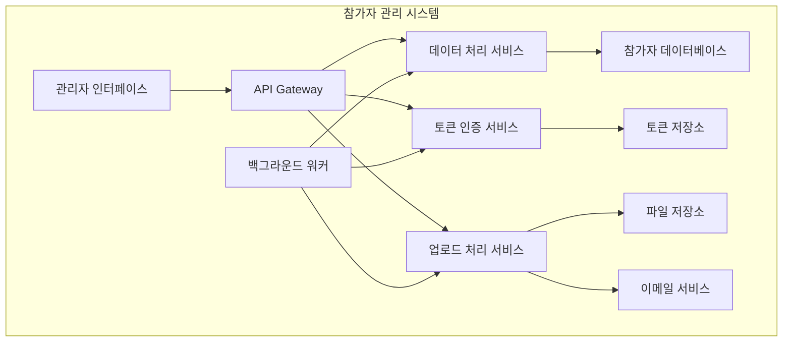

# Event Management 참가자 관리 및 토큰 시나리오 - 시스템 개요

## 📋 시나리오 개요

Event Management 시스템의 참가자 데이터 관리와 토큰 인증 시스템을 다룹니다.
대량 데이터 처리와 실시간 토큰 검증이 핵심 기능입니다.

## 🔄 파일 분할 이력

**원본 파일**: 783 lines → 개요 형태로 변환
**백업 파일**: `participant-management-old.md` (완전한 원본 내용 보존)
**분할 완료**: 2024년 최적화 작업의 일환으로 논리적 도메인별 분할

## 📁 세부 시나리오 파일

| 분할 파일 | 설명 | 주요 내용 |
|-----------|------|----------|
| **[data-processing.md](./data-processing.md)** | 참가자 데이터 처리 | CSV 업로드, 데이터 관리, 검색 기능 |
| **[auth-tokens.md](./auth-tokens.md)** | 토큰 인증 시스템 | 토큰 생성, 검증, 보안 처리 |
| **[upload-processing.md](./upload-processing.md)** | 업로드 처리 시스템 | 백그라운드 작업, 이메일 처리, 파일 핸들링 |

## 🏗️ 시스템 아키텍처

## 📊 성능 지표 요약

| 구분 | 지표 | 목표값 | 상세정보 |
|------|------|--------|----------|
| **데이터 처리** | CSV 업로드 처리속도 | 10,000 records/min | [상세보기](./participant-management-data-processing.md#성능-최적화) |
| **토큰 인증** | 토큰 검증 응답시간 | < 100ms | [상세보기](./participant-management-token-auth.md#성능-지표) |
| **업로드 처리** | 백그라운드 작업 완료율 | > 99.9% | [상세보기](./participant-management-upload-processing.md#신뢰성-지표) |
| **시스템 가용성** | 전체 시스템 업타임 | > 99.5% | 전체 구성요소 종합 |

## 🔗 관련 시나리오

### 연결된 시나리오
- **[실시간 출석 추적](./attendance-tracking.md)**: 출석 데이터 수신 및 처리
- **[외부 시스템 연동](./system-integration.md)**: Gate Management 및 Platform 연동
- **[Gate Management](../gate-management/attendance-processing.md)**: QR/BLE 스캔 처리
- **[User App](../user-app/accessibility-implementation.md)**: 토큰 기반 인증

### 기술 연동
- **데이터베이스**: PostgreSQL with full-text search
- **캐싱**: Redis for token validation
- **큐 시스템**: 대량 처리 및 이메일 발송
- **보안**: JWT + custom token system

## 📊 메트릭 및 성능 지표

### 처리 성능
- **CSV 업로드**: 10,000명/분 처리 속도
- **토큰 검증**: < 50ms 응답 시간
- **검색 성능**: < 100ms (캐시 히트)
- **배치 처리**: 99.9% 성공률

### 보안 지표
- **토큰 중복률**: 0%
- **의심 활동 감지율**: > 95%
- **토큰 만료 준수율**: 100%
- **캐시 히트율**: > 90%