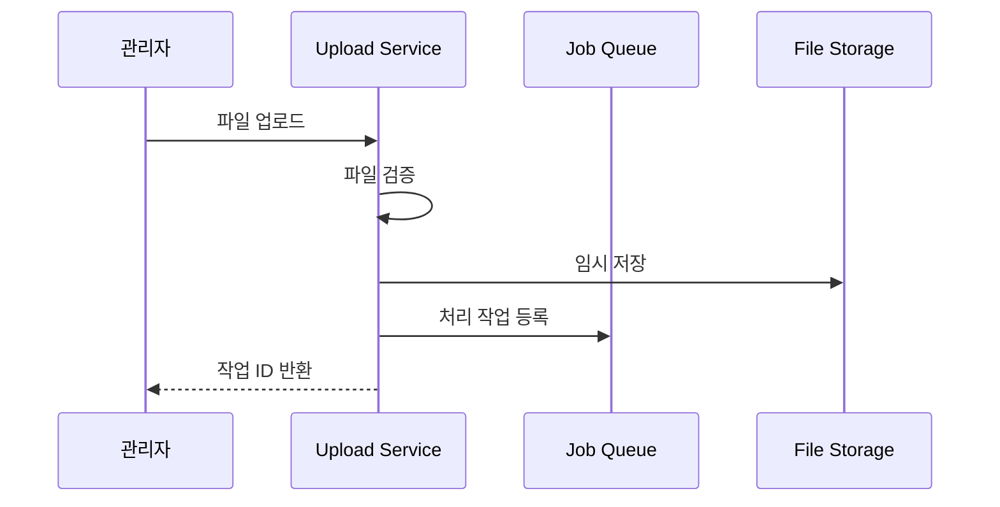

# Event Management - 파일 업로드 API

## 파일 업로드 처리 시스템 개요

참가자 데이터 파일 업로드를 위한 API 및 처리 시스템입니다.

### 파일 업로드 플로우



## API 명세

### 파일 업로드 서비스

```typescript
class FileUploadService {
  private readonly MAX_FILE_SIZE = 50 * 1024 * 1024; // 50MB
  private readonly ALLOWED_TYPES = ['text/csv', 'application/vnd.ms-excel'];
  
  async uploadFile(file: Express.Multer.File, metadata: UploadMetadata): Promise<UploadResult> {
    // 1. 파일 검증
    await this.validateFile(file);
    
    // 2. 고유 파일명 생성
    const fileName = this.generateFileName(file.originalname);
    
    // 3. 임시 저장소에 저장
    const tempPath = await this.saveToTempStorage(file, fileName);
    
    // 4. 백그라운드 처리 작업 생성
    const jobId = await this.createProcessingJob({
      fileName,
      tempPath,
      originalName: file.originalname,
      fileSize: file.size,
      metadata
    });
    
    return {
      jobId,
      fileName,
      estimatedProcessingTime: this.estimateProcessingTime(file.size)
    };
  }
  
  private async validateFile(file: Express.Multer.File): Promise<void> {
    // 파일 크기 검증
    if (file.size > this.MAX_FILE_SIZE) {
      throw new Error(`File size ${file.size} exceeds maximum ${this.MAX_FILE_SIZE}`);
    }
    
    // MIME 타입 검증
    if (!this.ALLOWED_TYPES.includes(file.mimetype)) {
      throw new Error(`File type ${file.mimetype} not allowed`);
    }
    
    // 파일 확장자 검증
    const allowedExtensions = ['.csv', '.xls', '.xlsx'];
    const fileExtension = path.extname(file.originalname).toLowerCase();
    if (!allowedExtensions.includes(fileExtension)) {
      throw new Error(`File extension ${fileExtension} not allowed`);
    }
  }
  
  private generateFileName(originalName: string): string {
    const timestamp = Date.now();
    const random = Math.random().toString(36).substring(2);
    const extension = path.extname(originalName);
    return `upload_${timestamp}_${random}${extension}`;
  }
  
  private async saveToTempStorage(file: Express.Multer.File, fileName: string): Promise<string> {
    const tempDir = path.join(process.env.TEMP_DIR || '/tmp', 'uploads');
    await fs.ensureDir(tempDir);
    
    const filePath = path.join(tempDir, fileName);
    await fs.writeFile(filePath, file.buffer);
    
    return filePath;
  }
  
  private estimateProcessingTime(fileSize: number): number {
    // 대략적인 처리 시간 추정 (바이트당 처리 시간)
    const BYTES_PER_SECOND = 100000; // 100KB/s
    return Math.ceil(fileSize / BYTES_PER_SECOND);
  }
}
```

## 데이터 타입 정의

```typescript
interface UploadMetadata {
  eventId: string;
  uploadedBy: string;
  options: {
    sendWelcomeEmail: boolean;
    generateQRCodes: boolean;
    overwriteExisting: boolean;
  };
}

interface UploadResult {
  jobId: string;
  fileName: string;
  estimatedProcessingTime: number;
}
```

## 에러 처리

### 지원되는 에러 타입

- `FILE_SIZE_EXCEEDED`: 파일 크기 초과
- `INVALID_FILE_TYPE`: 지원하지 않는 파일 형식
- `INVALID_FILE_FORMAT`: 파일 형식 오류
- `STORAGE_ERROR`: 저장소 접근 오류
- `VALIDATION_FAILED`: 파일 내용 검증 실패

### 에러 응답 형식

```json
{
  "error": {
    "code": "FILE_SIZE_EXCEEDED",
    "message": "File size 52,428,800 bytes exceeds maximum 50,000,000 bytes",
    "details": {
      "maxSize": 50000000,
      "actualSize": 52428800
    }
  }
}
```

## 성능 최적화

### 파일 처리 최적화
- 스트리밍 업로드 지원
- 청크 단위 검증 
- 메모리 사용량 제한
- 임시 파일 자동 정리

### 모니터링 메트릭
- 업로드 성공률
- 평균 처리 시간
- 에러 발생률
- 저장소 사용량
