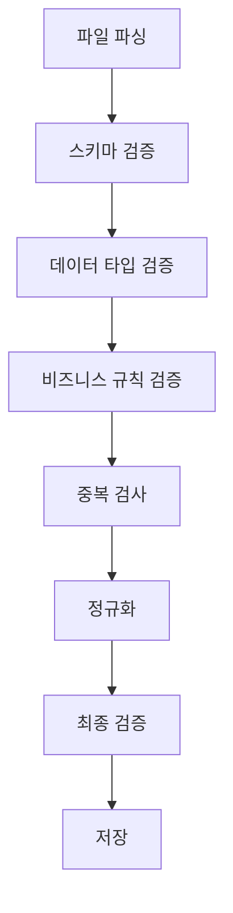

# Event Management - 데이터 검증 및 변환

## 데이터 검증 시스템

업로드된 참가자 데이터의 검증 및 변환 처리 시스템입니다.

### 데이터 검증 플로우



## 파일 파싱 및 검증

```typescript
class DataValidationService {
  async readAndParseFile(filePath: string, mimeType: string): Promise<ParticipantData[]> {
    switch (mimeType) {
      case 'text/csv':
        return await this.parseCSV(filePath);
      case 'application/vnd.ms-excel':
      case 'application/vnd.openxmlformats-officedocument.spreadsheetml.sheet':
        return await this.parseExcel(filePath);
      default:
        throw new Error(`Unsupported file type: ${mimeType}`);
    }
  }
  
  private async parseCSV(filePath: string): Promise<ParticipantData[]> {
    return new Promise((resolve, reject) => {
      const results: ParticipantData[] = [];
      
      fs.createReadStream(filePath)
        .pipe(csv({
          skipEmptyLines: true,
          trimHeaders: true,
          trimFields: true
        }))
        .on('data', (data) => {
          results.push(this.normalizeParticipantData(data));
        })
        .on('end', () => {
          resolve(results);
        })
        .on('error', (error) => {
          reject(new Error(`CSV parsing failed: ${error.message}`));
        });
    });
  }
  
  private async parseExcel(filePath: string): Promise<ParticipantData[]> {
    const workbook = XLSX.readFile(filePath);
    const sheetName = workbook.SheetNames[0];
    const worksheet = workbook.Sheets[sheetName];
    
    const jsonData = XLSX.utils.sheet_to_json(worksheet, {
      header: 1,
      defval: '',
      blankrows: false
    });
    
    // 첫 번째 행을 헤더로 사용
    const headers = jsonData[0] as string[];
    const dataRows = jsonData.slice(1) as any[][];
    
    return dataRows.map(row => {
      const participant: any = {};
      headers.forEach((header, index) => {
        participant[header] = row[index] || '';
      });
      return this.normalizeParticipantData(participant);
    });
  }
}
```

## 데이터 검증 규칙

### 필수 필드 검증

```typescript
interface ParticipantSchema {
  name: string;              // 필수
  email: string;             // 필수, 이메일 형식
  phone?: string;            // 선택, 전화번호 형식
  organization?: string;     // 선택
  position?: string;         // 선택
  dietary_restrictions?: string; // 선택
}

class ParticipantValidator {
  private readonly requiredFields = ['name', 'email'];
  private readonly emailRegex = /^[^\s@]+@[^\s@]+\.[^\s@]+$/;
  private readonly phoneRegex = /^[\+]?[\s\-\(\)]*[\d\s\-\(\)]{10,}$/;
  
  async validateAndCleanData(participants: ParticipantData[]): Promise<ValidationResult> {
    const validParticipants: ValidatedParticipant[] = [];
    const errors: ValidationError[] = [];
    
    for (let i = 0; i < participants.length; i++) {
      const participant = participants[i];
      const rowNumber = i + 2; // Excel 행 번호 (헤더 제외)
      
      try {
        const validated = await this.validateParticipant(participant, rowNumber);
        validParticipants.push(validated);
      } catch (error) {
        errors.push({
          row: rowNumber,
          field: error.field,
          value: error.value,
          message: error.message,
          severity: error.severity
        });
      }
    }
    
    return {
      participants: validParticipants,
      errors,
      statistics: {
        total: participants.length,
        valid: validParticipants.length,
        invalid: errors.length
      }
    };
  }
  
  private async validateParticipant(data: ParticipantData, rowNumber: number): Promise<ValidatedParticipant> {
    const errors: FieldError[] = [];
    
    // 필수 필드 검증
    for (const field of this.requiredFields) {
      if (!data[field] || data[field].trim() === '') {
        errors.push({
          field,
          value: data[field],
          message: `${field} is required`,
          severity: 'error'
        });
      }
    }
    
    // 이메일 형식 검증
    if (data.email && !this.emailRegex.test(data.email.trim())) {
      errors.push({
        field: 'email',
        value: data.email,
        message: 'Invalid email format',
        severity: 'error'
      });
    }
    
    // 전화번호 형식 검증 (선택사항)
    if (data.phone && !this.phoneRegex.test(data.phone.trim())) {
      errors.push({
        field: 'phone',
        value: data.phone,
        message: 'Invalid phone number format',
        severity: 'warning'
      });
    }
    
    // 중복 이메일 검증
    const existingParticipant = await this.checkEmailExists(data.email, data.eventId);
    if (existingParticipant) {
      errors.push({
        field: 'email',
        value: data.email,
        message: 'Email already exists for this event',
        severity: 'error'
      });
    }
    
    if (errors.some(e => e.severity === 'error')) {
      throw new ValidationError(errors, rowNumber);
    }
    
    return this.normalizeParticipant(data);
  }
}
```

## 데이터 정규화

```typescript
class DataNormalizer {
  normalizeParticipant(data: ParticipantData): ValidatedParticipant {
    return {
      name: this.normalizeName(data.name),
      email: this.normalizeEmail(data.email),
      phone: this.normalizePhone(data.phone),
      organization: this.normalizeOrganization(data.organization),
      position: this.normalizePosition(data.position),
      dietary_restrictions: this.normalizeDietaryRestrictions(data.dietary_restrictions),
      created_at: new Date(),
      updated_at: new Date()
    };
  }
  
  private normalizeName(name: string): string {
    return name?.trim()
      .replace(/\s+/g, ' ')
      .split(' ')
      .map(word => word.charAt(0).toUpperCase() + word.slice(1).toLowerCase())
      .join(' ') || '';
  }
  
  private normalizeEmail(email: string): string {
    return email?.trim().toLowerCase() || '';
  }
  
  private normalizePhone(phone: string): string {
    if (!phone) return '';
    
    // 숫자만 추출
    const digitsOnly = phone.replace(/\D/g, '');
    
    // 국제번호 형식으로 변환 (한국 기준)
    if (digitsOnly.startsWith('010')) {
      return `+82${digitsOnly.substring(1)}`;
    } else if (digitsOnly.startsWith('82')) {
      return `+${digitsOnly}`;
    }
    
    return phone.trim();
  }
  
  private normalizeOrganization(org: string): string {
    return org?.trim()
      .replace(/\s+/g, ' ')
      .replace(/^(주식회사|㈜|주)\s*/, '')
      .replace(/\s*(주식회사|㈜|주)$/, '') || '';
  }
}
```

## 비즈니스 규칙 검증

```typescript
class BusinessRuleValidator {
  async validateBusinessRules(participant: ValidatedParticipant, eventId: string): Promise<void> {
    const event = await this.getEventDetails(eventId);
    
    // 등록 기간 검증
    if (new Date() > event.registration_deadline) {
      throw new Error('Registration deadline has passed');
    }
    
    // 정원 검증
    const currentCount = await this.getParticipantCount(eventId);
    if (currentCount >= event.max_participants) {
      throw new Error('Event is full');
    }
    
    // 연령 제한 검증 (생년월일이 있는 경우)
    if (participant.birth_date && event.min_age) {
      const age = this.calculateAge(participant.birth_date);
      if (age < event.min_age) {
        throw new Error(`Minimum age requirement: ${event.min_age}`);
      }
    }
    
    // 특별 요구사항 검증
    await this.validateSpecialRequirements(participant, event);
  }
  
  private calculateAge(birthDate: Date): number {
    const today = new Date();
    const birth = new Date(birthDate);
    let age = today.getFullYear() - birth.getFullYear();
    const monthDiff = today.getMonth() - birth.getMonth();
    
    if (monthDiff < 0 || (monthDiff === 0 && today.getDate() < birth.getDate())) {
      age--;
    }
    
    return age;
  }
}
```

## 에러 보고 및 처리

### 검증 결과 리포트

```typescript
interface ValidationReport {
  summary: {
    totalRows: number;
    validRows: number;
    errorRows: number;
    warningRows: number;
  };
  errors: ValidationError[];
  warnings: ValidationWarning[];
  suggestions: string[];
}

class ValidationReporter {
  generateReport(result: ValidationResult): ValidationReport {
    const errors = result.errors.filter(e => e.severity === 'error');
    const warnings = result.errors.filter(e => e.severity === 'warning');
    
    return {
      summary: {
        totalRows: result.statistics.total,
        validRows: result.statistics.valid,
        errorRows: errors.length,
        warningRows: warnings.length
      },
      errors,
      warnings,
      suggestions: this.generateSuggestions(result.errors)
    };
  }
  
  private generateSuggestions(errors: ValidationError[]): string[] {
    const suggestions: string[] = [];
    
    const emailErrors = errors.filter(e => e.field === 'email');
    if (emailErrors.length > 0) {
      suggestions.push('Check email format: ensure all emails contain @ symbol and valid domain');
    }
    
    const phoneErrors = errors.filter(e => e.field === 'phone');
    if (phoneErrors.length > 0) {
      suggestions.push('Phone numbers should contain only digits, spaces, hyphens, and parentheses');
    }
    
    return suggestions;
  }
}
```

## 성능 최적화

### 배치 처리

```typescript
class BatchProcessor {
  private readonly BATCH_SIZE = 1000;
  
  async processBatch(participants: ValidatedParticipant[]): Promise<ProcessingResult> {
    const batches = this.createBatches(participants, this.BATCH_SIZE);
    const results: BatchResult[] = [];
    
    for (const batch of batches) {
      const result = await this.processSingleBatch(batch);
      results.push(result);
    }
    
    return this.aggregateResults(results);
  }
  
  private createBatches<T>(items: T[], batchSize: number): T[][] {
    const batches: T[][] = [];
    for (let i = 0; i < items.length; i += batchSize) {
      batches.push(items.slice(i, i + batchSize));
    }
    return batches;
  }
}
```
