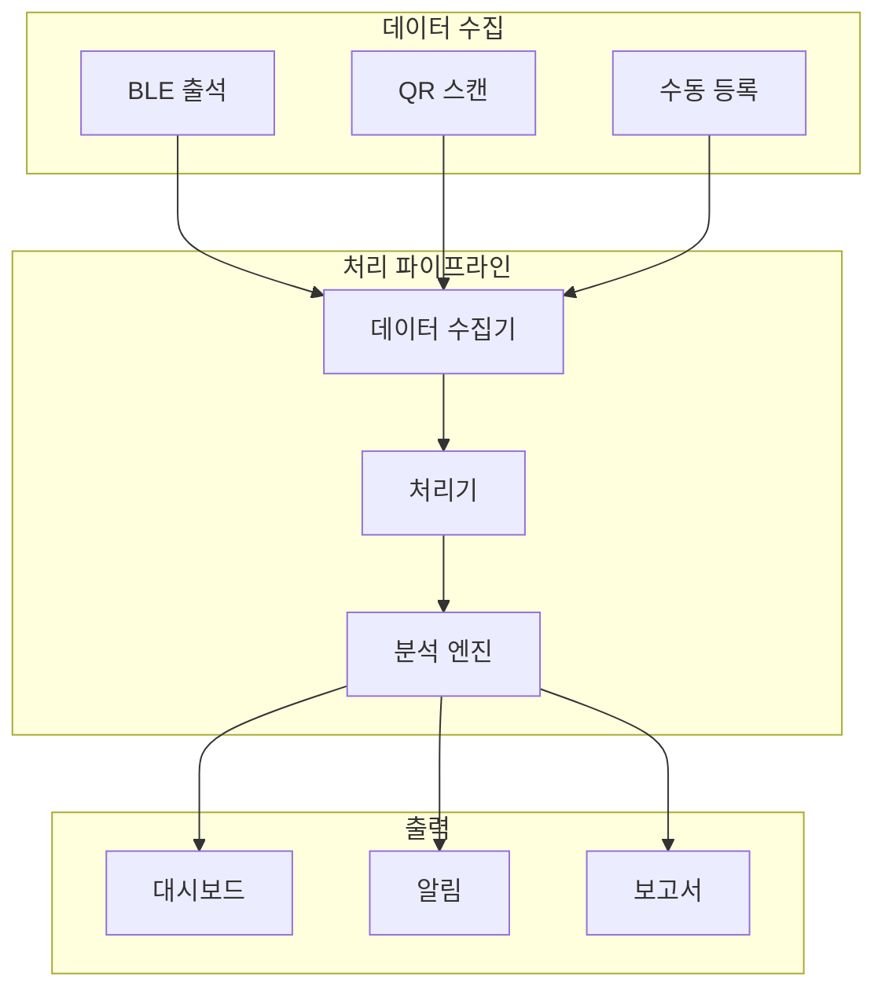

# 이벤트 추적 시스템

## 📌 개요

이벤트 진행 상황과 참가자 출석을 실시간으로 추적하고 모니터링하는 시스템입니다.
출석률, 참여도, 진행 현황 등을 실시간으로 파악할 수 있습니다.

## 📑 시스템 구성

### [출석 추적 API](./attendance-tracking-api.md)
- 실시간 출석 현황
- 출석 통계 및 분석
- 이상 징후 감지
- 출석 데이터 동기화

### [모니터링 구현](./monitoring-implementation.md)
- 실시간 대시보드
- 알림 및 경고
- 성능 모니터링
- 리소스 사용량

## 🔗 시스템 구조

## ⚡ 주요 기능

1. 실시간 추적
   - 출석 현황 모니터링
   - 진행 상황 추적
   - 문제 상황 감지
   - 즉시 대응 체계

2. 데이터 분석
   - 출석 패턴 분석
   - 참여도 측정
   - 예측 모델링
   - 개선점 도출

## 📊 성능 지표

| 기능 | 목표 응답시간 | 처리량 |
|-----|-------------|-------|
| 출석 기록 | < 300ms | 100/초 |
| 현황 조회 | < 500ms | 50/초 |
| 통계 생성 | < 2초 | 10/초 |

## 📚 관련 문서
- [이벤트 코어](../core/README.md)
- [분석 도구](../analytics/README.md)
- [알림 시스템](../notifications/README.md)
