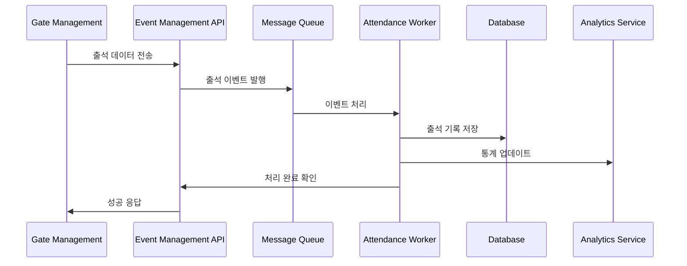
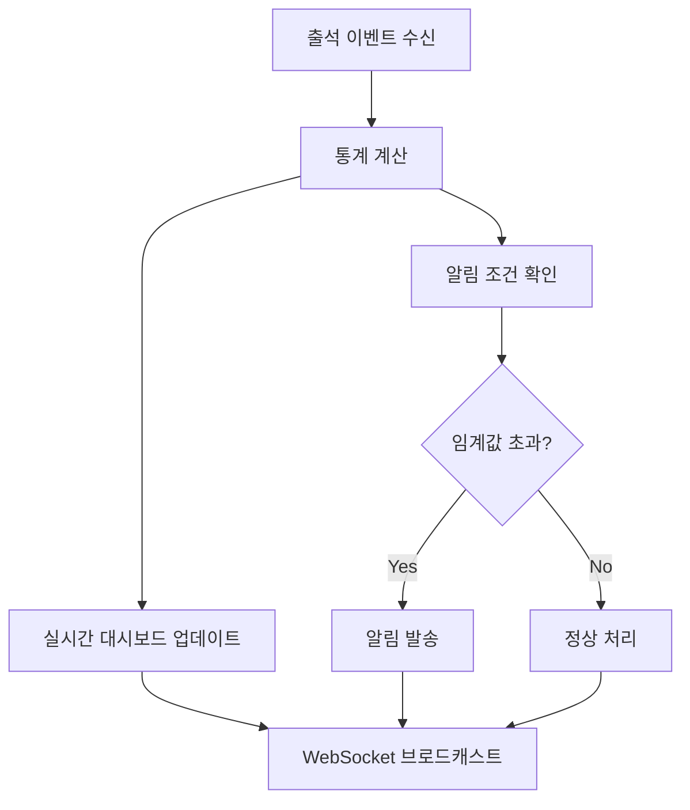

# Event Management 실시간 출석 추적 처리

## 📋 개요

Event Management 시스템의 실시간 출석 데이터 처리 시나리오입니다. 
고성능 메시지 큐 기반 처리와 실시간 통계 생성을 다룹니다.

---## 📈 실시간 출석 추적 시나리오

### 1. 출석 데이터 수신 및 처리



**출석 데이터 처리 API:**
```typescript
// 출석 기록 수신 API
POST /api/v1/attendance/record

interface AttendanceRequest {
  participantId: string;
  gateId: string;
  timestamp: string;
  method: 'ble_auto' | 'qr_scan' | 'manual';
  location?: GeoLocation;
  deviceInfo?: DeviceInfo;
}

class AttendanceService {
  async recordAttendance(request: AttendanceRequest): Promise<AttendanceRecord> {
    // 1. 기본 검증
    await this.validateAttendanceRequest(request);

    // 2. 중복 체크 (5분 내 동일 게이트)
    const recentAttendance = await this.checkRecentAttendance(
      request.participantId,
      request.gateId,
      5 * 60 * 1000 // 5분
    );

    if (recentAttendance) {
      throw new ConflictError('Recent attendance found for this gate');
    }

    // 3. 출석 기록 생성
    const record: AttendanceRecord = {
      id: generateUUID(),
      participantId: request.participantId,
      gateId: request.gateId,
      timestamp: new Date(request.timestamp),
      method: request.method,
      location: request.location,
      deviceInfo: request.deviceInfo,
      status: 'confirmed',
      createdAt: new Date()
    };

    // 4. 데이터베이스 저장
    await this.db.insertAttendanceRecord(record);

    // 5. 실시간 이벤트 발행
    await this.messageQueue.publish('attendance.recorded', {
      eventId: this.eventId,
      participantId: request.participantId,
      gateId: request.gateId,
      timestamp: request.timestamp,
      method: request.method
    });

    // 6. 통계 업데이트 (비동기)
    this.updateAttendanceStatistics(record);

    return record;
  }

  private async validateAttendanceRequest(request: AttendanceRequest): Promise<void> {
    // 참가자 존재 확인
    const participant = await this.db.getParticipant(request.participantId);
    if (!participant) {
      throw new NotFoundError('Participant not found');
    }

    if (participant.status !== 'active') {
      throw new BadRequestError('Participant is not active');
    }

    // 게이트 존재 확인
    const gate = await this.db.getGate(request.gateId);
    if (!gate || !gate.isActive) {
      throw new NotFoundError('Gate not found or inactive');
    }

    // 시간 범위 검증
    const timestamp = new Date(request.timestamp);
    const eventStart = new Date(this.eventInfo.startTime);
    const eventEnd = new Date(this.eventInfo.endTime);

    // 행사 시작 1시간 전부터 종료 1시간 후까지 허용
    const allowedStart = new Date(eventStart.getTime() - 60 * 60 * 1000);
    const allowedEnd = new Date(eventEnd.getTime() + 60 * 60 * 1000);

    if (timestamp < allowedStart || timestamp > allowedEnd) {
      throw new BadRequestError('Attendance time outside allowed period');
    }
  }

  private async checkRecentAttendance(
    participantId: string, 
    gateId: string, 
    windowMs: number
  ): Promise<AttendanceRecord | null> {
    const cutoffTime = new Date(Date.now() - windowMs);
    
    return await this.db.findAttendanceRecord({
      participantId,
      gateId,
      timestamp: { gte: cutoffTime }
    });
  }

  // 배치 출석 처리 (다중 게이트 동시 처리)
  async recordBatchAttendance(requests: AttendanceRequest[]): Promise<BatchResult> {
    const results: BatchResult = {
      successful: [],
      failed: [],
      duplicates: []
    };

    const batches = this.groupByGate(requests);

    for (const [gateId, gateRequests] of batches) {
      try {
        const batchResult = await this.processBatchForGate(gateId, gateRequests);
        results.successful.push(...batchResult.successful);
        results.failed.push(...batchResult.failed);
        results.duplicates.push(...batchResult.duplicates);
      } catch (error) {
        // 게이트별 처리 실패 시 해당 배치 전체를 실패로 처리
        results.failed.push(...gateRequests.map(req => ({
          request: req,
          error: error.message
        })));
      }
    }

    return results;
  }
}
```

### 2. 실시간 통계 및 모니터링



**실시간 통계 처리:**
```typescript
class RealTimeStatistics {
  private stats = new Map<string, any>();
  private websocket: WebSocketService;
  private cache: CacheService;

  async updateAttendanceStats(record: AttendanceRecord): Promise<void> {
    // 1. 전체 출석률 업데이트
    await this.updateOverallStats(record);

    // 2. 게이트별 통계 업데이트
    await this.updateGateStats(record);

    // 3. 시간대별 통계 업데이트
    await this.updateHourlyStats(record);

    // 4. 알림 조건 확인
    await this.checkAlertConditions(record);

    // 5. 실시간 대시보드에 브로드캐스트
    await this.broadcastUpdate();
  }

  private async updateOverallStats(record: AttendanceRecord): Promise<void> {
    const totalParticipants = await this.db.getTotalParticipants();
    const attendedParticipants = await this.db.getUniqueAttendees();
    
    const stats = {
      totalParticipants,
      attendedParticipants,
      attendanceRate: (attendedParticipants / totalParticipants) * 100,
      lastUpdated: new Date().toISOString(),
      trend: await this.calculateTrend()
    };

    await this.cache.setex('stats:overall', 60, stats);
    this.stats.set('overall', stats);
  }

  private async updateGateStats(record: AttendanceRecord): Promise<void> {
    const gateStats = await this.db.getGateStatistics(record.gateId);
    
    const stats = {
      gateId: record.gateId,
      totalProcessed: gateStats.total,
      avgProcessingTime: gateStats.avgTime,
      lastAttendance: record.timestamp,
      methodBreakdown: gateStats.methodStats,
      currentLoad: await this.calculateCurrentLoad(record.gateId),
      estimatedWaitTime: await this.estimateWaitTime(record.gateId)
    };

    await this.cache.setex(`stats:gate:${record.gateId}`, 60, stats);
    this.stats.set(`gate:${record.gateId}`, stats);
  }

  private async updateHourlyStats(record: AttendanceRecord): Promise<void> {
    const hour = new Date(record.timestamp).getHours();
    const hourKey = `hour:${hour}`;
    
    const hourStats = this.stats.get(hourKey) || {
      hour,
      count: 0,
      methods: {},
      gates: {}
    };

    hourStats.count++;
    hourStats.methods[record.method] = (hourStats.methods[record.method] || 0) + 1;
    hourStats.gates[record.gateId] = (hourStats.gates[record.gateId] || 0) + 1;

    this.stats.set(hourKey, hourStats);
    await this.cache.setex(`stats:${hourKey}`, 3600, hourStats);
  }

  private async checkAlertConditions(record: AttendanceRecord): Promise<void> {
    // 게이트 과부하 감지
    const currentLoad = await this.calculateCurrentLoad(record.gateId);
    if (currentLoad > 0.8) { // 80% 이상 부하
      await this.sendAlert('gate_overload', {
        gateId: record.gateId,
        currentLoad,
        estimatedWaitTime: await this.estimateWaitTime(record.gateId)
      });
    }

    // 출석률 저조 감지
    const overallStats = this.stats.get('overall');
    if (overallStats && overallStats.attendanceRate < 30) {
      const eventProgress = this.calculateEventProgress();
      if (eventProgress > 0.5) { // 행사 진행률 50% 이상에서 출석률 30% 미만
        await this.sendAlert('low_attendance', {
          attendanceRate: overallStats.attendanceRate,
          eventProgress
        });
      }
    }
  }

  private async calculateCurrentLoad(gateId: string): Promise<number> {
    // 최근 5분간 처리량 기반 부하 계산
    const fiveMinutesAgo = new Date(Date.now() - 5 * 60 * 1000);
    const recentAttendance = await this.db.getAttendanceCount({
      gateId,
      timestamp: { gte: fiveMinutesAgo }
    });

    const gateCapacity = await this.db.getGateCapacity(gateId);
    return recentAttendance / (gateCapacity * 5); // 5분 기준 처리율
  }

  private async broadcastUpdate(): Promise<void> {
    const statsSnapshot = Object.fromEntries(this.stats);
    
    // WebSocket으로 실시간 대시보드에 전송
    await this.websocket.broadcast('stats.updated', statsSnapshot);
    
    // 연동 서비스에도 전송
    await this.notifyIntegratedPlatform(statsSnapshot);
  }

  // 예측 통계 생성
  async generatePredictiveStats(): Promise<PredictiveStats> {
    const currentStats = this.stats.get('overall');
    const hourlyTrends = await this.getHourlyTrends();
    
    return {
      expectedFinalAttendance: this.predictFinalAttendance(currentStats, hourlyTrends),
      peakHourPrediction: this.predictPeakHour(hourlyTrends),
      gateLoadDistribution: await this.predictGateLoads(),
      completionTime: this.predictCompletionTime(currentStats)
    };
  }
}
```

### 3. 성능 최적화 및 확장성

```typescript
class PerformanceOptimizer {
  private connectionPool: DatabasePool;
  private redisCluster: RedisCluster;

  // 데이터베이스 최적화
  async optimizeQueries(): Promise<void> {
    // 출석 기록 조회 최적화
    await this.db.createIndex('attendance_participant_gate_timestamp', {
      table: 'attendance_records',
      columns: ['participant_id', 'gate_id', 'timestamp']
    });

    // 통계 쿼리 최적화를 위한 집계 테이블
    await this.createAggregationTables();

    // 파티셔닝 설정 (날짜별)
    await this.setupPartitioning();
  }

  private async createAggregationTables(): Promise<void> {
    // 시간대별 집계 테이블
    await this.db.raw(`
      CREATE TABLE IF NOT EXISTS attendance_hourly_stats (
        date DATE,
        hour INTEGER,
        gate_id VARCHAR(50),
        count INTEGER,
        method_breakdown JSONB,
        avg_processing_time NUMERIC,
        PRIMARY KEY (date, hour, gate_id)
      )
    `);

    // 실시간 집계 뷰
    await this.db.raw(`
      CREATE MATERIALIZED VIEW IF NOT EXISTS current_stats AS
      SELECT 
        gate_id,
        COUNT(*) as total_processed,
        AVG(processing_time_ms) as avg_processing_time,
        MAX(timestamp) as last_attendance,
        COUNT(DISTINCT participant_id) as unique_participants
      FROM attendance_records
      WHERE timestamp >= CURRENT_DATE
      GROUP BY gate_id
    `);

    // 주기적 갱신 스케줄
    this.scheduleViewRefresh();
  }

  // 캐싱 전략
  async implementCachingStrategy(): Promise<void> {
    // 다층 캐싱 구조
    const cacheConfig = {
      L1: { // 메모리 캐시 (가장 빠름)
        ttl: 60,
        maxSize: 1000,
        strategy: 'LRU'
      },
      L2: { // Redis 캐시 (중간 속도)
        ttl: 300,
        cluster: true,
        strategy: 'distributed'
      },
      L3: { // 데이터베이스 (가장 느림)
        strategy: 'materialized_views'
      }
    };

    await this.setupMultiLevelCache(cacheConfig);
  }

  // 실시간 이벤트 스트리밍
  async setupEventStreaming(): Promise<void> {
    // Kafka 클러스터 설정
    const kafka = new KafkaCluster({
      brokers: process.env.KAFKA_BROKERS?.split(',') || ['localhost:9092'],
      clientId: 'event-management'
    });

    // 토픽 생성
    await kafka.createTopics([
      {
        topic: 'attendance.events',
        numPartitions: 6, // 게이트 수에 따라 조정
        replicationFactor: 3
      },
      {
        topic: 'statistics.updates',
        numPartitions: 3,
        replicationFactor: 3
      }
    ]);

    // 컨슈머 그룹 설정
    await this.setupConsumerGroups(kafka);
  }
}
```

---


---

*이 파일은 [attendance-tracking.md](./attendance-tracking.md)에서 분할된 실시간 처리 전문 문서입니다.*
