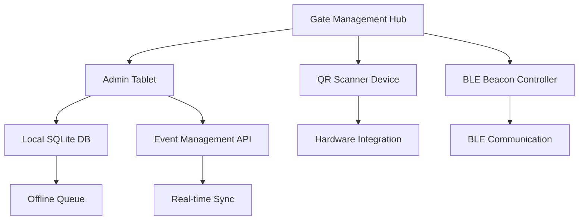
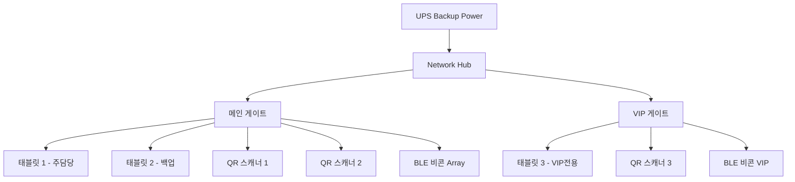

# Gate Management Service

## 🎯 서비스 정의

**Gate Management Service**는 행사 현장의 게이트에서 사용되는 출입 관리 시스템입니다.
**단일 행사 특화**로 설계되어 높은 성능과 안정성을 제공하며, 오프라인 모드까지 지원합니다.

## 📁 디렉토리 구조

### 핵심 기능 (core/)
- `implementation.md` - 시스템 구현
- `management.md` - 게이트 관리 기능

### 출석 처리 (attendance/)
- `processing.md` - 출석 데이터 처리

### 운영 관리 (operations/)
- `system.md` - 시스템 운영 관리
- 운영 관리 기능

### 보안 (security/)
- `ui.md` - UI 보안 구현
- 접근 제어 및 인증

### 분석 (analytics/)
- `reporting.md` - 분석 및 보고
- 성능 지표

### 디바이스 관리 (device/)
- 하드웨어 연동
- 비콘 관리

## 🔗 관련 링크
- [이벤트 관리](../event-management/README.md)
- [사용자 앱](../user-app/README.md)

## 🏗️ 기술 아키텍처

### 현장 기술 스택
```
Frontend: React Native | Flutter (태블릿 앱)
Backend: Node.js | Python Flask (경량 API)
로컬 DB: SQLite | Realm (오프라인 지원)
하드웨어: QR Scanner + BLE Hub + 태블릿
네트워크: Wi-Fi + 4G 백업
```

### 시스템 구성


### 현장 배치 구조


## 🏷️ 주요 구성 요소

### Gate Admin Tablet App
**현장 관리자용 태블릿 애플리케이션**
- 터치 최적화 UI
- 참가자 도움 및 문제 해결
- 실시간 출석 현황 모니터링
- 수동 출석 처리 기능

### QR Scanner Device System
**전용 QR 스캐너 하드웨어 시스템**
- 고성능 QR 코드 스캔
- 자동화된 출석 처리
- 하드웨어 최적화
- 대량 처리 지원

### BLE Beacon Integration
**BLE 비콘 연동 시스템**
- User App과 BLE 통신
- 자동 근접 감지
- 백그라운드 출석 처리

## 📱 주요 기능

### 출석 처리
- QR 코드 스캔 검증
- BLE 비콘 자동 감지
- 수동 출석 등록
- 중복 출석 방지

### 현장 관리
- 실시간 참가자 지원
- 문제 상황 대응
- 게이트별 통계 모니터링
- 스태프 커뮤니케이션

### 데이터 동기화
- Event Management Service 연동
- 오프라인 데이터 저장
- 네트워크 복구 시 자동 동기화

## 🔗 연동 서비스

### Event Management Service
- 참가자 토큰 실시간 검증
- 출석 데이터 전송
- 행사 설정 및 업데이트 수신

### User App
- BLE 비콘 통신
- 자동 출석 처리 신호

## 📊 데이터 구조

### 게이트 설정
```json
{
  "gateConfig": {
    "gateId": "main-entrance",
    "eventId": "tech-conference-2024",
    "eventApiEndpoint": "https://tc24.events.com/api",
    "deviceSettings": {
      "scanTimeout": 5000,
      "bleEnabled": true,
      "offlineMode": true
    }
  }
}
```

### 출석 기록
```json
{
  "attendanceRecord": {
    "participantToken": "TCF24-ABCD-1234",
    "gateId": "main-entrance",
    "timestamp": "2024-01-20T09:30:00Z",
    "method": "qr_scan",
    "deviceId": "tablet-001",
    "status": "success"
  }
}
```

## 🎯 핵심 시나리오

1. **[실시간 출석 처리 시나리오](./gate-management-scenarios.md#실시간-출석-처리)**
   - QR 코드 스캔 및 검증
   - 즉시 피드백 제공

2. **[현장 문제 해결 시나리오](./gate-management-scenarios.md#현장-문제-해결)**
   - 참가자 지원 및 도움
   - 수동 출석 처리

3. **[오프라인 모드 시나리오](./gate-management-scenarios.md#오프라인-모드)**
   - 네트워크 장애 시 운영
   - 로컬 데이터 관리

4. **[다중 게이트 운영](./gate-management-scenarios.md#다중-게이트-운영)**
   - 여러 입구 동시 관리
   - 게이트 간 데이터 동기화

## 🔧 기술 스택 권장사항

### 태블릿 애플리케이션
- **React Native** 또는 **Flutter**: 크로스 플랫폼
- **Progressive Web App**: 웹 기반 배포 용이성
- **Native**: 성능 최적화 필요 시

### QR 스캐너 연동
- **Camera API**: 실시간 QR 스캔
- **ZXing**: QR 코드 디코딩 라이브러리
- **Hardware SDK**: 전용 스캐너 연동

### BLE 통신
- **CoreBluetooth** (iOS), **BluetoothLE** (Android)
- **Web Bluetooth API** (PWA 사용 시)

### 데이터 저장
- **SQLite**: 로컬 데이터 저장
- **IndexedDB**: 웹 환경 로컬 저장소

## 📈 성능 요구사항

### 응답성
- QR 스캔 처리: 2초 이내
- 토큰 검증: 3초 이내
- UI 반응: 500ms 이내

### 처리량
- 동시 스캔: 5명/분
- 피크 타임: 10명/분
- 연속 운영: 8시간 이상

### 안정성
- 오프라인 동작: 필수
- 데이터 무손실: 99.9%
- 시스템 가용성: 99.5%

## 🏢 배포 시나리오

### 행사별 독립 배포
```
Tech Conference 2024 배포:
- Gate Management Service (별도 인스턴스)
- 태블릿 앱 설치 (5대)
- QR 스캐너 설정 (3대)
- BLE 비콘 설치 (입구 2곳)

Startup Meetup 2024 배포:
- Gate Management Service (별도 인스턴스) 
- 태블릿 앱 설치 (2대)
- QR 스캐너 설정 (1대)
- BLE 비콘 설치 (입구 1곳)
```

### 하드웨어 요구사항
- **태블릿**: 10인치 이상, Android/iOS
- **QR 스캐너**: 2D 바코드 지원
- **BLE 비콘**: Bluetooth 5.0 지원
- **네트워크**: Wi-Fi 또는 4G/5G

## 🚀 개발 로드맵

### Phase 1: 기본 기능
- QR 코드 스캔 및 검증
- 기본 태블릿 UI
- Event Management 연동

### Phase 2: 현장 최적화
- 오프라인 모드 구현
- 현장 관리자 도구
- 다중 게이트 지원

### Phase 3: 고급 기능
- BLE 비콘 연동
- 실시간 분석 대시보드
- 자동화 기능 강화

### Phase 4: 하드웨어 통합
- 전용 QR 스캐너 연동
- IoT 센서 통합
- 하드웨어 최적화

이 Gate Management Service는 현장의 운영 효율성을 최대화하면서도, 참가자에게 매끄러운 입장 경험을 제공하는 것을 목표로 합니다.
