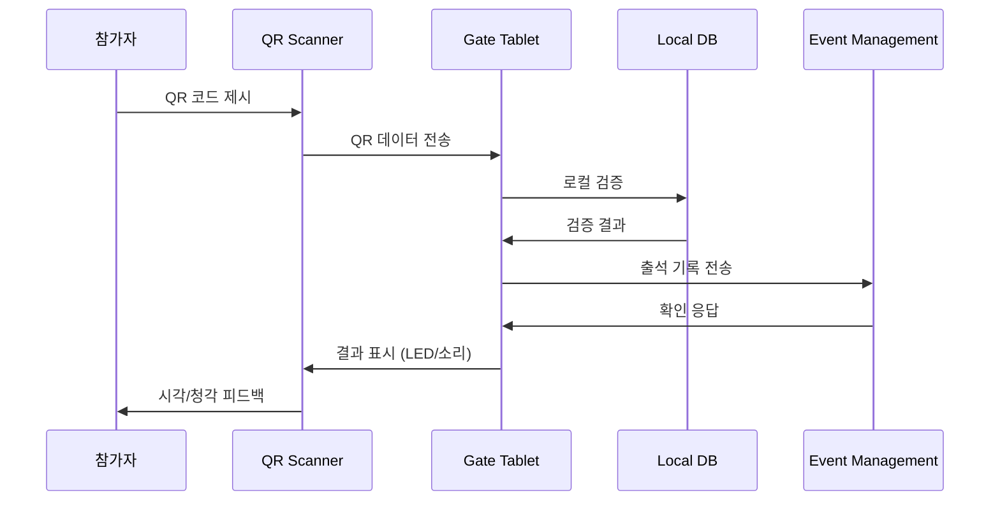
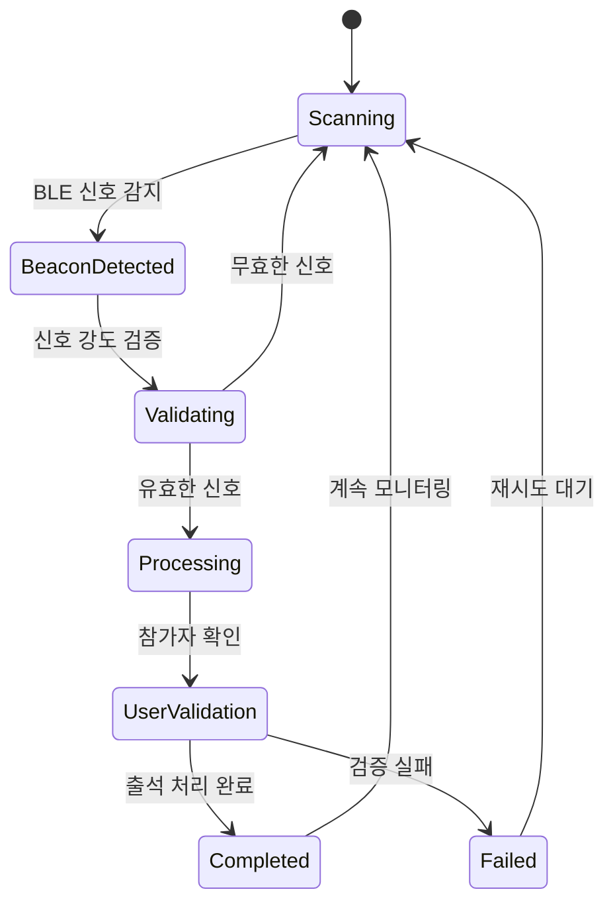
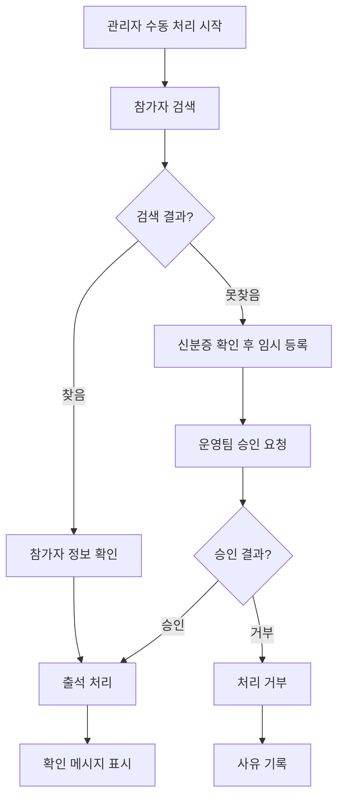
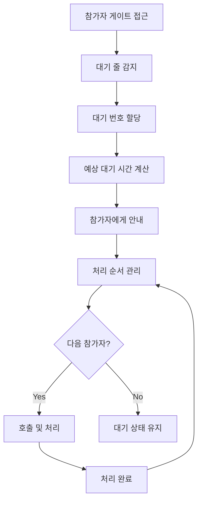

# Gate Management 현장 출석 처리 및 모니터링

## 개요

Gate Management Service의 현장 출석 처리와 실시간 모니터링 시스템의 상세 시나리오입니다.

> **연관 문서**: 
> - [시스템 운영 및 하드웨어](system-operations.md) - 오프라인 모드, 하드웨어 연동
> - [UI/UX 및 보안](ui-security.md) - 태블릿 인터페이스, 보안 관리
> - [게이트 관리 개요](core-scenarios.md) - 전체 시스템 개요

---

## 🚪 현장 출석 처리 시나리오

### 1. QR 코드 스캔 처리



**QR 스캐너 하드웨어 연동:**
```typescript
// QR 스캐너 하드웨어 인터페이스
class QRScannerDevice {
  private device: HardwareInterface;
  private onScanCallback: (data: string) => void;

  async initialize(): Promise<void> {
    // 하드웨어 초기화
    await this.device.connect();
    await this.device.configure({
      scanMode: 'continuous',
      timeout: 5000,
      illumination: true,
      beepOnSuccess: true,
      ledIndicator: true
    });

    // 스캔 이벤트 리스너 설정
    this.device.onScan(this.handleScan.bind(this));
  }

  private async handleScan(rawData: string): Promise<void> {
    try {
      // QR 데이터 파싱
      const qrData = JSON.parse(rawData);
      
      // 데이터 구조 검증
      if (!this.isValidQRData(qrData)) {
        await this.showError('Invalid QR Code');
        return;
      }

      // 출석 처리 콜백 실행
      await this.onScanCallback?.(qrData);
      
      // 성공 피드백
      await this.showSuccess();
      
    } catch (error) {
      console.error('QR scan error:', error);
      await this.showError('Scan Failed');
    }
  }

  private isValidQRData(data: any): boolean {
    return data && 
           typeof data.participantId === 'string' &&
           typeof data.token === 'string' &&
           typeof data.eventId === 'string';
  }

  private async showSuccess(): Promise<void> {
    // LED 녹색 + 성공 비프음
    await this.device.setLED('green', 1000);
    await this.device.beep(2, 200);
  }

  private async showError(message: string): Promise<void> {
    // LED 빨간색 + 오류 비프음
    await this.device.setLED('red', 2000);
    await this.device.beep(1, 500);
    console.log(`QR Error: ${message}`);
  }
}
```

### 2. BLE 자동 감지 처리



**BLE 비콘 컨트롤러:**
```typescript
class BLEBeaconController {
  private beacons: Map<string, BeaconConfig> = new Map();
  private detectedDevices: Map<string, DetectionData> = new Map();

  async initializeBeacons(gateConfig: GateConfig): Promise<void> {
    for (const beaconConfig of gateConfig.beacons) {
      await this.setupBeacon(beaconConfig);
    }

    // BLE 스캐닝 시작
    await this.startContinuousScanning();
  }

  private async startContinuousScanning(): Promise<void> {
    // Central 모드로 스캐닝
    BluetoothLE.scan({
      services: this.getTargetServices(),
      scanMode: 'lowLatency',
      reportDelay: 0 // 즉시 보고
    });

    BluetoothLE.onDeviceFound(this.handleDeviceDetected.bind(this));
  }

  private async handleDeviceDetected(device: BLEDevice): Promise<void> {
    // User App에서 송신하는 출석 신호 감지
    if (!this.isAttendanceSignal(device)) {
      return;
    }

    const userId = this.extractUserIdFromSignal(device);
    const signalStrength = device.rssi;
    const distance = this.calculateDistance(signalStrength);

    // 거리 검증 (5m 이내)
    if (distance > 5.0) {
      return;
    }

    // 중복 감지 방지 (10초 내)
    const lastDetection = this.detectedDevices.get(userId);
    if (lastDetection && Date.now() - lastDetection.timestamp < 10000) {
      return;
    }

    // 출석 처리 요청
    await this.processAutoAttendance({
      userId,
      signalStrength,
      distance,
      timestamp: new Date(),
      method: 'ble_auto'
    });

    // 감지 기록 업데이트
    this.detectedDevices.set(userId, {
      timestamp: Date.now(),
      signalStrength,
      distance
    });
  }

  private isAttendanceSignal(device: BLEDevice): boolean {
    // User App에서 보내는 특정 패턴 확인
    return device.name?.startsWith('SAG-') && 
           device.manufacturerData?.includes(this.eventId);
  }

  private calculateDistance(rssi: number): number {
    // RSSI를 거리로 변환 (대략적 계산)
    if (rssi === 0) return -1.0;

    const ratio = rssi / -59.0; // 1m에서의 기준 RSSI
    if (ratio < 1.0) {
      return Math.pow(ratio, 10);
    } else {
      const accuracy = (0.89976) * Math.pow(ratio, 7.7095) + 0.111;
      return accuracy;
    }
  }
}
```

### 3. 수동 출석 처리



**태블릿 관리자 인터페이스:**
```typescript
// 태블릿 앱 - 수동 처리 컴포넌트
class ManualAttendanceProcessor {
  private searchResults: Participant[] = [];

  async searchParticipant(query: string): Promise<Participant[]> {
    // 로컬 DB에서 먼저 검색 (빠른 응답)
    let results = await this.localDB.searchParticipants(query);

    // 로컬 결과가 없으면 서버 검색
    if (results.length === 0 && this.isOnline()) {
      try {
        results = await this.eventManagementAPI.searchParticipants(query);
        
        // 검색 결과를 로컬에 캐시
        await this.cacheSearchResults(results);
      } catch (error) {
        console.error('Server search failed:', error);
      }
    }

    this.searchResults = results;
    return results;
  }

  async processManualAttendance(participantId: string, reason?: string): Promise<void> {
    const participant = this.searchResults.find(p => p.id === participantId);
    if (!participant) {
      throw new Error('Participant not found in search results');
    }

    // 중복 체크
    const recentAttendance = await this.checkRecentAttendance(participantId);
    if (recentAttendance) {
      throw new ConflictError('Participant already checked in recently');
    }

    const attendanceRecord: AttendanceRecord = {
      id: generateUUID(),
      participantId,
      gateId: this.gateId,
      timestamp: new Date(),
      method: 'manual',
      processedBy: this.adminId,
      reason: reason || 'Manual check-in',
      status: 'confirmed'
    };

    // 로컬 저장
    await this.localDB.insertAttendance(attendanceRecord);

    // 서버 동기화 시도
    try {
      await this.syncToEventManagement(attendanceRecord);
    } catch (error) {
      // 오프라인 큐에 추가
      await this.addToSyncQueue(attendanceRecord);
    }

    // UI 업데이트
    await this.showSuccessMessage(participant.name);
    await this.updateLocalStats();
  }

  // 임시 참가자 등록 (신분증 확인 후)
  async createTemporaryParticipant(data: TempParticipantData): Promise<void> {
    const tempId = `TEMP_${Date.now()}`;
    
    const tempParticipant: TempParticipant = {
      id: tempId,
      name: data.name,
      phone: data.phone,
      idNumber: data.idNumber, // 신분증 번호
      verificationMethod: data.verificationMethod,
      approvalRequired: true,
      createdBy: this.adminId,
      createdAt: new Date()
    };

    // 임시 저장
    await this.localDB.insertTempParticipant(tempParticipant);

    // 운영팀 승인 요청
    await this.requestApproval(tempParticipant);

    // 대기 상태 표시
    await this.showPendingApprovalMessage(data.name);
  }
}
```

---

## 📊 실시간 모니터링 시나리오

### 1. 게이트 현황 대시보드

```
태블릿 메인 화면:

┌─────────────────────────────────────┐
│ 🚪 메인 게이트 - 실시간 현황       │
│ 🕐 15:30 | 📡 온라인 | 🔋 85%     │
│                                     │
│ 📊 오늘 출석 현황:                 │
│ ✅ 처리완료: 1,247명               │
│ ⏳ 현재 대기: 3명                  │
│ ⚡ 평균 처리: 4.2초                │
│                                     │
│ 🔧 시스템 상태:                    │
│ 📷 QR 스캐너: 🟢 정상              │
│ 📡 BLE 비콘: 🟢 4/4 온라인         │
│ 🌐 네트워크: 🟢 Wi-Fi 연결         │
│ 💾 동기화: 🟢 실시간               │
│                                     │
│ [👤 참가자 검색] [📋 수동 처리]     │
│ [⚙️ 설정] [❓ 도움말]             │
│                                     │
│ ⚠️ 알림: VIP 그룹 16:00 도착 예정   │
└─────────────────────────────────────┘
```

**실시간 통계 업데이트:**
```typescript
class RealTimeMonitoring {
  private stats: GateStatistics = {
    totalProcessed: 0,
    currentWaiting: 0,
    avgProcessingTime: 0,
    systemStatus: 'online'
  };

  private updateInterval: NodeJS.Timeout;

  async startMonitoring(): Promise<void> {
    // 1초마다 통계 업데이트
    this.updateInterval = setInterval(async () => {
      await this.updateStatistics();
      await this.checkSystemHealth();
    }, 1000);

    // WebSocket으로 실시간 업데이트 수신
    this.websocket.on('stats.updated', this.handleStatsUpdate.bind(this));
    this.websocket.on('system.alert', this.handleSystemAlert.bind(this));
  }

  private async updateStatistics(): Promise<void> {
    // 로컬 DB에서 통계 계산
    const today = new Date().toDateString();
    
    const [totalProcessed, avgTime, pendingCount] = await Promise.all([
      this.localDB.getAttendanceCount(today),
      this.localDB.getAverageProcessingTime(today),
      this.localDB.getPendingCount()
    ]);

    this.stats = {
      ...this.stats,
      totalProcessed,
      avgProcessingTime: avgTime,
      currentWaiting: pendingCount,
      lastUpdated: new Date()
    };

    // UI 업데이트
    await this.updateDashboard(this.stats);
  }

  private async checkSystemHealth(): Promise<void> {
    const health = {
      qrScanner: await this.checkQRScannerStatus(),
      bleBeacons: await this.checkBLEBeaconStatus(),
      network: await this.checkNetworkStatus(),
      storage: await this.checkStorageStatus(),
      battery: await this.getBatteryLevel()
    };

    // 문제 감지 시 알림
    for (const [component, status] of Object.entries(health)) {
      if (status.status !== 'healthy') {
        await this.showSystemAlert(component, status);
      }
    }
  }

  private async checkQRScannerStatus(): Promise<ComponentStatus> {
    try {
      const lastScan = await this.qrScanner.getLastActivity();
      const isResponsive = Date.now() - lastScan < 30000; // 30초 이내 활동

      return {
        status: isResponsive ? 'healthy' : 'warning',
        lastActivity: lastScan,
        message: isResponsive ? 'Normal' : 'No recent activity'
      };
    } catch (error) {
      return {
        status: 'error',
        message: 'QR Scanner disconnected'
      };
    }
  }
}
```

### 2. 대기 줄 관리



**대기 줄 관리 시스템:**
```typescript
class QueueManagement {
  private queue: QueueItem[] = [];
  private currentlyProcessing: Set<string> = new Set();

  async addToQueue(participantInfo: ParticipantInfo): Promise<QueueTicket> {
    const ticket: QueueTicket = {
      id: generateUUID(),
      participantId: participantInfo.id,
      joinTime: new Date(),
      estimatedWaitTime: this.calculateWaitTime(),
      priority: this.calculatePriority(participantInfo),
      status: 'waiting'
    };

    // 우선순위에 따라 정렬 삽입
    this.insertByPriority(ticket);

    // 참가자에게 대기 번호 알림
    await this.notifyParticipant(ticket);

    return ticket;
  }

  private calculateWaitTime(): number {
    const avgProcessingTime = this.stats.avgProcessingTime;
    const queueLength = this.queue.length;
    const activeProcessors = this.currentlyProcessing.size;

    // 단순 계산: (대기 인원 * 평균 처리 시간) / 활성 처리 창구
    return Math.ceil((queueLength * avgProcessingTime) / Math.max(activeProcessors, 1));
  }

  private calculatePriority(participant: ParticipantInfo): number {
    let priority = 100; // 기본 우선순위

    // VIP/VVIP 우선 처리
    if (participant.vipLevel === 'VVIP') priority += 50;
    else if (participant.vipLevel === 'VIP') priority += 30;

    // 접근성 요구사항 (휠체어, 시각장애 등)
    if (participant.accessibilityNeeds) priority += 20;

    // 대기 시간이 길수록 우선순위 증가
    const waitMinutes = Math.floor((Date.now() - participant.joinTime) / 60000);
    priority += Math.min(waitMinutes * 2, 40); // 최대 40점 추가

    return priority;
  }

  async processNext(): Promise<QueueTicket | null> {
    if (this.queue.length === 0) return null;

    // 가장 높은 우선순위 참가자 선택
    const nextTicket = this.queue.shift()!;
    nextTicket.status = 'processing';
    nextTicket.processingStartTime = new Date();

    this.currentlyProcessing.add(nextTicket.id);

    // 처리 시작 알림
    await this.notifyProcessingStart(nextTicket);

    return nextTicket;
  }

  async completeProcessing(ticketId: string): Promise<void> {
    this.currentlyProcessing.delete(ticketId);

    // 대기 시간 업데이트 (다른 대기자들을 위해)
    await this.updateWaitTimes();

    // 다음 참가자 자동 호출
    await this.processNext();
  }
}
```
