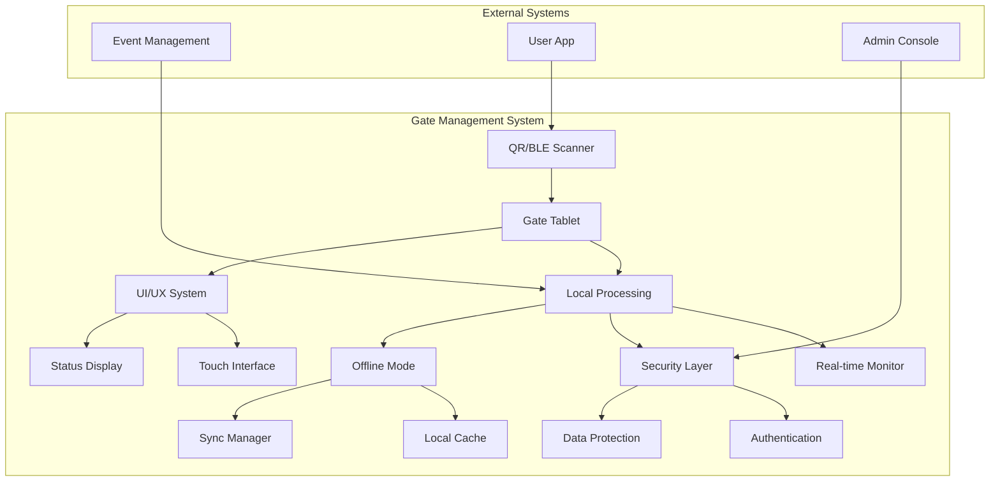

# Gate Management 핵심 시나리오

## 🎯 개요

Gate Management Service의 핵심 기능별 상세 시나리오입니다.
현장 최적화, 오프라인 지원, 실시간 처리가 주요 특징입니다.

**⚠️ 파일 분할 완료**: 이 문서는 관리 편의성을 위해 3개의 전문 영역으로 분할되었습니다.
각 영역별 상세 내용은 아래 링크된 파일을 참조하시기 바랍니다.

---

## 📋 시나리오 구성

### 1. 출석 처리 시나리오 (520 lines)
**[📄 attendance-processing.md](./attendance-processing.md)**

QR 코드 스캔, BLE 자동 감지, 수동 출석 처리 등 현장에서의 실제 출석 처리 과정과 실시간 모니터링 기능을 다룹니다.

**주요 내용:**
- QR 코드 스캔 및 하드웨어 연동
- BLE 자동 감지 및 근접 처리
- 수동 출석 처리 워크플로우
- 실시간 게이트 현황 대시보드
- 대기 줄 관리 및 최적화

### 2. 시스템 운영 시나리오 (733 lines)
**[⚙️ system-operations.md](./system-operations.md)**

오프라인 모드, 네트워크 장애 대응, 하드웨어 연동 등 시스템 운영과 관련된 기술적 시나리오를 포함합니다.

**주요 내용:**
- 네트워크 장애 대응 전략
- 로컬 데이터 캐싱 및 동기화
- QR 스캐너 하드웨어 관리
- BLE 비콘 하드웨어 연동
- 오프라인 모드 운영

### 3. UI/UX 및 보안 시나리오 (661 lines)
**[🔐 ui-security.md](./ui-security.md)**

태블릿 사용자 인터페이스 최적화와 보안 관련 기능들을 다룹니다.

**주요 내용:**
- 터치 최적화 인터페이스
- 반응형 태블릿 UI/UX
- 관리자 인증 및 권한 관리
- 데이터 보호 및 암호화
- 보안 감사 및 모니터링

---

## 🔗 시스템 아키텍처

---

## 📊 종합 성능 지표

| 영역 | 목표 지표 | 측정 방법 | 상세 문서 |
|------|-----------|-----------|----------|
| **출석 처리** | 평균 3초 이내 | QR 스캔부터 완료까지 | [📄 attendance-processing.md](./attendance-processing.md) |
| **시스템 운영** | 99.9% 가용성 | 오프라인 대응 및 동기화 | [⚙️ system-operations.md](./system-operations.md) |
| **UI 응답성** | 터치 응답 < 100ms | 터치 이벤트 처리 시간 | [🔐 ui-security.md](./ui-security.md) |
| **보안** | 0건 보안사고 | 감사 로그 분석 | [🔐 ui-security.md](./ui-security.md) |

---

## 🛠️ 기술 스택

### 하드웨어
- **QR 스캐너**: USB/Serial 연결 → [⚙️ system-operations.md](./system-operations.md#qr-스캐너-하드웨어-관리)
- **BLE 비콘**: Bluetooth 5.0+ → [⚙️ system-operations.md](./system-operations.md#ble-비콘-하드웨어-관리)
- **태블릿**: Android 12+ (12인치 권장) → [🔐 ui-security.md](./ui-security.md#터치-최적화-인터페이스)

### 소프트웨어
- **Frontend**: React Native with TypeScript → [🔐 ui-security.md](./ui-security.md#반응형-터치-인터페이스)
- **Local DB**: SQLite with encryption → [⚙️ system-operations.md](./system-operations.md#로컬-데이터-캐싱-전략)
- **Security**: AES-256-GCM encryption → [🔐 ui-security.md](./ui-security.md#데이터-보호-및-암호화)
- **Communication**: REST API + WebSocket → [⚙️ system-operations.md](./system-operations.md#네트워크-장애-대응)

---

## 📈 향후 확장 계획

1. **AI 기반 예측**: 대기 시간 예측 및 최적화 → [📄 attendance-processing.md](./attendance-processing.md#대기-줄-관리)
2. **다국어 지원**: 국제 이벤트 대응 → [🔐 ui-security.md](./ui-security.md#터치-최적화-인터페이스)
3. **생체 인식**: 지문/얼굴 인식 추가 → [🔐 ui-security.md](./ui-security.md#관리자-인증-및-권한-관리)
---

## 🔗 관련 시나리오

### 📄 내부 시나리오 연계
- **[📄 attendance-processing.md](./attendance-processing.md)**: 출석 처리 핵심 기능
- **[⚙️ system-operations.md](./system-operations.md)**: 시스템 운영 및 하드웨어 관리
- **[🔐 ui-security.md](./ui-security.md)**: UI/UX 및 보안 기능

### 🌐 외부 시스템 연동
- **Event Management**: API 연동 및 참가자 데이터 동기화
- **User App**: BLE 통신 및 근접 감지 처리
- **Admin Console**: 실시간 모니터링 및 통계 분석

---

## 📝 분할 이력

**분할 일자**: 2025년 7월 7일  
**분할 사유**: 파일 크기 최적화 (1,179 라인 → 개요 형태로 축소)  
**백업 파일**: [core-scenarios-old.md](./core-scenarios-old.md)

**분할 결과**:
- 출석 처리: 520 라인
- 시스템 운영: 733 라인  
- UI/보안: 661 라인
- 개요 (현재): ~140 라인

모든 원본 내용은 백업 파일에 보존되어 있으며, 분할된 파일들을 통해 체계적으로 접근할 수 있습니다.
