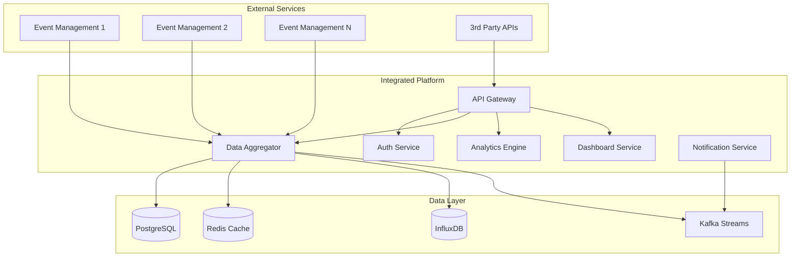

# Integrated Platform - 데이터 통합 및 API 허브

## 🎯 기술 아키텍처 개요

**Integrated Platform Service**는 **다중 행사 통합 관리**를 위한 엔터프라이즈급 플랫폼으로, 마이크로서비스 아키텍처 기반의 확장 가능한 클라우드 네이티브 시스템입니다.

### 기술 스택
- **Backend**: Node.js/Express.js with TypeScript
- **Database**: PostgreSQL (메인), Redis (캐싱), InfluxDB (시계열 데이터)
- **Message Queue**: Apache Kafka/RabbitMQ
- **API Gateway**: Kong/AWS API Gateway
- **Frontend**: React.js with TypeScript, Material-UI
- **Analytics**: Apache Spark, Elasticsearch
- **Deployment**: Docker, Kubernetes, CI/CD

### 시스템 구성도



---

## 🔄 다중 행사 데이터 통합 시나리오

### 시나리오 1: Event Management Service 연동 및 데이터 수집

**목표**: 새로운 Event Management Service를 플랫폼에 연동하고 실시간 데이터 수집 설정

#### 1.1 서비스 등록 및 연동 설정

```typescript
// src/services/integration/EventServiceRegistry.ts
interface EventServiceConfig {
  eventId: string;
  serviceName: string;
  endpoints: {
    api: string;
    webhook: string;
    healthCheck: string;
  };
  authentication: {
    type: 'api_key' | 'oauth2' | 'jwt';
    credentials: Record<string, string>;
  };
  syncSettings: {
    interval: number; // seconds
    retryPolicy: RetryPolicy;
    dataSchema: string;
  };
}

class EventServiceRegistry {
  async registerService(config: EventServiceConfig): Promise<void> {
    // 1. API 연결 테스트
    await this.validateServiceConnection(config);
    
    // 2. 데이터베이스에 서비스 등록
    await this.saveServiceConfig(config);
    
    // 3. 초기 데이터 동기화
    await this.performInitialSync(config);
    
    // 4. 실시간 동기화 스케줄러 설정
    await this.setupSyncScheduler(config);
    
    // 5. 헬스체크 모니터링 시작
    await this.startHealthMonitoring(config);
  }

  private async validateServiceConnection(config: EventServiceConfig): Promise<void> {
    try {
      const response = await fetch(`${config.endpoints.healthCheck}`, {
        headers: this.buildAuthHeaders(config.authentication),
        timeout: 10000
      });
      
      if (!response.ok) {
        throw new Error(`Service validation failed: ${response.statusText}`);
      }
      
      const healthData = await response.json();
      if (healthData.status !== 'healthy') {
        throw new Error('Service is not in healthy state');
      }
    } catch (error) {
      throw new Error(`Failed to validate service connection: ${error.message}`);
    }
  }

  private async performInitialSync(config: EventServiceConfig): Promise<void> {
    const syncJob = new InitialSyncJob(config);
    await syncJob.execute();
  }
}
```

#### 1.2 실시간 데이터 수집 엔진

```typescript
// src/services/aggregation/DataAggregator.ts
class DataAggregator {
  private kafkaProducer: KafkaProducer;
  private redisClient: RedisClient;
  
  async startRealTimeCollection(): Promise<void> {
    const registeredServices = await this.getRegisteredServices();
    
    for (const service of registeredServices) {
      this.scheduleDataCollection(service);
    }
  }
  
  private scheduleDataCollection(service: EventServiceConfig): void {
    const scheduler = new CronJob(
      `*/${service.syncSettings.interval} * * * * *`,
      async () => {
        try {
          await this.collectServiceData(service);
        } catch (error) {
          await this.handleCollectionError(service, error);
        }
      }
    );
    
    scheduler.start();
  }
  
  private async collectServiceData(service: EventServiceConfig): Promise<void> {
    const timestamp = new Date().toISOString();
    
    // Event Management Service에서 데이터 수집
    const response = await fetch(`${service.endpoints.api}/analytics/realtime`, {
      headers: this.buildAuthHeaders(service.authentication)
    });
    
    const data = await response.json();
    
    // 데이터 검증 및 정규화
    const normalizedData = this.normalizeEventData(data, service.eventId);
    
    // 실시간 캐시 업데이트
    await this.redisClient.setex(
      `realtime:${service.eventId}`,
      300, // 5분 TTL
      JSON.stringify(normalizedData)
    );
    
    // 시계열 데이터베이스에 저장
    await this.saveToInfluxDB(normalizedData, timestamp);
    
    // Kafka로 실시간 이벤트 발행
    await this.kafkaProducer.send({
      topic: 'event-data-updates',
      messages: [{
        key: service.eventId,
        value: JSON.stringify(normalizedData),
        timestamp: timestamp
      }]
    });
  }
  
  private normalizeEventData(rawData: any, eventId: string): NormalizedEventData {
    return {
      eventId,
      timestamp: new Date().toISOString(),
      metrics: {
        totalRegistered: rawData.participants?.total || 0,
        currentAttendees: rawData.attendance?.current || 0,
        attendanceRate: this.calculateAttendanceRate(rawData),
        gateActivity: rawData.gates?.map(g => ({
          gateId: g.id,
          status: g.status,
          throughput: g.throughput || 0
        })) || []
      },
      alerts: this.extractAlerts(rawData),
      status: this.determineEventStatus(rawData)
    };
  }
}
```

### 시나리오 2: 크로스 이벤트 분석 및 인사이트 생성

**목표**: 여러 행사의 데이터를 분석하여 비즈니스 인사이트 제공

#### 2.1 고급 분석 엔진

```typescript
// src/services/analytics/CrossEventAnalytics.ts
class CrossEventAnalytics {
  private sparkSession: SparkSession;
  private elasticsearchClient: ElasticsearchClient;
  
  async generateCrossEventInsights(): Promise<CrossEventInsights> {
    // 1. 모든 행사 데이터 수집
    const eventData = await this.collectAllEventData();
    
    // 2. 출석 패턴 분석
    const attendancePatterns = await this.analyzeAttendancePatterns(eventData);
    
    // 3. 참가자 행동 분석 (익명화)
    const behaviorAnalysis = await this.analyzeBehaviorPatterns(eventData);
    
    // 4. 예측 모델링
    const predictions = await this.generatePredictions(eventData);
    
    // 5. ROI 분석
    const roiAnalysis = await this.calculateROI(eventData);
    
    return {
      attendancePatterns,
      behaviorAnalysis,
      predictions,
      roiAnalysis,
      recommendations: this.generateRecommendations(eventData)
    };
  }
  
  private async analyzeAttendancePatterns(
    eventData: EventData[]
  ): Promise<AttendancePatterns> {
    // Apache Spark을 사용한 대규모 데이터 분석
    const sparkQuery = `
      SELECT 
        event_type,
        AVG(attendance_rate) as avg_attendance,
        STDDEV(attendance_rate) as attendance_variance,
        hour_of_day,
        day_of_week,
        COUNT(*) as sample_size
      FROM event_attendance_data
      WHERE event_date >= DATE_SUB(NOW(), INTERVAL 1 YEAR)
      GROUP BY event_type, hour_of_day, day_of_week
      ORDER BY avg_attendance DESC
    `;
    
    const results = await this.sparkSession.sql(sparkQuery);
    
    return {
      byEventType: this.groupByEventType(results),
      byTimeOfDay: this.groupByTimeOfDay(results),
      byDayOfWeek: this.groupByDayOfWeek(results),
      trends: this.identifyTrends(results)
    };
  }
  
  private async analyzeBehaviorPatterns(
    eventData: EventData[]
  ): Promise<BehaviorAnalysis> {
    // 익명화된 참가자 행동 분석
    const anonymizedData = this.anonymizeParticipantData(eventData);
    
    return {
      entryPatterns: this.analyzeEntryPatterns(anonymizedData),
      durationPatterns: this.analyzeDurationPatterns(anonymizedData),
      engagementMetrics: this.calculateEngagementMetrics(anonymizedData),
      dropoffPoints: this.identifyDropoffPoints(anonymizedData)
    };
  }
  
  private async generatePredictions(eventData: EventData[]): Promise<Predictions> {
    // 머신러닝 모델을 사용한 예측
    const model = await this.loadPredictionModel();
    
    const features = this.extractFeatures(eventData);
    const predictions = await model.predict(features);
    
    return {
      attendanceForecast: predictions.attendance,
      optimalTiming: predictions.timing,
      resourceRequirements: predictions.resources,
      riskFactors: predictions.risks
    };
  }
}
```

#### 2.2 실시간 대시보드 API

```typescript
// src/controllers/DashboardController.ts
class DashboardController {
  async getUnifiedDashboard(req: Request, res: Response): Promise<void> {
    try {
      const timeRange = req.query.timeRange as string || '24h';
      const filters = this.parseFilters(req.query);
      
      // 실시간 데이터 조회 (Redis 캐시 우선)
      const realTimeData = await this.getRealTimeData(filters);
      
      // 히스토리 데이터 조회 (InfluxDB)
      const historicalData = await this.getHistoricalData(timeRange, filters);
      
      // 분석 인사이트 조회
      const insights = await this.getLatestInsights(filters);
      
      // 알림 및 경고 조회
      const alerts = await this.getActiveAlerts(filters);
      
      const dashboardData: UnifiedDashboard = {
        summary: {
          totalEvents: realTimeData.length,
          totalAttendees: realTimeData.reduce((sum, event) => 
            sum + event.metrics.currentAttendees, 0),
          averageAttendanceRate: this.calculateAverageAttendanceRate(realTimeData),
          activeAlerts: alerts.length
        },
        events: realTimeData.map(event => ({
          eventId: event.eventId,
          eventName: event.eventName,
          status: event.status,
          metrics: event.metrics,
          trend: this.calculateTrend(event.eventId, historicalData),
          alerts: alerts.filter(alert => alert.eventId === event.eventId)
        })),
        insights: {
          attendancePatterns: insights.attendancePatterns,
          performanceMetrics: insights.performanceMetrics,
          recommendations: insights.recommendations
        },
        charts: {
          attendanceTrend: this.generateAttendanceTrendChart(historicalData),
          eventComparison: this.generateEventComparisonChart(realTimeData),
          alertsTimeline: this.generateAlertsTimeline(alerts)
        }
      };
      
      res.json(dashboardData);
    } catch (error) {
      res.status(500).json({ error: error.message });
    }
  }
  
  async getEventInsights(req: Request, res: Response): Promise<void> {
    const { eventId } = req.params;
    
    try {
      const insights = await this.analyticsService.generateEventInsights(eventId);
      res.json(insights);
    } catch (error) {
      res.status(500).json({ error: error.message });
    }
  }
}
```

---

## 🔗 API 통합 허브 시나리오

### 시나리오 3: 외부 시스템 통합 API 제공

**목표**: 써드파티 서비스가 통합 플랫폼의 데이터에 접근할 수 있는 표준화된 API 제공

#### 3.1 API Gateway 및 인증 시스템

```typescript
// src/api/gateway/APIGateway.ts
class APIGateway {
  private rateLimiter: RateLimiter;
  private authService: AuthenticationService;
  
  async setupRoutes(): Promise<void> {
    // 공개 API 엔드포인트
    this.app.use('/api/public', this.publicRoutes());
    
    // 인증이 필요한 API 엔드포인트
    this.app.use('/api/partner', 
      this.authenticatePartner.bind(this),
      this.partnerRoutes()
    );
    
    // 프리미엄 API 엔드포인트
    this.app.use('/api/premium',
      this.authenticatePremium.bind(this),
      this.rateLimiter.premium(),
      this.premiumRoutes()
    );
  }
  
  private async authenticatePartner(
    req: Request, 
    res: Response, 
    next: NextFunction
  ): Promise<void> {
    try {
      const apiKey = req.headers['x-api-key'] as string;
      const partner = await this.authService.validatePartnerAPIKey(apiKey);
      
      if (!partner) {
        return res.status(401).json({ error: 'Invalid API key' });
      }
      
      // 파트너별 권한 확인
      const permissions = await this.authService.getPartnerPermissions(partner.id);
      req.partner = { ...partner, permissions };
      
      next();
    } catch (error) {
      res.status(401).json({ error: 'Authentication failed' });
    }
  }
  
  private partnerRoutes(): Router {
    const router = Router();
    
    // 행사 목록 조회
    router.get('/events', async (req: Request, res: Response) => {
      const events = await this.getAuthorizedEvents(req.partner);
      res.json(events);
    });
    
    // 실시간 출석 데이터
    router.get('/events/:eventId/attendance', async (req: Request, res: Response) => {
      const { eventId } = req.params;
      
      if (!this.hasEventAccess(req.partner, eventId)) {
        return res.status(403).json({ error: 'Access denied' });
      }
      
      const attendanceData = await this.getAttendanceData(eventId);
      res.json(attendanceData);
    });
    
    // 분석 데이터 (요약)
    router.get('/analytics/summary', async (req: Request, res: Response) => {
      const analytics = await this.getAnalyticsSummary(req.partner.permissions);
      res.json(analytics);
    });
    
    return router;
  }
}
```

#### 3.2 웹훅 시스템

```typescript
// src/services/webhook/WebhookService.ts
class WebhookService {
  private queue: Queue;
  
  async registerWebhook(config: WebhookConfig): Promise<string> {
    const webhookId = uuidv4();
    
    await this.saveWebhookConfig({
      id: webhookId,
      partnerId: config.partnerId,
      url: config.url,
      events: config.events,
      secret: this.generateSecret(),
      active: true,
      retryPolicy: config.retryPolicy || DEFAULT_RETRY_POLICY
    });
    
    return webhookId;
  }
  
  async triggerWebhook(eventType: string, data: any): Promise<void> {
    const webhooks = await this.getActiveWebhooks(eventType);
    
    for (const webhook of webhooks) {
      await this.queue.add('webhook-delivery', {
        webhookId: webhook.id,
        eventType,
        data,
        timestamp: new Date().toISOString()
      });
    }
  }
  
  async deliverWebhook(job: WebhookJob): Promise<void> {
    const webhook = await this.getWebhookConfig(job.webhookId);
    
    const payload = {
      id: uuidv4(),
      event: job.eventType,
      timestamp: job.timestamp,
      data: job.data
    };
    
    const signature = this.generateSignature(payload, webhook.secret);
    
    try {
      const response = await fetch(webhook.url, {
        method: 'POST',
        headers: {
          'Content-Type': 'application/json',
          'X-Webhook-Signature': signature,
          'X-Webhook-Event': job.eventType,
          'User-Agent': 'S-Attend-Gate-Platform/1.0'
        },
        body: JSON.stringify(payload),
        timeout: 10000
      });
      
      if (!response.ok) {
        throw new Error(`HTTP ${response.status}: ${response.statusText}`);
      }
      
      await this.logWebhookDelivery(webhook.id, 'success', response.status);
      
    } catch (error) {
      await this.logWebhookDelivery(webhook.id, 'failed', error.message);
      await this.scheduleRetry(job, webhook.retryPolicy);
    }
  }
}
```

---

## 🔗 관련 시나리오

- **[비즈니스 인텔리전스 및 모니터링](./business-intelligence-monitoring.md)** - BI 분석 및 실시간 모니터링
- **[보안 및 성능 최적화](./security-performance.md)** - 보안 시스템 및 성능 튜닝
- **[Integrated Platform Service 개요](./README.md)** - 서비스 전체 개요
- **[Integrated Platform 비즈니스 시나리오](./integrated-platform-scenarios.md)** - 비즈니스 활용 시나리오
