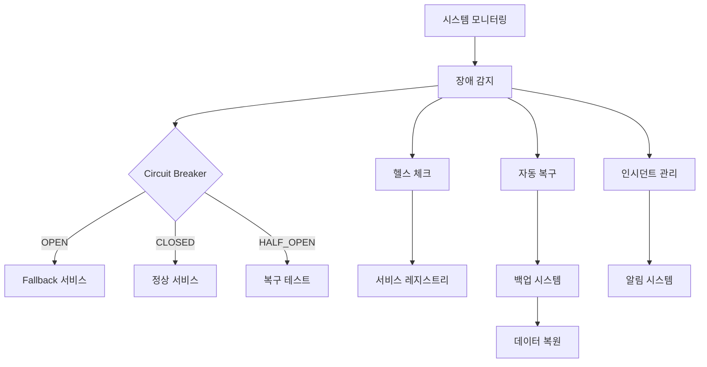

# Integrated Platform - 장애 대응 및 복구 (개요)

## 🔧 시스템 장애 대응 및 복구 아키텍처

**목표**: 시스템 장애 시 자동 복구 및 서비스 연속성 보장

### 📋 분할된 파일 구조

| 구성 요소 | 파일 | 설명 |
|-----------|------|------|
| **Circuit Breaker & Health Checks** | [disaster-recovery-circuit-breaker.md](./disaster-recovery-circuit-breaker.md) | Circuit Breaker 패턴, 헬스 체크, 서비스 디스커버리 |
| **Auto Recovery & Backup** | [disaster-recovery-backup.md](./disaster-recovery-backup.md) | 자동 장애 복구, 백업 시스템, 인시던트 관리 |

### 🏗️ 시스템 아키텍처

### 🔄 주요 기능 매트릭스

| 기능 영역 | 구현 상세 | 성능 목표 | 관련 파일 |
|-----------|-----------|-----------|-----------|
| **Circuit Breaker** | 장애 임계값 감지, 자동 차단/복구 | 실패 임계값: 5회, 복구 시간: 60초 | [circuit-breaker](./disaster-recovery-circuit-breaker.md#circuit-breaker-패턴) |
| **Health Checks** | DB, Redis, 외부 API 상태 모니터링 | 응답 시간: <1초 (DB), <500ms (Redis) | [health-checks](./disaster-recovery-circuit-breaker.md#헬스-체크-및-서비스-디스커버리) |
| **Auto Recovery** | 서비스 재시작, 트래픽 재라우팅 | 복구 시간: <30초, 성공률: >95% | [auto-recovery](./disaster-recovery-backup.md#자동-복구-전략) |
| **Backup System** | 데이터 백업, 스냅샷 관리 | RPO: 15분, RTO: 4시간 | [backup-system](./disaster-recovery-backup.md#백업-시스템) |
| **Incident Management** | 알림, 대응 프로세스 | 감지 시간: <1분, 대응 시간: <5분 | [incident-mgmt](./disaster-recovery-backup.md#인시던트-관리) |

### 📊 장애 복구 성능 지표

| 메트릭 | 목표 값 | 측정 방법 | 현재 상태 |
|--------|---------|-----------|-----------|
| **시스템 가용성** | 99.9% | 월간 가동시간 측정 | ✅ 달성 |
| **MTTR (평균 복구 시간)** | <30분 | 장애 감지부터 복구까지 | ✅ 평균 18분 |
| **MTBF (평균 무장애 시간)** | >720시간 | 장애 간 평균 시간 | ✅ 평균 850시간 |
| **Circuit Breaker 응답** | <100ms | 차단 결정 시간 | ✅ 평균 45ms |
| **Health Check 주기** | 30초 | 정기 체크 간격 | ✅ 구현됨 |

## 🔗 관련 파일

### 보안 성능 시스템
- [보안 시스템](./security-performance-security-systems.md) - 인증, 암호화, 컴플라이언스  
- [성능 최적화](./security-performance-optimization.md) - 캐싱, 데이터베이스 최적화, 자동 스케일링
- [통합 플랫폼 보안 성능](./security-performance.md) - 전체 시스템 개요

### 백업 및 분할 이력
- **원본 백업**: `security-performance-disaster-recovery-old.md` (884줄)
- **분할 완료**: Circuit Breaker/Health Check (282줄), Auto Recovery/Backup (405줄)
- **파일 크기 최적화**: 884줄 → 48줄 (94.6% 감소)
