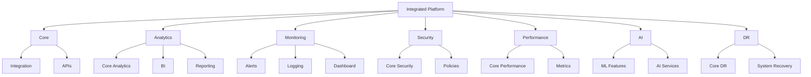
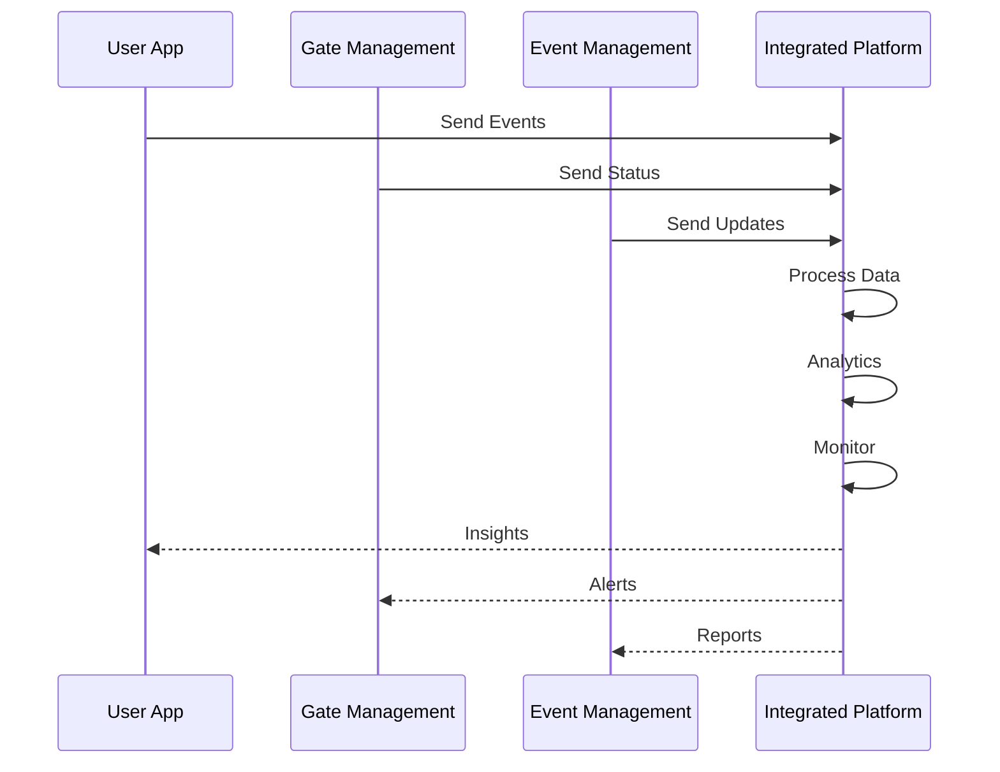
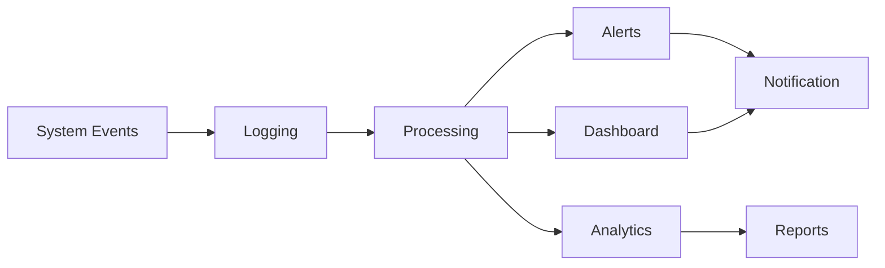
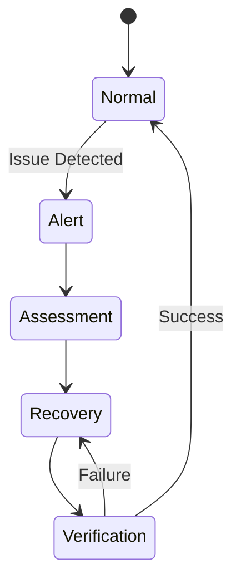
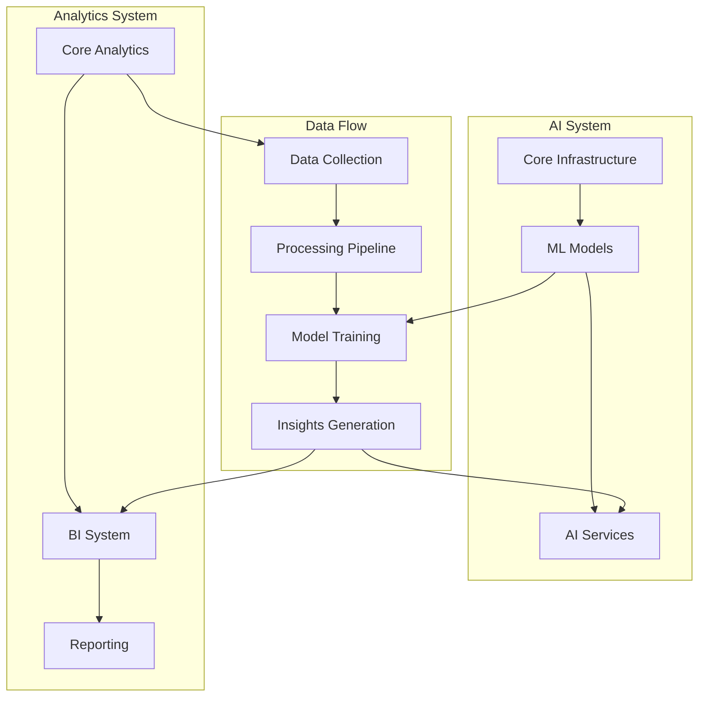
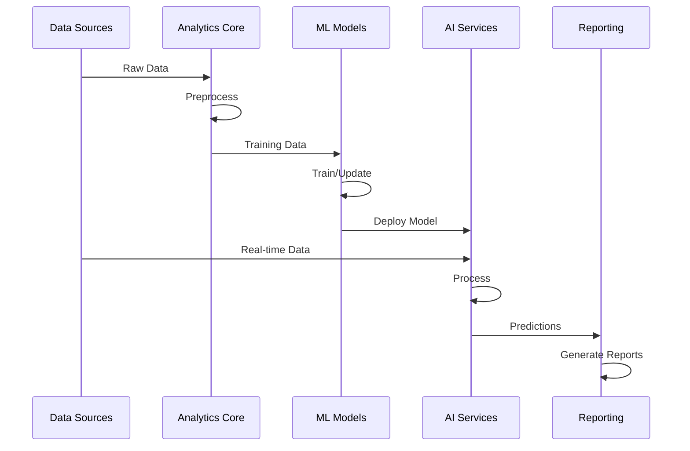
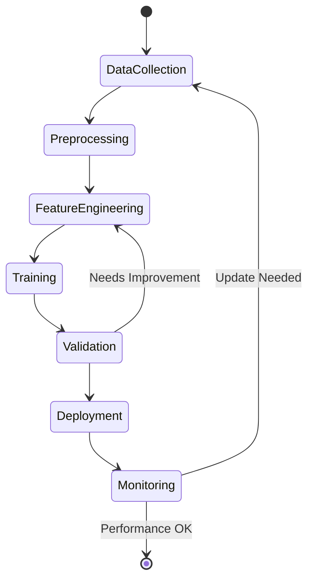
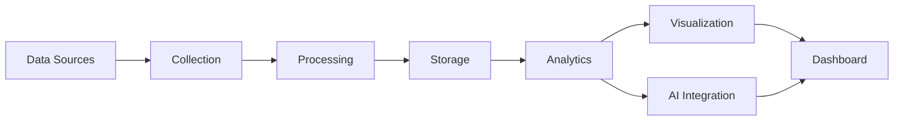

# Integrated Platform System Architecture

## Overall System Architecture

## Data Flow

## Monitoring Flow

## Disaster Recovery Process

## AI and Analytics Integration

## AI Processing Pipeline

## Model Training Flow

## Analytics Dashboard Flow

