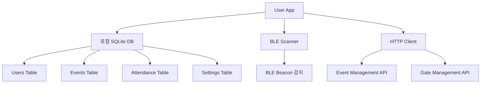

# User App Service

## 🎯 서비스 정의

**User App Service**는 참가자용 모바일 애플리케이션으로, **다중 행사 지원**이 핵심 특징입니다.
하나의 앱에서 여러 행사 참여가 가능하며, 토큰 기반 인증으로 행사별 권한을 관리합니다.

## 📁 디렉토리 구조

### 핵심 기능 (core/)
- `implementation.md` - 앱 핵심 구현

### 기술 구현 (technical/)
- **ble/** - BLE 관련 구현
  - `scanning.md` - BLE 스캐닝 구현

### 접근성 (accessibility/)
- 접근성 구현
- UI/UX 가이드라인

### 기능 구현 (features/)
- `main.md` - 주요 기능 구현
- 사용자 인터페이스
- 비즈니스 로직

## 🔗 관련 링크
- [게이트 관리](../gate-management/README.md)
- [이벤트 관리](../event-management/README.md)
- [핵심 API](../core-apis/README.md)

## 🏗️ 기술 아키텍처

### 플랫폼 및 기술 스택
```
Frontend: React Native / Flutter
상태 관리: Redux / Zustand
로컬 저장소: SQLite / Realm
BLE 통신: react-native-ble-plx
푸시 알림: FCM / APNS
```

### 데이터 아키텍처


### 핵심 기능 범위

**1. 다중 행사 관리**
- 행사별 독립 데이터 저장
- 토큰 기반 행사 추가/제거
- 행사 간 데이터 격리

**2. BLE 출석 체크**
- 백그라운드 BLE 스캐닝
- 근접 기반 자동 출석
- 중복 체크 방지 로직

**3. 오프라인 지원**
- 로컬 데이터 캐싱
- 오프라인 출석 기록
- 온라인 복구 시 동기화

## 🔗 연동 서비스

### Event Management Service
- 참가자 토큰 검증
- 행사 정보 동기화
- 출석 데이터 전송

### Gate Management Service  
- BLE 비콘 통신
- 근접 감지 및 출석 처리

## 📊 데이터 구조

### 로컬 저장소
```json
{
  "user": {
    "userId": "user-12345",
    "profile": { "name": "홍길동", "email": "hong@example.com" }
  },
  "events": [
    {
      "eventId": "tech-conference-2024",
      "token": "TCF24-ABCD-1234",
      "serverEndpoint": "https://tc24.events.com/api",
      "lastSync": "2024-01-20T10:00:00Z"
    }
  ]
}
```

## 🎯 핵심 시나리오

1. **[다중 행사 참여 시나리오](./user-app-scenarios.md#다중-행사-참여)**
   - 토큰으로 새 행사 추가
   - 행사 간 전환 및 관리

2. **[자동 출석 체크 시나리오](./user-app-scenarios.md#자동-출석-체크)**
   - BLE 비콘 감지 및 처리
   - 백그라운드 동작 최적화

3. **[오프라인 모드 시나리오](./user-app-scenarios.md#오프라인-모드)**
   - 네트워크 없이 출석 체크
   - 재연결 시 데이터 동기화

4. **[사용자 경험 최적화](./user-app-scenarios.md#사용자-경험)**
   - 접근성 지원
   - 다양한 사용자 페르소나 대응

## 🔧 기술 스택 권장사항

### 모바일 플랫폼
- **React Native** 또는 **Flutter**: 크로스 플랫폼 개발
- **Native**: iOS(Swift), Android(Kotlin) - 성능 최적화 필요 시

### 핵심 기술
- **BLE 통신**: CoreBluetooth(iOS), BluetoothLE(Android)
- **로컬 저장소**: SQLite, Realm
- **상태 관리**: Redux, MobX, Provider
- **네트워킹**: HTTP/HTTPS, WebSocket

### 보안
- **토큰 저장**: Keychain(iOS), Keystore(Android)
- **통신 암호화**: TLS 1.3
- **데이터 암호화**: AES-256

## 📈 성능 요구사항

### 응답성
- 앱 시작: 3초 이내
- 행사 전환: 1초 이내
- BLE 감지: 5초 이내

### 배터리 최적화
- 백그라운드 BLE 스캔 최적화
- 불필요한 네트워크 요청 최소화
- 효율적인 데이터 동기화

### 저장 공간
- 기본 앱 크기: 50MB 이하
- 행사별 데이터: 5MB 이하
- 이미지 캐시 관리

## 🚀 개발 로드맵

### Phase 1: MVP
- 단일 행사 지원
- 기본 출석 체크 (QR)
- 핵심 UI/UX

### Phase 2: 다중 행사
- 토큰 기반 행사 추가
- 행사 간 전환 UI
- 데이터 동기화

### Phase 3: 고급 기능
- BLE 자동 감지
- 오프라인 모드
- 고급 알림 시스템

### Phase 4: 최적화
- 성능 최적화
- 접근성 강화
- 사용자 경험 개선

이 User App Service는 참가자의 편의성을 최우선으로 하면서도, 시스템 전체의 안정성과 확장성을 고려한 설계로 구성되어 있습니다.
