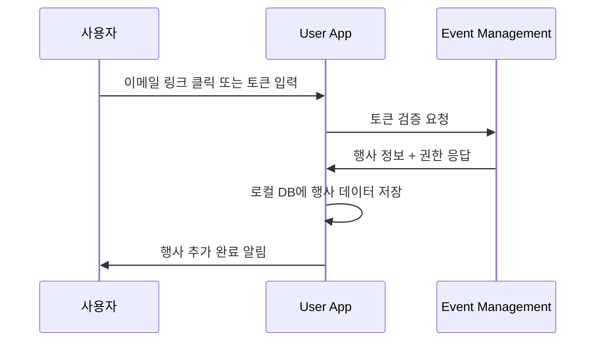
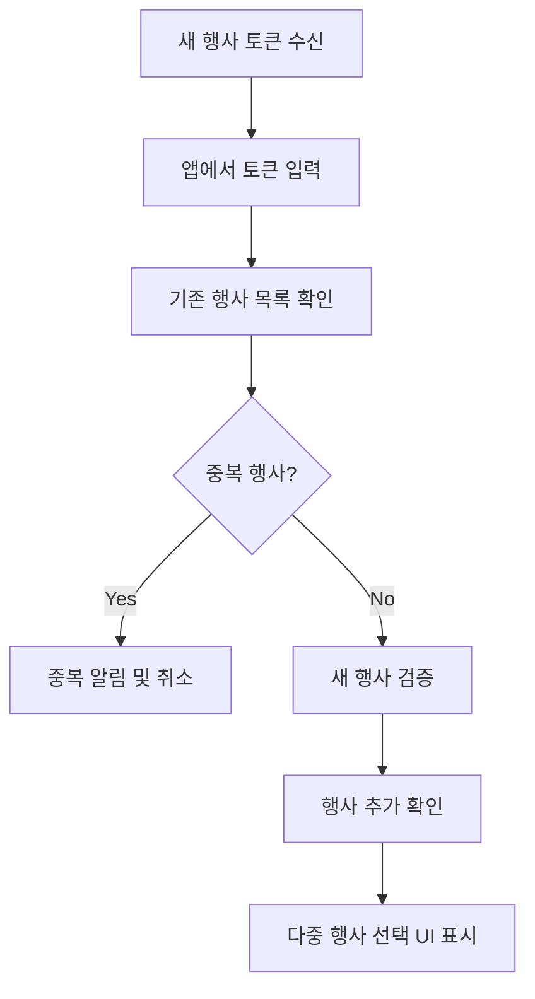
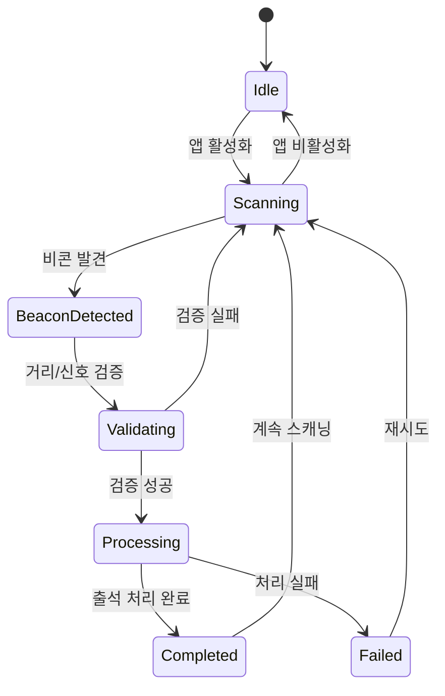
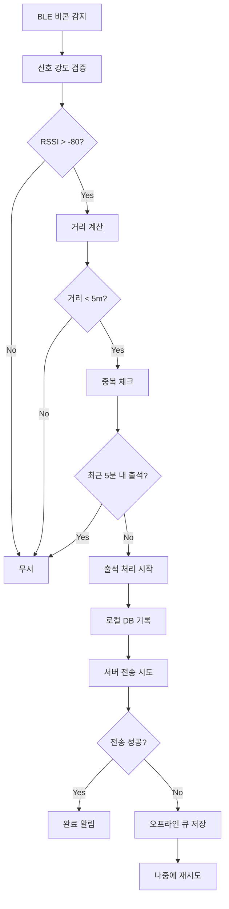
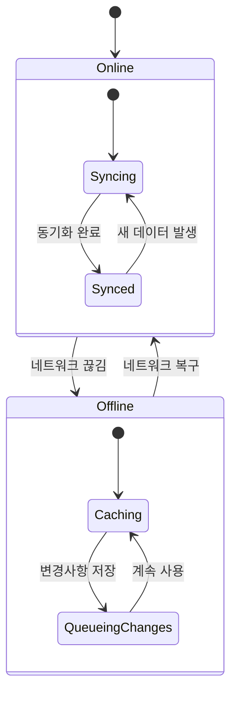
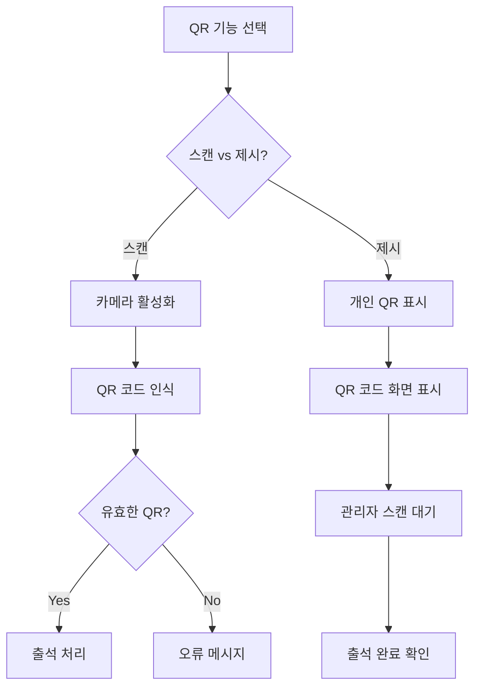

# User App 핵심 시나리오

## 🎯 개요

User App Service의 핵심 기능별 상세 시나리오입니다.
다중 행사 지원, BLE 자동 감지, 오프라인 모드가 주요 특징입니다.

---

## 📱 다중 행사 관리 시나리오

### 1. 첫 번째 행사 추가



**기술 구현 요구사항:**
```typescript
// 토큰 검증 및 행사 추가
interface TokenVerificationRequest {
  token: string;
  deviceId: string;
  platform: 'ios' | 'android';
}

interface EventData {
  eventId: string;
  eventName: string;
  startDate: string;
  endDate: string;
  venue: VenueInfo;
  gateConfigs: GateConfig[];
  userPermissions: Permission[];
}

// 로컬 저장소 스키마
const EventsTable = {
  id: 'string PRIMARY KEY',
  eventId: 'string UNIQUE',
  eventName: 'string',
  serverEndpoint: 'string',
  token: 'string ENCRYPTED',
  isActive: 'boolean',
  lastSync: 'datetime',
  eventData: 'json'
};
```

### 2. 추가 행사 등록 (기존 앱 사용자)



**UI/UX 구현:**
```
행사 선택 화면:
┌─────────────────────────────────────┐
│ 🎪 내 행사 목록                    │
│                                     │
│ 📅 진행 중:                        │
│ ✅ Spring Conference 2024           │
│    📍 코엑스 A홀 | 🕘 오늘         │
│                                     │
│ 📅 예정:                           │
│ ⏳ Summer Festival 2024             │
│    📍 올림픽공원 | 🕘 8월 15일      │
│                                     │
│ 📅 완료:                           │
│ ✔️ Winter Workshop 2023             │
│    📍 강남센터 | 🕘 12월 10일       │
│                                     │
│ [➕ 새 행사 참가] [⚙️ 설정]        │
└─────────────────────────────────────┘
```

### 3. 행사 간 전환 및 데이터 격리

```typescript
// 행사별 데이터 격리 구현
class EventDataManager {
  private currentEventId: string | null = null;

  async switchToEvent(eventId: string): Promise<void> {
    // 현재 행사 데이터 동기화
    if (this.currentEventId) {
      await this.syncEventData(this.currentEventId);
    }
    
    // 새 행사로 전환
    this.currentEventId = eventId;
    await this.loadEventData(eventId);
    
    // BLE 스캐닝 설정 업데이트
    await this.updateBLEConfig(eventId);
  }

  private async loadEventData(eventId: string): Promise<void> {
    const eventData = await this.localDB.getEvent(eventId);
    this.configureEventSettings(eventData);
  }
}
```

---

## 📡 BLE 자동 감지 시나리오

### 1. BLE 비콘 스캐닝 및 감지



**기술 구현:**
```typescript
// BLE 스캐닝 서비스
class BLEAttendanceService {
  private isScanning = false;
  private detectedBeacons = new Map<string, BeaconData>();

  async startScanning(): Promise<void> {
    if (this.isScanning) return;

    this.isScanning = true;
    
    // 현재 활성 행사의 비콘 UUID 목록 가져오기
    const activeEvent = await this.getActiveEvent();
    const targetUUIDs = activeEvent.gateConfigs.map(g => g.beaconUUIDs).flat();

    // BLE 스캐닝 시작
    BleManager.scan(targetUUIDs, {
      scanMode: ScanMode.LowLatency,
      allowDuplicates: true,
      interval: 1000
    });

    // 비콘 감지 이벤트 처리
    BleManager.onDeviceFound(this.handleBeaconDetected.bind(this));
  }

  private async handleBeaconDetected(beacon: BeaconData): Promise<void> {
    // 신호 강도 및 거리 검증
    if (beacon.rssi < -80 || beacon.distance > 5) {
      return; // 너무 멀거나 약한 신호
    }

    // 중복 체크 방지 (5분 내 동일 게이트)
    const recentAttendance = await this.checkRecentAttendance(
      beacon.gateId, 
      5 * 60 * 1000
    );
    
    if (recentAttendance) {
      console.log('Recent attendance found, skipping');
      return;
    }

    // 출석 처리 실행
    await this.processAttendance(beacon);
  }
}
```

### 2. 자동 출석 처리 플로우



**출석 처리 구현:**
```typescript
interface AttendanceRecord {
  id: string;
  eventId: string;
  userId: string;
  gateId: string;
  timestamp: string;
  method: 'ble_auto' | 'qr_scan' | 'manual';
  location?: GeoLocation;
  syncStatus: 'synced' | 'pending' | 'failed';
}

class AttendanceProcessor {
  async processAttendance(beacon: BeaconData): Promise<void> {
    const record: AttendanceRecord = {
      id: generateUUID(),
      eventId: this.currentEventId,
      userId: this.userId,
      gateId: beacon.gateId,
      timestamp: new Date().toISOString(),
      method: 'ble_auto',
      location: await this.getCurrentLocation(),
      syncStatus: 'pending'
    };

    // 로컬 저장
    await this.localDB.saveAttendance(record);

    // 즉시 서버 전송 시도
    try {
      await this.syncAttendanceToServer(record);
      await this.showSuccessNotification();
    } catch (error) {
      console.log('서버 전송 실패, 오프라인 큐에 저장');
      await this.addToSyncQueue(record);
    }
  }
}
```

---

## 🔄 오프라인 모드 시나리오

### 1. 네트워크 연결 상태 관리



**네트워크 상태 관리:**
```typescript
class NetworkStateManager {
  private isOnline = true;
  private syncQueue: AttendanceRecord[] = [];

  constructor() {
    NetInfo.addEventListener(this.handleNetworkChange.bind(this));
  }

  private async handleNetworkChange(state: NetInfoState): Promise<void> {
    const wasOffline = !this.isOnline;
    this.isOnline = state.isConnected ?? false;

    if (wasOffline && this.isOnline) {
      // 온라인 복구 시 동기화 실행
      await this.processSyncQueue();
    }
  }

  private async processSyncQueue(): Promise<void> {
    const pendingRecords = await this.localDB.getPendingAttendance();
    
    for (const record of pendingRecords) {
      try {
        await this.syncAttendanceToServer(record);
        await this.localDB.markAsSynced(record.id);
      } catch (error) {
        console.log(`동기화 실패: ${record.id}`, error);
        // 나중에 재시도하도록 큐에 유지
      }
    }
  }
}
```

### 2. 오프라인 출석 체크

```
오프라인 상태에서의 출석 처리:

1. BLE 비콘 감지 (네트워크 불필요)
   ↓
2. 로컬 검증 (캐시된 게이트 정보 사용)
   ↓
3. 로컬 DB에 출석 기록 저장
   ↓
4. 사용자에게 오프라인 출석 완료 알림
   ↓
5. 네트워크 복구 시 자동 동기화
```

**오프라인 검증 로직:**
```typescript
class OfflineValidator {
  async validateAttendanceOffline(
    gateId: string, 
    timestamp: string
  ): Promise<boolean> {
    // 캐시된 행사 정보로 검증
    const eventData = await this.localDB.getEventData(this.currentEventId);
    const gateConfig = eventData.gateConfigs.find(g => g.id === gateId);
    
    if (!gateConfig) {
      return false; // 알 수 없는 게이트
    }

    // 행사 시간 범위 검증
    const eventStart = new Date(eventData.startTime);
    const eventEnd = new Date(eventData.endTime);
    const attendanceTime = new Date(timestamp);

    if (attendanceTime < eventStart || attendanceTime > eventEnd) {
      return false; // 행사 시간 외
    }

    // 중복 체크 (로컬 DB 기준)
    const recentAttendance = await this.localDB.getRecentAttendance(
      gateId, 
      5 * 60 * 1000
    );

    return !recentAttendance; // 최근 출석이 없으면 유효
  }
}
```

---

## 📊 사용자 인터페이스 시나리오

### 1. 메인 대시보드

```
실시간 행사 현황 화면:

┌─────────────────────────────────────┐
│ 🎪 Spring Conference 2024          │
│ 📍 코엑스 A홀 | 🕘 09:00-18:00     │
│                                     │
│ 📊 내 출석 현황:                   │
│ ✅ 입장: 09:15 (메인 게이트)       │
│ ⏳ 세션1: 10:00 (예정)             │
│ ⏳ 점심: 12:00 (예정)              │
│                                     │
│ 🔘 출석 준비 상태: 활성화          │
│ 📡 BLE: 🟢 | 📶 네트워크: 🟢      │
│                                     │
│ [📷 QR 스캔] [📋 세부 정보]        │
│ [⚙️ 설정] [❓ 도움말]             │
└─────────────────────────────────────┘
```

### 2. QR 코드 스캔/제시 인터페이스



### 3. 설정 및 개인화

```typescript
interface UserSettings {
  // BLE 설정
  autoAttendance: boolean;
  bleScanInterval: number; // ms
  proximityThreshold: number; // meters
  
  // 알림 설정
  attendanceNotifications: boolean;
  eventReminders: boolean;
  soundEnabled: boolean;
  vibrationEnabled: boolean;
  
  // 개인정보 설정
  locationSharing: boolean;
  analyticsOptIn: boolean;
  
  // 접근성 설정
  highContrast: boolean;
  fontSize: 'small' | 'medium' | 'large';
  voiceOver: boolean;
}
```

---

## 🔒 보안 및 프라이버시 시나리오

### 1. 토큰 보안 관리

```typescript
// 토큰 암호화 저장
class SecureTokenManager {
  async storeToken(eventId: string, token: string): Promise<void> {
    const encryptedToken = await this.encryptWithDeviceKey(token);
    await this.secureStorage.setItem(`token_${eventId}`, encryptedToken);
  }

  async getToken(eventId: string): Promise<string | null> {
    const encryptedToken = await this.secureStorage.getItem(`token_${eventId}`);
    if (!encryptedToken) return null;
    
    return await this.decryptWithDeviceKey(encryptedToken);
  }

  private async encryptWithDeviceKey(data: string): Promise<string> {
    // 디바이스 고유키 + 생체인증 기반 암호화
    const deviceKey = await this.getDeviceKey();
    return CryptoJS.AES.encrypt(data, deviceKey).toString();
  }
}
```

### 2. 개인정보 보호

```typescript
// 개인정보 최소화 및 익명화
interface PrivacyConfig {
  locationPrecision: 'exact' | 'approximate' | 'none';
  dataRetentionDays: number;
  analyticsLevel: 'none' | 'basic' | 'detailed';
}

class PrivacyManager {
  async processLocationData(
    location: GeoLocation, 
    config: PrivacyConfig
  ): Promise<GeoLocation | null> {
    switch (config.locationPrecision) {
      case 'none':
        return null;
      case 'approximate':
        return this.approximateLocation(location, 100); // 100m 반경
      case 'exact':
        return location;
    }
  }
}
```

---

## 🚀 성능 최적화 시나리오

### 1. 배터리 효율성

```typescript
// 배터리 최적화된 BLE 스캐닝
class BatteryOptimizedScanner {
  private scanningInterval = 1000; // 기본 1초
  
  async adaptiveScanScheduling(): Promise<void> {
    const batteryLevel = await this.getBatteryLevel();
    const isCharging = await this.isCharging();
    
    if (batteryLevel < 20 && !isCharging) {
      // 배터리 부족 시 스캔 간격 증가
      this.scanningInterval = 5000; // 5초
    } else if (batteryLevel > 80) {
      // 배터리 충분 시 스캔 간격 단축
      this.scanningInterval = 500; // 0.5초
    }
    
    this.scheduleScan();
  }
}
```

### 2. 메모리 관리

```typescript
// 효율적인 데이터 캐싱
class DataCacheManager {
  private cache = new Map<string, CacheItem>();
  private readonly MAX_CACHE_SIZE = 50; // 최대 50개 항목
  
  async cacheEventData(eventId: string, data: EventData): Promise<void> {
    // LRU 캐시 구현
    if (this.cache.size >= this.MAX_CACHE_SIZE) {
      const oldestKey = this.cache.keys().next().value;
      this.cache.delete(oldestKey);
    }
    
    this.cache.set(eventId, {
      data,
      timestamp: Date.now(),
      accessCount: 0
    });
  }
}
```

---

# 앱 코어 시스템 구현

모바일 앱의 핵심 시스템 구현을 위한 기술 사양입니다.

## 기술적 개요
앱의 기본 구조 및 핵심 기능의 구현 방안을 정의합니다.

## 구현 세부사항

### 앱 초기화
```typescript
interface AppConfig {
  appId: string;
  environment: 'dev' | 'staging' | 'prod';
  apiEndpoint: string;
  features: {
    [key: string]: boolean;
  };
}

class AppInitializer {
  loadConfig(): Promise<AppConfig>;
  initializeServices(): Promise<void>;
  setupErrorHandling(): void;
}
```

### 상태 관리
```typescript
interface AppState {
  user: UserState;
  attendance: AttendanceState;
  settings: SettingsState;
}

class StateManager {
  updateState(partial: Partial<AppState>): void;
  subscribe(listener: StateListener): void;
  persist(): void;
}
```

## 성능 요구사항
- 앱 시작 시간: < 2초
- 메모리 사용: < 100MB
- 저장소 사용: < 50MB
- 응답 시간: < 100ms

## 오프라인 지원
- 데이터 캐싱
- 동기화 관리
- 충돌 해결

## 보안 요구사항
- 데이터 암호화
- 안전한 저장소
- 인증 관리
- 무결성 검증

## 모니터링 지표
- 크래시율
- ANR 발생률
- 메모리 사용량
- 배터리 소비량
