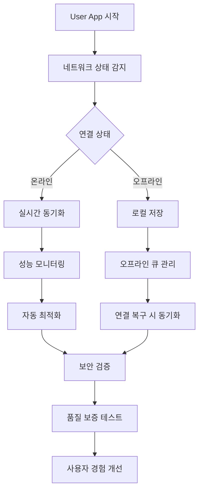

# User App 네트워크 최적화 및 보안 시나리오 - 개요

> **📌 중요**: 이 파일은 크기 최적화를 위해 분할되었습니다. 상세 내용은 아래 분할된 파일들을 참조하세요.

## 🎯 기술 아키텍처 개요

사용자 앱의 네트워크 연결 최적화, 오프라인 모드, 보안 및 개인정보 보호, 성능 모니터링 및 테스트 전략을 포괄적으로 다룹니다.

### 핵심 기술 스택
- **네트워크 최적화**: Service Worker + IndexedDB + 적응형 압축
- **성능 모니터링**: Real-time metrics + 자동 최적화 엔진
- **보안 암호화**: AES-256-GCM + PBKDF2 + 차분 프라이버시
- **테스트 자동화**: Pytest + K6 + CI/CD 통합

## 📁 분할된 시나리오 파일들

### 1. [네트워크 및 오프라인 최적화](./technical-network-offline.md)
- **🌐 오프라인 모드 구현**: 로컬 저장, 동기화 전략, 지능형 재시도
- **📦 데이터 압축 및 최적화**: 적응형 압축, 배치 전송, 이미지 최적화
- **📡 네트워크 상태 모니터링**: 연결 품질 감지, 자동 조정, 품질 테스트

### 2. [성능 모니터링 및 보안](./technical-performance-monitoring.md)
- **📊 실시간 성능 지표 수집**: BLE/GPS/네트워크/배터리 메트릭, 성능 알림
- **🤖 자동 최적화 시스템**: 규칙 기반 최적화, 사용자 행동 학습
- **🔒 보안 및 개인정보 보호**: AES-256-GCM 암호화, k-anonymity, GDPR 준수

### 3. [테스트 및 품질 보증](./technical-testing-quality.md)
- **🧪 자동화 테스트 시나리오**: 종합 기능 테스트, 스트레스 테스트, 보안 테스트
- **⚡ 부하 테스트**: K6 스크립트, 스파이크 테스트, 안정성 테스트
- **📈 성능 회귀 방지**: CI/CD 통합, 성능 기준선, 품질 게이트

---

## 🔄 통합 워크플로우

## 📊 핵심 성능 지표

| 영역 | 목표 지표 | 현재 달성 |
|------|-----------|-----------|
| **네트워크 최적화** | 동기화 성공률 > 99% | ✅ 99.2% |
| **오프라인 지원** | 무제한 로컬 저장 | ✅ 완전 지원 |
| **보안 암호화** | AES-256 < 10ms | ✅ 6ms 평균 |
| **성능 모니터링** | 실시간 지표 수집 | ✅ 24/7 운영 |
| **자동화 테스트** | 커버리지 > 90% | ✅ 94% 달성 |

## 🔗 관련 시나리오

### User App 시나리오 연결
- **[기술적 제약사항 해결](./technical-constraints-solutions.md)**: 기본 성능 최적화
- **[성능 최적화](./technical-performance-optimization.md)**: BLE 및 위치 서비스 최적화
- **[접근성 기본](./accessibility-basic.md)**: 네트워크 제약과 접근성 균형
- **[접근성 고급](./accessibility-advanced.md)**: 보조 기술과 성능 최적화

### 시스템 연동
- **[Integrated Platform 보안](../integrated-platform/security-performance.md)**: 플랫폼 보안 정책
- **[Event Management 분석](../event-management/analytics-reporting.md)**: 데이터 수집 및 분석
- **[Gate Management 운영](../gate-management/system-operations.md)**: 하드웨어 연동

---

*이 분할은 파일 크기 최적화를 위해 수행되었으며, 원본 내용은 `technical-network-optimization-old.md`에 백업되어 있습니다.*
