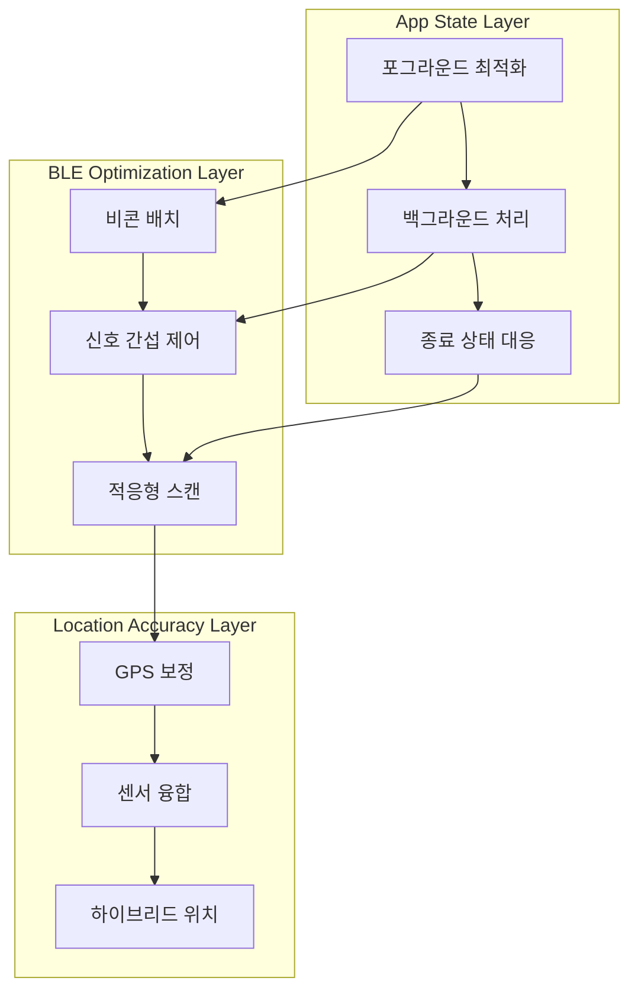

# User App 기술 성능 최적화 - 개요

## 📋 시나리오 개요

User App의 기술적 성능 최적화를 다룹니다. 앱 상태별 BLE 비콘 감지 성능, 
BLE 통신 제약사항 해결, GPS 정확도 향상 등의 종합적인 최적화 전략을 제시합니다.

> **분할 기록**: 2025년 7월 9일 - 812 라인에서 3개의 전문화된 파일로 분리  
> **백업 파일**: `technical-performance-optimization-old.md`에 원본 보존

---

## 🗂️ 분할된 시나리오 파일 구조

### 1. 📱 [앱 상태별 감지 성능 최적화](./technical-performance-app-states.md)
**포그라운드, 백그라운드, 종료 상태별 성능 최적화**
- iOS 백그라운드 제약 해결
- Android 배터리 최적화 대응
- 적응형 스캔 전략

### 2. 📡 [BLE 비콘 제약사항 해결](./technical-performance-ble-constraints.md)  
**BLE 통신 한계 극복과 신호 최적화**
- 비콘 배치 최적화 알고리즘
- 신호 간섭 최소화
- 적응형 전력 제어

### 3. 🎯 [GPS 정확도 제한 해결](./technical-performance-gps-accuracy.md)
**하이브리드 위치 확인과 센서 융합**
- 실내 위치 확인 보완 시스템
- 고급 위치 추정 알고리즘
- 크라우드소싱 기반 위치 보정

---

## 🔗 시스템 아키텍처 다이어그램

---

## 📋 관련 개념

### 상위 수준 연결
- [User App 개요](../user-app/) - 전체 사용자 앱 시스템
- [User App API](../core-apis/user-app-api.md) - API 통합 지점

### 병렬 시나리오  
- [네트워크 최적화](./technical-network-optimization.md) - 오프라인 모드 및 데이터 최적화
- [접근성 기본](./accessibility-basic.md) - 성능과 접근성의 균형
- [접근성 고급](./accessibility-advanced.md) - 보조 기술 성능 최적화

### 기술 패턴
- [BLE 통신 패턴](../../common/technical-patterns-ble-communication.md) - BLE 기본 통신 구현
- [보안 인증 패턴](../../common/technical-patterns-security-auth.md) - 인증 보안
- [데이터 동기화 패턴](../../common/technical-patterns-data-sync.md) - 오프라인 동기화

---

## 📊 메트릭 및 성능 지표

| 최적화 영역 | 목표 지표 | 측정 방법 | 우선순위 |
|-------------|-----------|-----------|-----------|
| **앱 상태별 성능** | 포그라운드 95%, 백그라운드 80% | 실시간 모니터링 | High |
| **BLE 비콘 최적화** | 감지 범위 10-15m, 안정성 90% | RSSI 측정 | High |
| **GPS 정확도** | 실외 ±3-5m, 실내 ±5-10m | 위치 정확도 검증 | Medium |
| **배터리 효율성** | 포그라운드 8-10시간, 백그라운드 24-48시간 | 배터리 사용량 추적 | High |