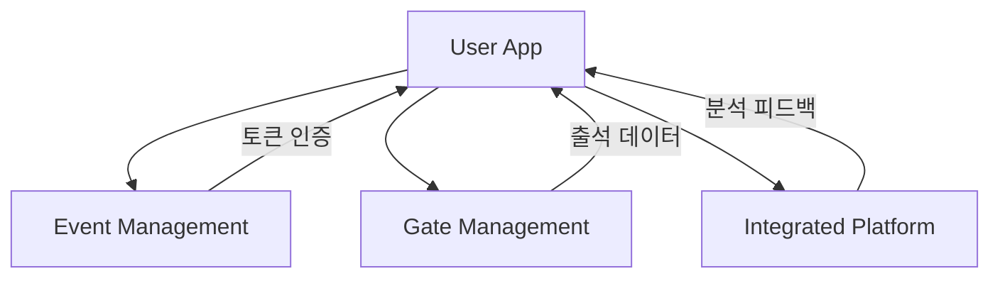

# User App - 시스템 개요

## 시스템 소개

User App은 참가자가 사용하는 모바일 애플리케이션으로, 직관적이고 접근성이 뛰어난 출석 체크 경험을 제공합니다.

## 핵심 기능

### 🎯 스마트 출석 체크
- **자동 감지**: BLE 비콘 + GPS를 활용한 완전 자동화
- **QR 스캔**: 빠르고 정확한 수동 체크인
- **다중 백업**: 실패 시 대체 방법 자동 제안

### 📱 다중 행사 지원  
- **통합 관리**: 하나의 앱으로 여러 행사 참가
- **개별 설정**: 행사별 맞춤 설정과 알림
- **이력 관리**: 참가 기록과 개인화된 추천

### ♿ 포용적 접근성
- **웹 표준 준수**: WCAG 2.1 AA 등급 달성
- **다양한 입력**: 음성, 터치, 스위치 컨트롤 지원
- **시각/청각/신체/인지 장애** 모든 유형 고려

## 아키텍처 연동

## 시나리오 구성

### [👥 personas.md](./personas.md)
다양한 사용자 유형별 특성과 요구사항 정의
- **테크 얼리어답터**: 고급 기능 선호 사용자
- **일반 사용자**: 대다수를 차지하는 핵심 타겟
- **기술 초보자**: 간단한 사용법 필요 사용자  
- **국제 참가자**: 다국어 지원 필요 사용자
- **장애인 참가자**: 접근성 기능 필수 사용자

### [🚀 onboarding-scenarios.md](./onboarding-scenarios.md)
앱 설치부터 첫 출석까지의 온보딩 과정
- **이메일 기반 초대**: Event Management와 토큰 연동
- **단계별 설정**: 권한, 알림, 개인화 설정
- **페르소나별 경험**: 사용자 유형에 맞는 맞춤 온보딩

### [✅ attendance-scenarios.md](./attendance-scenarios.md)
다양한 출석 체크 방법과 상황별 대응
- **3단계 Fallback**: 자동감지 → QR스캔 → 수동처리
- **실시간 피드백**: 즉각적인 성공/실패 안내
- **예외 상황 처리**: 네트워크 불안정, 하드웨어 오류 등

### [🏢 multi-event-scenarios.md](./multi-event-scenarios.md)
하나의 앱으로 여러 행사 참가 관리
- **행사 추가/전환**: 토큰 기반 간편 등록
- **개별 설정**: 행사별 독립적 설정 관리
- **이력 및 추천**: 과거 참가 기반 개인화 서비스

### [♿ accessibility-scenarios.md](./accessibility-scenarios.md)
모든 사용자가 이용할 수 있는 포용적 설계
- **시각 장애**: 스크린 리더, 고대비 모드, 음성 안내
- **청각 장애**: 진동 피드백, 시각적 알림, 수화 영상
- **신체 장애**: 대체 입력, 큰 터치 영역, 스위치 제어
- **인지 장애**: 단순화 UI, 단계별 가이드, Easy 모드

## 핵심 성과 지표

### 사용성 지표
- **온보딩 완료율**: > 95%
- **첫 출석 성공률**: > 90%  
- **전체 출석 성공률**: > 98%
- **평균 처리 시간**: < 5초

### 접근성 지표
- **스크린 리더 호환성**: 100%
- **색상 대비율**: > 7:1 (AAA 등급)
- **키보드 접근성**: 모든 기능
- **장애인 사용자 만족도**: > 4.5/5

### 기술 성능
- **앱 시작 시간**: < 3초
- **BLE 감지 정확도**: > 95%
- **QR 스캔 성공률**: > 98%
- **배터리 사용량**: < 5%/일

## 설계 원칙

### 1. 접근성 우선 (Accessibility First)
모든 기능은 접근성을 먼저 고려하여 설계하고, 이후 고급 기능을 추가합니다.

### 2. 점진적 향상 (Progressive Enhancement)  
기본 기능이 모든 환경에서 작동하고, 조건이 허용하는 경우 고급 기능을 제공합니다.

### 3. 다중 경로 (Multiple Pathways)
같은 목표를 달성할 수 있는 여러 방법을 제공하여 사용자 선택권을 보장합니다.

### 4. 맥락 인식 (Context Awareness)
사용자의 상황과 환경을 이해하고 그에 맞는 최적의 경험을 제공합니다.

## 기술 스택

### 플랫폼
- **모바일**: React Native (iOS/Android 동시 지원)
- **웹**: PWA (Progressive Web App) 지원
- **데스크톱**: Electron (필요시)

### 핵심 기술
- **실시간 통신**: WebSocket, Server-Sent Events
- **로컬 저장**: SQLite, AsyncStorage
- **위치 서비스**: GPS, Wi-Fi, BLE 융합
- **접근성**: React Native Accessibility API

### 외부 연동
- **푸시 알림**: Firebase Cloud Messaging
- **지도**: Google Maps, Apple Maps
- **분석**: 자체 구축 (개인정보 보호)
- **다국어**: i18next, react-native-localize
