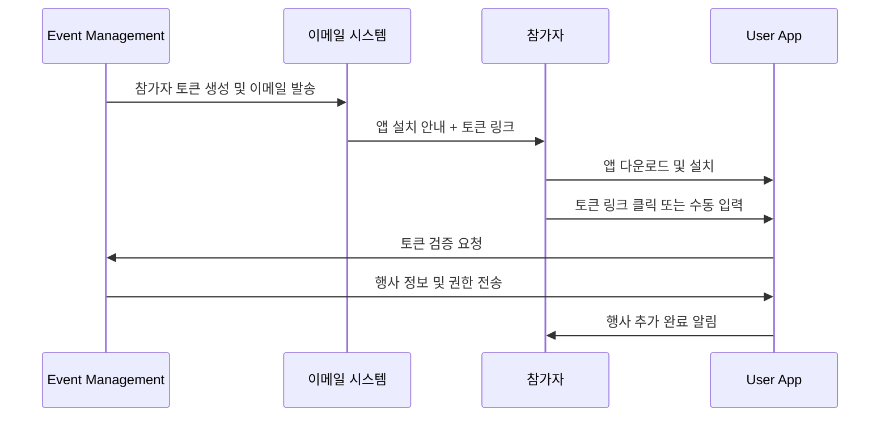

# User App - 온보딩 시나리오

## 온보딩 개요

참가자가 앱을 설치하고 행사에 참가하기까지의 전체 과정을 관리합니다.
4개 독립 서비스 아키텍처에서 Event Management와 토큰 기반으로 연동됩니다.

## 사전 준비 단계

### 1. 행사 등록 완료 (D-7일 ~ D-1일)



### 2. 이메일 안내 템플릿

```
From: Spring Conference 2024 <events@company.com>
To: {참가자명} <{이메일}>
Subject: [Spring Conference 2024] 출석 체크 앱 설치 안내

안녕하세요, {참가자명}님!

Spring Conference 2024 참가 등록이 완료되었습니다.
원활한 행사 진행을 위해 출석 체크 앱 설치를 부탁드립니다.

📱 앱 설치 방법:
1. 앱 다운로드
   - iOS: App Store에서 "S-Attend Gate" 검색
   - Android: Google Play에서 "S-Attend Gate" 검색

2. 행사 참가 설정
   방법 1: 토큰 입력
   토큰: SCF24-ABCD-1234-EFGH
   
   방법 2: 원클릭 링크 (권장)
   👉 https://attend.company.com/add-event?token=SCF24-ABCD-1234-EFGH

⚠️ 중요 안내:
- 행사 당일 앱을 통해 자동 출석 체크가 진행됩니다
- 사전 앱 설치 시 당일 대기시간이 단축됩니다
- 스마트폰 없이도 QR코드로 출석 가능합니다

📞 문의사항: support@company.com
📅 행사 일정: 2024년 4월 15일 (월) 09:00-18:00
📍 장소: 코엑스 컨벤션센터 Hall A

감사합니다.
Spring Conference 2024 운영팀
```

## 앱 설치 및 초기 설정

### 3. 첫 실행 온보딩 플로우

```
화면 1: 환영 화면
┌─────────────────────────────────┐
│ 🎉 S-Attend Gate에 오신걸      │
│    환영합니다!                  │
│                                 │
│ 스마트한 출석 체크로            │
│ 행사를 더욱 편리하게            │
│                                 │
│ [시작하기] [Skip 둘러보기]      │
└─────────────────────────────────┘

화면 2: 권한 요청
┌─────────────────────────────────┐
│ 📍 위치 서비스 권한             │
│                                 │
│ 자동 출석 체크를 위해           │
│ 위치 정보가 필요합니다          │
│                                 │
│ ✅ 필수: 출석 체크 시에만      │
│ ✅ 권장: 백그라운드 자동 감지  │
│                                 │
│ [허용] [나중에]                 │
└─────────────────────────────────┘

화면 3: 첫 행사 추가
┌─────────────────────────────────┐
│ 🎫 첫 번째 행사 추가           │
│                                 │
│ 초대 토큰을 입력하거나         │
│ QR코드를 스캔해주세요          │
│                                 │
│ [토큰 입력] [QR 스캔]          │
│ [이메일 링크에서 왔나요?]      │
└─────────────────────────────────┘
```

### 4. 토큰 기반 행사 추가

```
토큰 입력 화면:
┌─────────────────────────────────┐
│ 🔑 행사 토큰 입력              │
│                                 │
│ ┌─────────────────────────────┐ │
│ │ SCF24-ABCD-1234-EFGH        │ │
│ └─────────────────────────────┘ │
│                                 │
│ 예시: ABC24-1234-WXYZ-5678     │
│                                 │
│ [추가하기] [QR 스캔으로 변경]  │
└─────────────────────────────────┘

성공 시:
┌─────────────────────────────────┐
│ ✅ 행사 추가 완료!             │
│                                 │
│ 📅 Spring Conference 2024      │
│ 👤 김철수 (ID: 2024001)        │
│ 📍 코엑스 컨벤션센터           │
│ 🕘 2024.04.15 09:00-18:00     │
│                                 │
│ [메인으로] [추가 설정]         │
└─────────────────────────────────┘
```

## 페르소나별 온보딩 경험

### 5. 테크 얼리어답터 (Alex)

```
온보딩 특징:
- 모든 권한 즉시 허용
- 고급 설정까지 모두 활성화
- 베타 기능 테스트 신청
- 알림 설정 세밀하게 조정

경험 여정:
1. 이메일 받자마자 즉시 앱 설치
2. 모든 온보딩 화면 빠르게 완료 (< 2분)
3. 추가 기능 탐색 (푸시 알림, 위젯 등)
4. 프로필 상세 설정 및 선호도 조정
5. 소셜 기능 활성화 (친구 찾기 등)

완료율: 100%
만족도: 매우 높음
```

### 6. 일반 사용자 (Sarah)

```
온보딩 특징:
- 필수 권한만 허용
- 기본 설정으로 진행
- 도움말 적극 활용
- 단계별 신중한 진행

경험 여정:
1. 동료 추천으로 며칠 후 앱 설치
2. 온보딩 화면 차근차근 읽기 (5-7분)
3. 위치 권한 설명 재확인 후 허용
4. 기본 설정으로 완료
5. 사용법 가이드 북마크

완료율: 95%
만족도: 높음
```

### 7. 기술 초보자 (Robert)

```
온보딩 특징:
- 지인 도움 필요
- 권한 의미 문의
- 단계별 확인 요청
- 전화 지원 필요할 수 있음

경험 여정:
1. 지인이 앱 설치 도움 (D-3일)
2. 권한 설명 충분히 듣고 허용 결정
3. 토큰 입력 시 실수 방지 기능 활용
4. 완료 후 사용법 재확인
5. 고객센터 연락처 저장

완료율: 85% (지원 시 98%)
만족도: 보통 → 높음 (지원 후)
```

### 8. 국제 참가자 (Maria)

```
온보딩 특징:
- 영어 UI 선택
- 오프라인 가이드 다운로드
- 현지 연락처 확인
- 시간대 자동 설정

경험 여정:
1. 다국어 이메일 수신 (영어)
2. 언어 선택 후 영어 온보딩
3. 현지 시간대 자동 감지
4. 로밍 데이터 절약 설정
5. 현지 지원 연락처 확인

완료율: 90%
만족도: 높음
```

## 온보딩 최적화

### 9. A/B 테스트 영역

```
테스트 요소:
1. 권한 요청 타이밍
   - A: 앱 시작 즉시
   - B: 기능 사용 시점

2. 토큰 입력 방식
   - A: 수동 타이핑
   - B: 카메라 OCR 인식

3. 온보딩 길이
   - A: 상세한 5단계
   - B: 간소한 3단계

측정 지표:
- 완료율
- 완료 시간
- 첫 성공적 출석까지 시간
- 사용자 만족도
```

### 10. 지원 시스템

```
단계별 도움말:
1. 인앱 가이드
   - 화면별 말풍선 도움말
   - 애니메이션 가이드
   - FAQ 바로가기

2. 실시간 지원
   - 채팅 봇 (24시간)
   - 유인 상담 (업무시간)
   - 화면 공유 지원

3. 커뮤니티 지원
   - 사용자 포럼
   - 영상 가이드
   - 동료 멘토링

성공 지표:
- 온보딩 완료율: > 95%
- 평균 완료 시간: < 5분
- 지원 요청률: < 5%
- 첫 출석 성공률: > 90%
```
