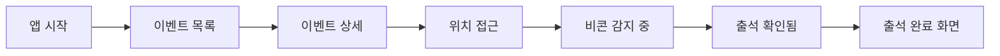

# UI 스토리보드 모음

이 디렉토리는 s-attend-gate 프로젝트의 UI 스토리보드 및 목업 파일을 포함합니다. 각 UI 스토리보드는 시나리오를 기반으로 시각적 구현 예시를 제공합니다.

## 목적

UI 스토리보드 디렉토리의 역할:
- **시각적 문서화**: 사용자 시나리오에 대한 시각적 표현
- **UI/UX 가이드**: 개발자 및 디자이너를 위한 시각적 참조 자료
- **디자인 일관성**: 전체 시스템의 시각적 일관성 유지
- **사용자 경험 정의**: 사용자 행동에 대한 시각적 흐름 제공
- **기술적 구현 가이드**: 인터페이스 요소의 기술적 요구사항 명세

## 파일 조직 원칙
- 모든 모형은 해당 시나리오의 구조를 따르며 해당 시나리오와 연결됨
- 각 목업은 관련 시나리오를 참조하여 기능적 요구사항과 일관성 유지
- 파일 형식은 다음을 포함: 
  - Markdown 형식 스토리보드 (mermaid 포함)
  - 이미지 파일 (PNG, JPEG)
  - 필요시 벡터 파일 (SVG)

## 폴더 구조
```
.concepts/mockups/
├── README.md                  # 목업 디렉토리 개요
├── user-app/                  # 모바일 앱 관련 UI 모형
│   ├── attendance/            # 출석 체크 관련 화면
│   ├── onboarding/            # 앱 초기 설정 화면
│   └── multi-event/           # 다중 이벤트 관련 화면
├── event-management/          # 이벤트 관리 시스템 UI
│   ├── setup/                 # 이벤트 설정 인터페이스
│   └── analytics/             # 이벤트 분석 대시보드
├── gate-management/           # 게이트 관리 시스템 UI
│   ├── operations/            # 운영 관리 화면
│   └── monitoring/            # 실시간 모니터링 화면
├── integrated-platform/       # 통합 플랫폼 UI
│   ├── dashboard/             # 통합 대시보드
│   └── admin/                 # 관리자 인터페이스
└── extensions/                # 확장 기능 UI
    ├── analytics-dashboard/   # 고급 분석 UI
    ├── networking-game/       # 네트워킹 게임 UI
    ├── treasure-hunt/         # 보물찾기 게임 UI
    └── integrations/          # 시스템 통합 UI
```

## 스토리보드 작성 지침

### 핵심 원칙
1. **시나리오 기반**: 모든 UI는 해당 사용자/시스템 시나리오를 기반으로 함
2. **사용자 중심**: 사용자 관점에서 인터페이스 흐름 구성
3. **접근성 고려**: 다양한 사용자가 접근 가능한 디자인 요소 포함
4. **일관성 유지**: 디자인 언어와 패턴의 일관성 유지
5. **기술적 실현 가능성**: 구현 가능한 범위 내에서 디자인

### 스토리보드 포맷
각 스토리보드 문서는 다음 요소를 포함해야 합니다:

1. **관련 시나리오 참조**: 구현 대상 시나리오 링크
2. **사용자 여정 맵**: 전체 사용자 경험 흐름도
3. **핵심 화면 목업**: 주요 화면의 시각적 표현
4. **상호작용 설명**: 사용자 액션과 시스템 반응
5. **접근성 요소**: 접근성 관련 특별 고려사항
6. **구현 노트**: 개발자를 위한 기술적 참고사항

## 작성 예시

```markdown
# 자동 출석 체크 UI 스토리보드

관련 시나리오: [자동 출석 성공 사용자 행동](../../scenarios/user-scenarios/user-app/attendance-scenarios.md)

## 사용자 여정 맵



## 핵심 화면

### 1. 비콘 감지 중 화면


### 2. 출석 확인 화면


## 상호작용 설명

1. 사용자가 행사장 근처에 도착하면 자동으로 비콘 감지 시작
2. 진행 상태를 애니메이션으로 표시 (원형 프로그레스 바)
3. 비콘 감지 시 진동 피드백과 함께 확인 화면으로 전환
4. 출석 완료 확인 후 체크 애니메이션 표시

## 접근성 요소
- 시각적 피드백 외에 촉각적(진동) 및 청각적(알림음) 피드백 제공
- 고대비 모드 지원
- 스크린 리더 호환 텍스트 레이블

## 구현 노트
- 비콘 감지 화면은 백그라운드 프로세스 상태 반영
- 애니메이션은 부드러운 전환을 위해 60fps 유지
- 배터리 소모 최소화를 위한 최적화 필요
```
