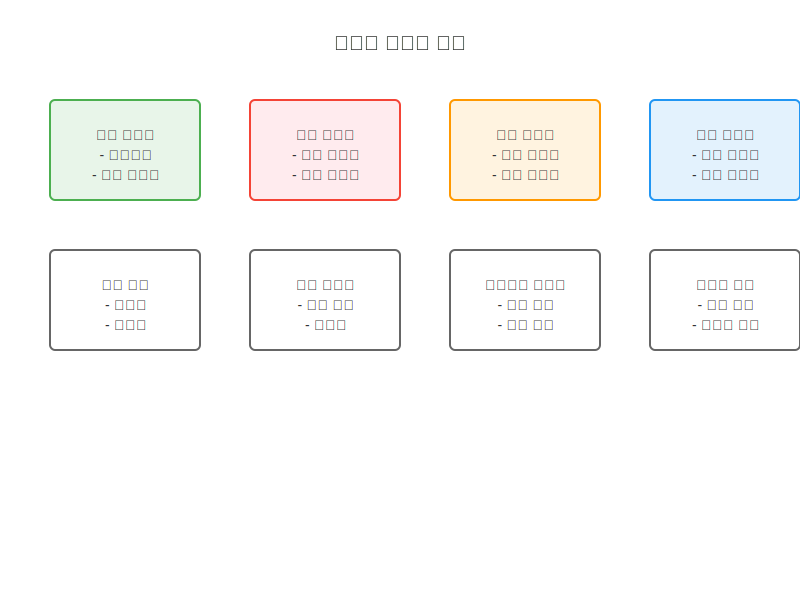
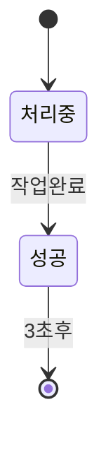
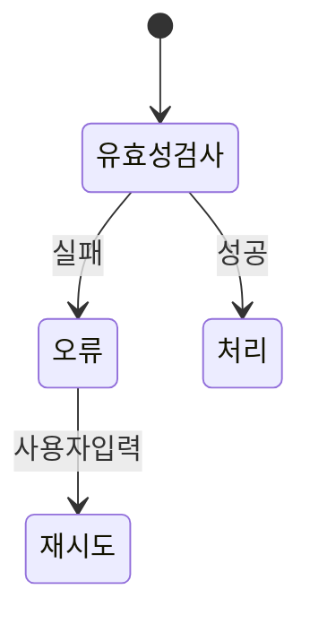
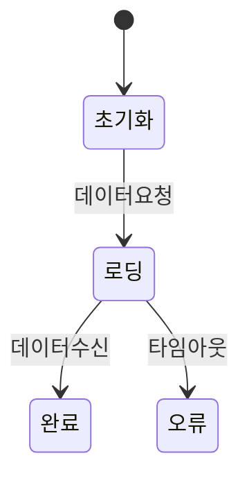

# 시스템 피드백 패턴

## 피드백 유형 개요

## 상태 기반 피드백

### 성공 상태

### 오류 상태

### 로딩 상태

## 상호작용 피드백

### 즉각적 피드백
1. 호버 상태 변화
2. 클릭/터치 효과
3. 포커스 표시
4. 드래그 가이드

### 진행 피드백
1. 진행률 표시
2. 단계별 상태
3. 작업 예상 시간
4. 취소 옵션

## 알림 시스템

### 알림 유형
1. 토스트 메시지
2. 스낵바
3. 모달 다이얼로그
4. 인라인 알림

### 알림 우선순위
1. 긴급 (빨강)
2. 경고 (주황)
3. 정보 (파랑)
4. 성공 (초록)

## 접근성 고려사항

### 시각적 피드백
- 고대비 색상
- 아이콘 사용
- 애니메이션 효과
- 텍스트 크기

### 청각적 피드백
- 성공음
- 경고음
- 알림음
- 상호작용음

### 스크린리더 지원
- ARIA 레이블
- 상태 설명
- 실시간 업데이트
- 오류 안내

## 구현 가이드라인

### 피드백 타이밍
1. 즉각적 응답 (100ms 이내)
2. 진행 표시 (1초 이상)
3. 상태 유지 (3초)
4. 자동 소멸 (설정 가능)

### 애니메이션 효과
1. 부드러운 전환
2. 적절한 지속 시간
3. 과도한 움직임 방지
4. 사용자 설정 존중

## 관련 시나리오
- [피드백 상호작용](/scenarios/user-scenarios/feedback-interaction.md)
- [오류 처리 피드백](/scenarios/system-scenarios/error-feedback.md)
- [접근성 피드백](/scenarios/user-scenarios/accessibility-feedback.md)
