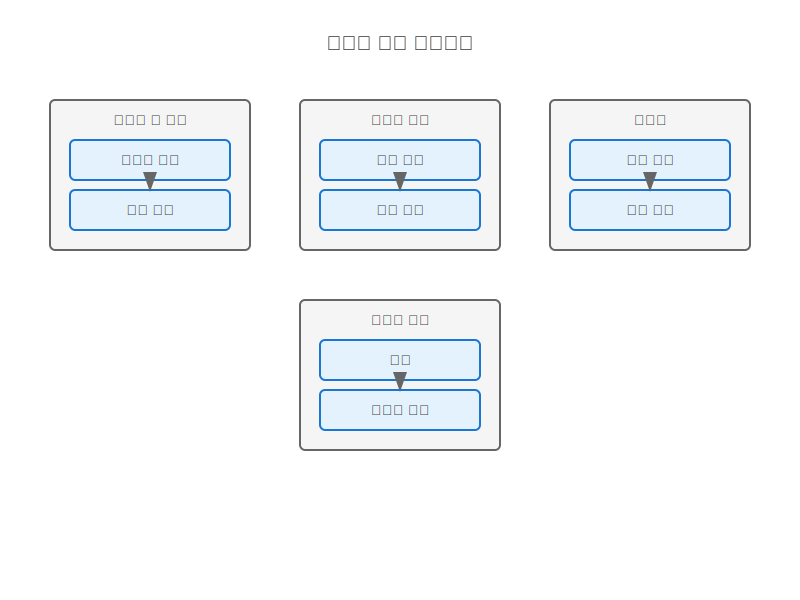
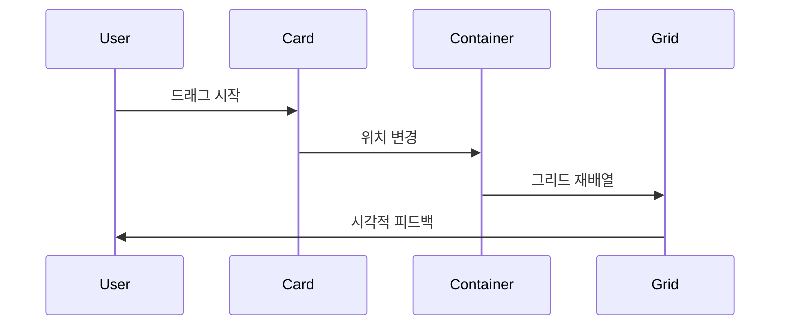
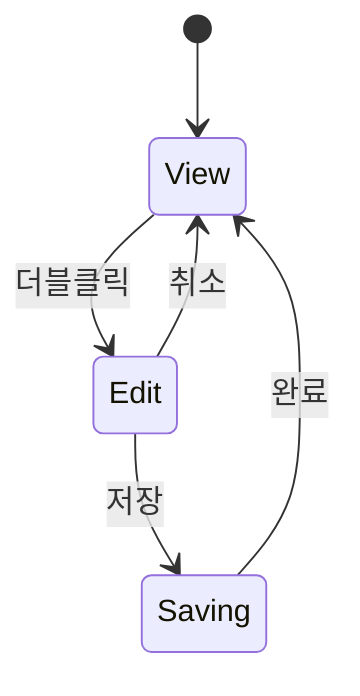
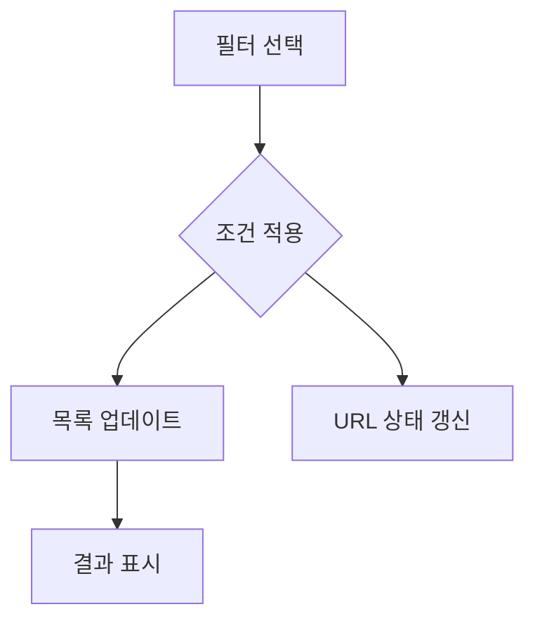

# 이벤트 관리 상호작용 패턴

## 상호작용 패턴 개요

## 드래그 앤 드롭 패턴

### 이벤트 카드 재정렬

### 구현 요구사항
- 부드러운 애니메이션
- 그리드 스냅
- 터치 제스처 지원
- 키보드 접근성

## 인라인 편집 패턴

### 즉시 수정 인터페이스

### 구현 요구사항
- 자동 저장
- 실행 취소
- 유효성 검사
- 오류 피드백

## 필터링 패턴

### 동적 필터 인터페이스

### 구현 요구사항
- 실시간 필터링
- URL 파라미터 동기화
- 필터 조합
- 초기화 옵션

## 접근성 고려사항

### 키보드 네비게이션
- Tab 순서 최적화
- 단축키 지원
- 포커스 관리
- 스크린리더 호환성

### 터치 인터랙션
- 적절한 터치 영역
- 제스처 인식
- 햅틱 피드백
- 멀티터치 지원

## 피드백 시스템

### 시각적 피드백
- 상태 표시
- 진행 상태
- 성공/실패 표시
- 로딩 인디케이터

### 청각적 피드백
- 알림음
- 상태 변경음
- 오류 경고음
- 완료 사운드

## 성능 최적화

### 렌더링 최적화
- 가상 스크롤
- 지연 로딩
- 이미지 최적화
- 캐시 전략

### 인터랙션 최적화
- 디바운싱
- 쓰로틀링
- 메모이제이션
- 배치 업데이트
