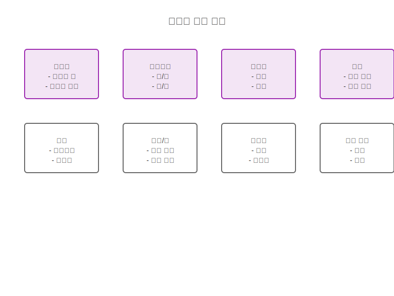
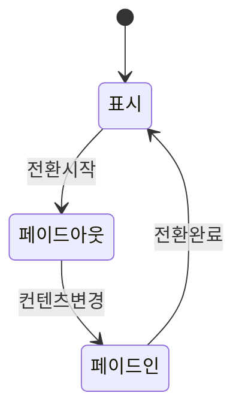
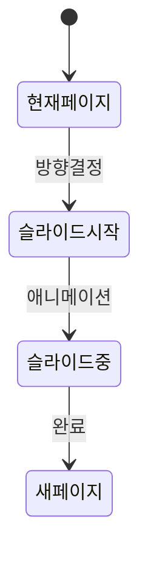
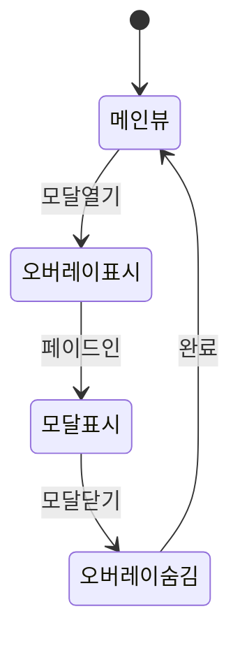
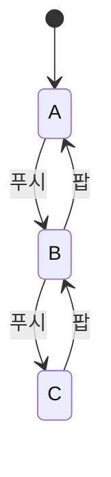

# 페이지 전환 패턴

## 전환 패턴 개요

## 기본 전환 패턴

### 페이드 전환

### 슬라이드 전환

## 고급 전환 패턴

### 모달 전환

### 네비게이션 전환

## 전환 속성

### 타이밍
1. 즉시 전환 (0ms)
2. 빠른 전환 (200ms)
3. 일반 전환 (300ms)
4. 느린 전환 (500ms)

### 이징 함수
1. 선형 (linear)
2. 가속 (ease-in)
3. 감속 (ease-out)
4. 가속-감속 (ease-in-out)

## 상황별 전환

### 화면 전환
1. 페이지 이동
2. 탭 전환
3. 메뉴 전환
4. 뷰 전환

### 컨텐츠 전환
1. 리스트 아이템
2. 카드 전환
3. 이미지 갤러리
4. 폼 전환

## 접근성 고려사항

### 모션 감소
- 축소된 애니메이션
- 전환 비활성화 옵션
- 대체 전환 효과
- 시스템 설정 준수

### 키보드 내비게이션
- 포커스 관리
- 전환 중 조작
- 단축키 지원
- 포커스 트랩

## 성능 최적화

### 렌더링 성능
1. GPU 가속 사용
2. 레이어 최적화
3. 프레임 드롭 방지
4. 메모리 관리

### 로딩 전략
1. 프리로딩
2. 레이지 로딩
3. 캐시 활용
4. 백그라운드 로딩

## 관련 시나리오
- [화면 전환 흐름](/scenarios/user-scenarios/screen-transitions.md)
- [모달 상호작용](/scenarios/user-scenarios/modal-interaction.md)
- [성능 최적화](/scenarios/system-scenarios/transition-performance.md)
