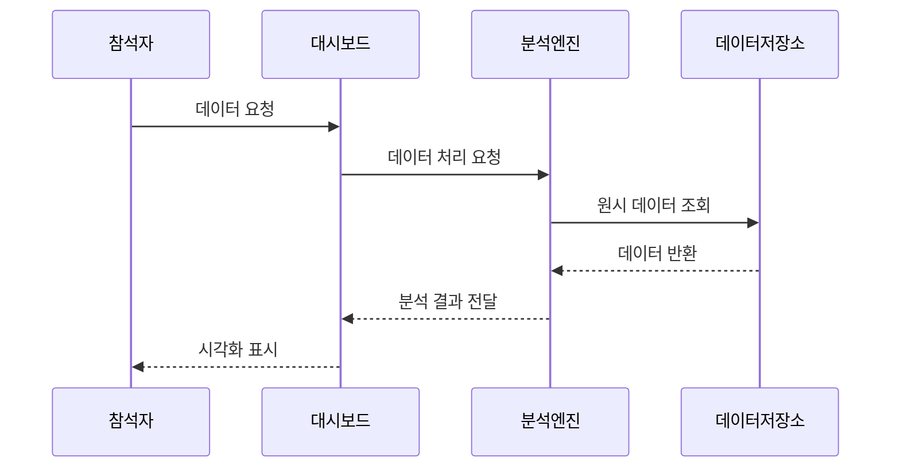

# 분석 대시보드 스토리보드

## 개요
이벤트 및 출석 데이터에 대한 고급 분석과 인사이트를 제공하는 대시보드입니다.

## 화면 구성

### 화면 1: 대시보드 홈
메인 대시보드 화면으로 주요 지표와 차트를 표시합니다.

#### 상호작용
- 기간 선택: 데이터 범위 조정
- 지표 드릴다운: 상세 분석 보기
- 차트 필터링: 데이터 시각화 조정

#### 접근성
- 스크린리더: 차트 데이터 텍스트 설명 제공
- 키보드: 탭 순서 최적화
- 고대비: 차트 색상 구분 보장

### 화면 2: 이벤트 분석
이벤트별 상세 분석과 트렌드를 표시합니다.

#### 상호작용
- 이벤트 선택: 특정 이벤트 데이터 조회
- 비교 분석: 여러 이벤트 데이터 비교
- 데이터 내보내기: 보고서 생성

#### 접근성
- 데이터 테이블: 차트의 대체 표현
- 키보드 단축키: 빠른 데이터 탐색
- 색맹 고려: 패턴 기반 차트 구분

### 화면 3: 참석자 분석
참석자 행동과 패턴 분석을 제공합니다.

#### 상호작용
- 세그먼트 필터: 참석자 그룹 분석
- 행동 추적: 참석 패턴 확인
- 프로필 드릴다운: 개별 참석자 상세 정보

#### 접근성
- 음성 안내: 데이터 변경 알림
- 확대/축소: 차트 가독성 조정
- 포커스 표시: 현재 선택 항목 강조

### 화면 4: 예측 분석
미래 트렌드와 참석률 예측을 표시합니다.

#### 상호작용
- 예측 모델 선택: 분석 방법 조정
- 변수 조정: 예측 매개변수 설정
- 시나리오 테스트: 가상 상황 분석

#### 접근성
- 오디오 그래프: 트렌드 음성 설명
- 촉각 피드백: 중요 지점 표시
- 텍스트 크기: 조절 가능한 폰트

### 화면 5: 보고서 생성
맞춤형 보고서를 생성하고 관리합니다.

#### 상호작용
- 템플릿 선택: 보고서 형식 지정
- 데이터 선택: 포함할 분석 지정
- 자동화 설정: 정기 보고서 예약

#### 접근성
- PDF 최적화: 스크린리더 호환
- 단순 내비게이션: 명확한 구조
- 대체 텍스트: 모든 그래프 설명

### 화면 6: 설정
대시보드 사용자 설정과 관리 기능을 제공합니다.

#### 상호작용
- 알림 설정: 중요 지표 알림 구성
- 데이터 동기화: 업데이트 주기 설정
- 접근 권한: 사용자 권한 관리

#### 접근성
- 설정 그룹화: 논리적 카테고리
- 상태 메시지: 변경사항 확인
- 기본값 복원: 쉬운 초기화

## 시스템 흐름

## 관련 시나리오
- [데이터 분석 시나리오](../../scenarios/system-scenarios/analytics/data-analysis.md)
- [보고서 생성 흐름](../../scenarios/user-scenarios/analytics/report-generation.md)
- [예측 모델링](../../scenarios/system-scenarios/analytics/predictive-modeling.md)
