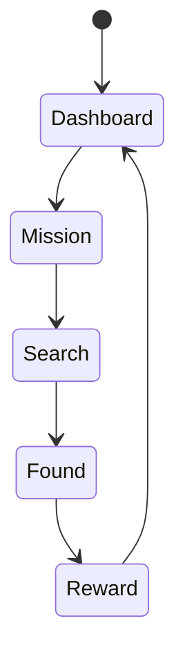

# BLE 보물찾기 게임

## 개요

BLE 비콘을 활용한 상호작용형 보물찾기 게임입니다. 참가자들은 앱을 통해 숨겨진 비콘을 찾아 포인트를 획득합니다.

## 화면 1: 게임 대시보드

### 설명
게임 진행 상황과 현재 미션을 보여주는 메인 화면입니다.

### 화면 구성
- 현재 점수/순위
- 활성 미션 목록
- 주변 비콘 지시계
- 진행률 표시

### 상호작용
- 미션 선택
- 힌트 확인
- 보상 획득
- 순위표 확인

### 접근성
- 음성 내비게이션
- 진동 피드백
- 색상 대비 강화

## 화면 2: 비콘 탐색

### 설명
주변 비콘을 탐색하고 방향을 안내하는 화면입니다.

### 화면 구성
- 방향 지시기
- 거리 표시기
- 신호 강도 게이지
- 힌트 카드

### 상호작용
- 방향 추적
- 힌트 사용
- 거리 확인
- 발견 확인

### 접근성
- 음성 방향 안내
- 진동 강도 변화
- 큰 터치 영역

## 화면 3: 보상 획득

### 설명
비콘 발견 시 보상을 획득하는 화면입니다.

### 화면 구성
- 보상 애니메이션
- 획득 포인트
- 업적 달성
- 다음 미션

### 상호작용
- 보상 수령
- 공유하기
- 미션 선택
- 순위 확인

### 접근성
- 자동 진행
- 소리/진동 피드백
- 건너뛰기 옵션

## 화면 4: 순위표

### 설명
실시간 참가자 순위와 성과를 보여주는 화면입니다.

### 화면 구성
- 전체 순위표
- 개인 통계
- 업적 목록
- 보상 상점

### 상호작용
- 순위 필터링
- 통계 확인
- 보상 교환
- 친구 도전

### 접근성
- 정렬 옵션
- 테이블 탐색
- 상세 정보 음성 안내

## 관련 시나리오
- [게임 규칙](../../scenarios/extensions/treasure-hunt/rules.md)
- [보상 시스템](../../scenarios/extensions/treasure-hunt/rewards.md)
