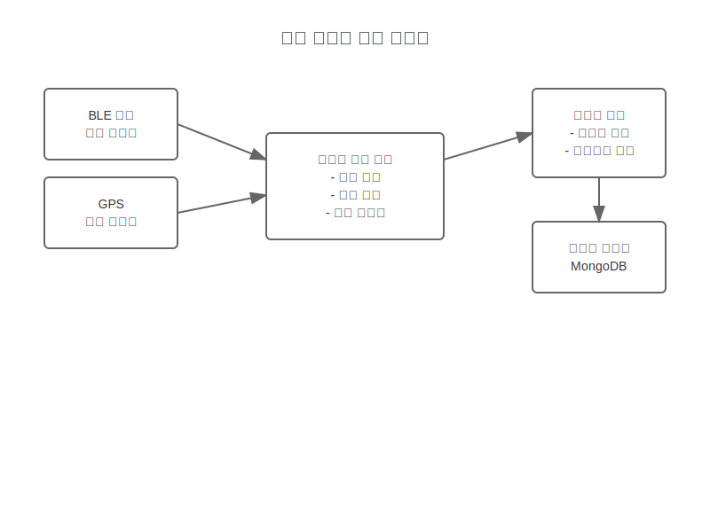
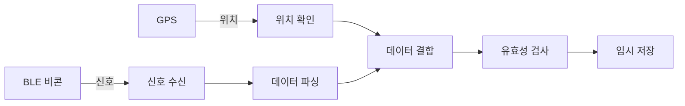
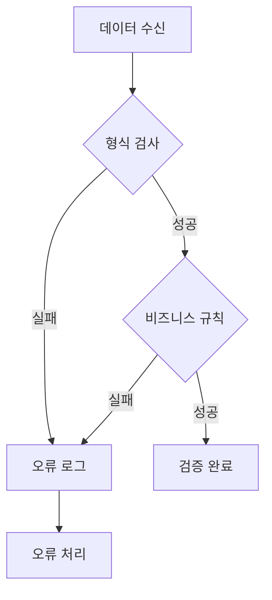
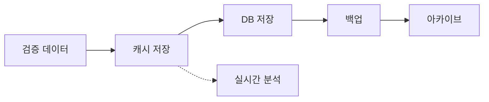

# 출석 데이터 처리 흐름

## 프로세스 1: 데이터 수집

### 시스템 구성
- BLE 비콘 신호 수신기
- 위치 데이터 수집기
- 시간 동기화 모듈
- 데이터 유효성 검사기

### 시스템 구조도

### 데이터 흐름

### 처리 단계
1. 비콘 신호 수신
2. RSSI 값 측정
3. 위치 데이터 수집
4. 시간 정보 첨부
5. 데이터 패키지 생성

### 오류 처리
- 신호 약할 때: 재시도
- 위치 오차: 보정 알고리즘
- 시간 불일치: NTP 동기화

## 프로세스 2: 데이터 검증

### 시스템 구성
- 데이터 검증 엔진
- 비즈니스 규칙 검사기
- 보안 검증 모듈
- 중복 체크 시스템

### 검증 흐름

### 검증 기준
1. 데이터 형식 유효성
2. 비즈니스 규칙 준수
3. 보안 요구사항 충족
4. 중복 체크

### 예외 처리
- 형식 오류: 자동 보정
- 규칙 위반: 관리자 알림
- 보안 위반: 접근 차단

## 프로세스 3: 데이터 저장

### 시스템 구성
- 데이터베이스 관리자
- 캐시 시스템
- 백업 관리자
- 아카이브 시스템

### 저장 흐름

### 저장 정책
1. 실시간 캐시 저장
2. 주기적 DB 커밋
3. 일일 백업
4. 월간 아카이브

### 성능 최적화
- 인덱스 최적화
- 캐시 전략
- 배치 처리
- 파티셔닝
