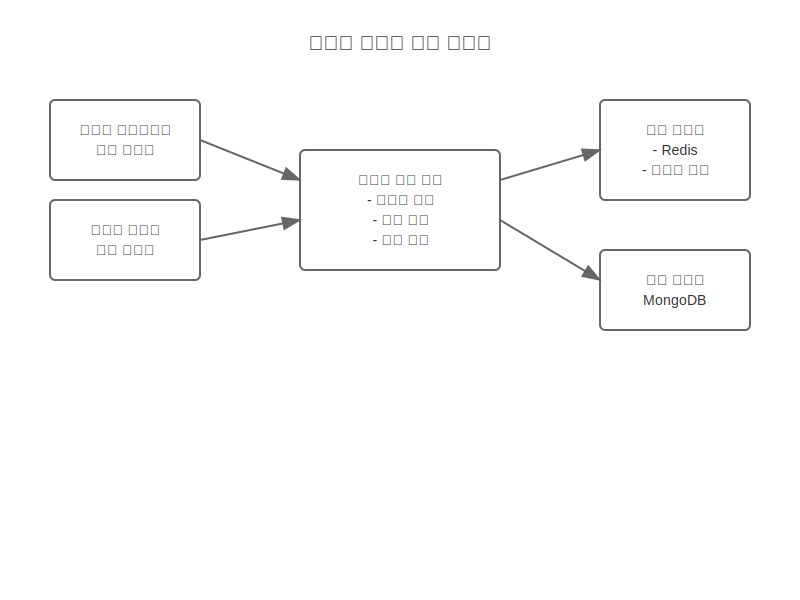
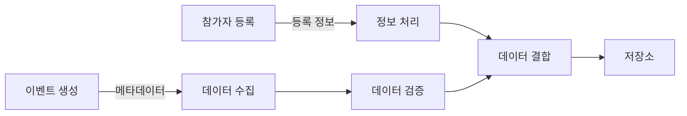
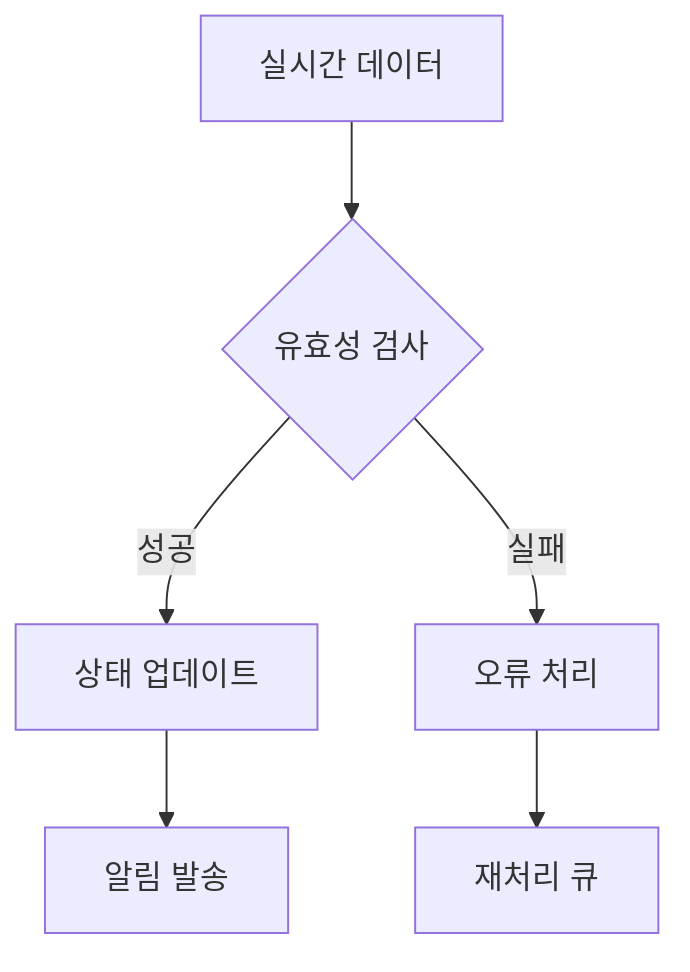
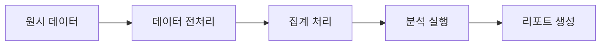

# 이벤트 데이터 처리 흐름

## 프로세스 1: 이벤트 데이터 수집

### 시스템 구성
- 이벤트 메타데이터 처리기
- 참가자 데이터 수집기
- 설정 데이터 관리자
- 데이터 유효성 검사기

### 시스템 구조도

### 데이터 흐름

### 처리 단계
1. 이벤트 기본 정보 수집
2. 참가자 데이터 처리
3. 설정 데이터 통합
4. 데이터 정규화
5. 저장소 업데이트

## 프로세스 2: 실시간 데이터 처리

### 시스템 구성
- 실시간 데이터 스트림 처리기
- 상태 모니터링 시스템
- 알림 관리자
- 캐시 시스템

### 처리 흐름

### 처리 정책
1. 실시간 데이터 스트리밍
2. 상태 변경 감지
3. 캐시 업데이트
4. 알림 트리거

## 프로세스 3: 데이터 분석

### 시스템 구성
- 분석 엔진
- 리포트 생성기
- 데이터 집계기
- 시각화 처리기

### 분석 흐름

### 분석 단계
1. 데이터 수집 및 정제
2. 통계 분석 실행
3. 인사이트 도출
4. 리포트 생성
