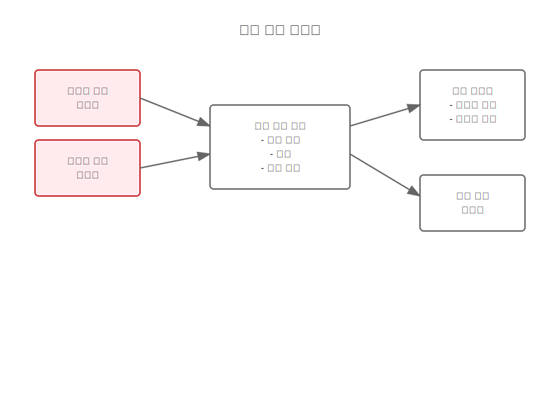
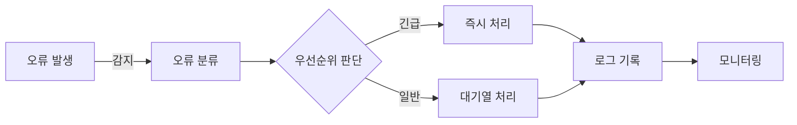
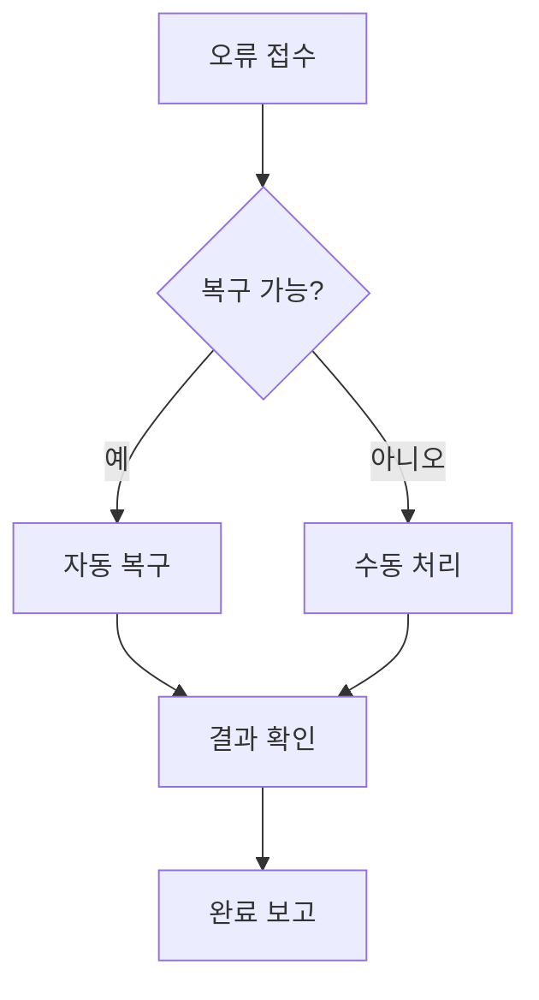

# 오류 처리 시스템 흐름

## 프로세스 1: 오류 감지 및 분류

### 시스템 구성
- 오류 감지기
- 오류 분류기
- 오류 우선순위 결정기
- 로깅 시스템

### 시스템 구조도

### 데이터 흐름

### 처리 단계
1. 오류 감지
2. 오류 유형 분류
3. 우선순위 결정
4. 처리 전략 선택
5. 로그 기록

## 프로세스 2: 오류 처리 및 복구

### 시스템 구성
- 오류 처리 엔진
- 복구 전략 관리자
- 알림 시스템
- 모니터링 시스템

### 처리 흐름

### 처리 단계
1. 복구 가능성 판단
2. 복구 전략 선택
3. 복구 작업 실행
4. 결과 검증
5. 보고서 생성

## 관련 시나리오
- [시스템 오류 복구](/scenarios/system-scenarios/error-recovery.md)
- [사용자 오류 처리](/scenarios/system-scenarios/user-error-handling.md)

## 모니터링 및 알림
1. 실시간 오류 모니터링
2. 임계치 기반 알림
3. 에스컬레이션 정책
4. 보고서 생성

## 성능 지표
- 평균 감지 시간
- 평균 복구 시간
- 오류 재발생률
- 자동 복구 성공률
